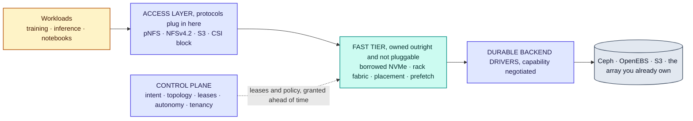
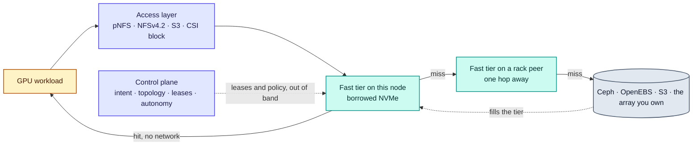

<p align="center">
  <picture>
    <source media="(prefers-color-scheme: dark)" srcset="docs/brand/logo-dark.svg">
    
  </picture>
</p>

<h3 align="center">Write once. Read it any way. Copy it never.</h3>

<p align="center">
  The open, Kubernetes-native storage control plane for AI infrastructure.
</p>

<p align="center">
  <a href="LICENSE"></a>
  
  
  <a href="docs/rfcs/README.md"></a>
</p>

<p align="center">
  
</p>

> **Not runnable yet.** The first packages exist and are tested, but nothing is wired to a device or
> a cluster, so there is nothing to install. Forebay is still being designed in the open, one RFC at
> a time, and the most useful thing you can do today is read
> [RFC-0001](docs/rfcs/0001-thesis-scope-and-non-goals.md) and tell us where it is wrong. It lists
> the five conditions under which we should give up.

## What it is

A storage control plane for GPU clusters. It borrows the NVMe sitting idle in your compute nodes,
turns it into a rack-aware tier, and hands the capacity straight back the moment a job wants it.
Durable data stays wherever you already keep it — Ceph, OpenEBS, S3, or the array you have paid for.

On top of that sits the surface you expect from a real storage platform: file, object and block;
snapshots, clones, replication, encryption, QoS, quotas, multi-tenancy and audit. See
**[the platform surface](docs/platform.md)** for all of it, compared honestly against a mature array.

## High-level design



| Component | Responsibility | Runs as |
| --- | --- | --- |
| **Control plane** | Intent, topology, lease grants, tenancy, autonomy | Deployment |
| **Node agent** | Discovery, pool accounting, lease enforcement, serving the fast tier | DaemonSet |
| **Access layer** | Protocol termination, pNFS layouts and recall | With the agent |
| **Backend drivers** | Durable storage behind a capability-negotiated contract | In the control plane |
| **CSI driver** | Volumes and ephemeral volumes | DaemonSet plus controller |

The control plane sits on no vertical edge above. It grants leases ahead of time, out of band, so
losing it stops new grants while reads and reclamation carry on.

Full design, with the deployment view, the lease and reclaim flows and the failure model, in
**[docs/architecture.md](docs/architecture.md)**.

## How it works



Every node's NVMe splits three ways:

| Pool | Owner | Holds | Reclaimed by |
| --- | --- | --- | --- |
| **Compute** | The job on the node | Anything it wants | Never touched |
| **Donated** | Forebay, permanently | Durable data | Never reclaimed |
| **Borrowed** | Forebay, revocably | Regenerable data only | **Dropping it** |

Borrowed capacity never holds anything whose loss matters, so reclaiming it is a delete rather than a
migration. That one rule is why the elastic part is safe.

## Why not just buy an array

<p align="center">
  
</p>

A mature array is better than Forebay at being an array, and will be for years. It also cannot see
your GPUs, because they sit on the far side of a cable it does not terminate. Everything below needs
that view:

| | Forebay |
| --- | --- |
| Capacity that appears from idle nodes and returns itself | [0005](docs/rfcs/0005-capacity-pools-and-elastic-leases.md) |
| Placement that follows the accelerator, by GPU, NUMA and PCIe topology | [0003](docs/rfcs/0003-topology-model.md) |
| Telling the scheduler where the data already is | [0022](docs/rfcs/0022-data-aware-scheduling.md) |
| GB/s per GPU and GPU hours lost to storage, as the unit of management | [0024](docs/rfcs/0024-efficiency-accounting.md) |
| Datasets and versions instead of volumes and LUNs | [0012](docs/rfcs/0012-dataset-object-model.md) |
| One copy read as file **and** object, never duplicated per protocol | [0021](docs/rfcs/0021-single-copy-multi-protocol.md) |

## What using it will look like

> Design sketch, not implemented. Argue with the shape in an [issue](../../issues/new/choose).

```yaml
apiVersion: forebay.io/v1alpha1
kind: CapacityPolicy
metadata:
  name: gpu-nodes
spec:
  donated: 2Ti                  # permanent. holds durable data
  borrowed:
    max: 4Ti                    # elastic. regenerable data only
    class: elastic              # guaranteed | elastic | opportunistic
    reclaimWithin: 30s          # the contract. capacity comes back this fast
```

The reclamation promise is a field, because a promise that is not written down is not a promise.

## Building it

```sh
git clone https://github.com/mayur-tolexo/forebay && cd forebay
make check     # gofmt, vet, race-enabled tests, 80% coverage gate
make build     # binaries into bin/
```

`make check` is exactly what CI runs, so a green local check means a green pipeline. What exists so
far is capacity accounting, the lease state machine and the lease journal from
[RFC-0005](docs/rfcs/0005-capacity-pools-and-elastic-leases.md): the three-pool arithmetic, the three
lease classes, the reclaim ladder, the never-worse-off invariant, and durable lease state so a
restart does not forget what a node lent. All unit tested. The binaries
build and report their version. Neither has a runtime.

## The honest part

Forebay bets that node-local NVMe beats fetching from a fanned-out backend. In one measured
environment it **did not** — a Ceph RGW read across eleven OSDs took 0.23 s against 1.71 s from the
node's own disk. That is about seven times faster on wall clock, and two and a half times on raw
bandwidth, since the object crossing the network was compressed and the local read was not. Different
hardware to what we target, but it means locality is a hypothesis rather than a premise. Finding the
crossover on real GPU hardware is
[RFC-0018](docs/rfcs/0018-benchmark-and-falsification-suite.md), and it is the first serious
engineering task.

## Roadmap

| Phase | What | Ends when |
| --- | --- | --- |
| **0 · Design** | Architecture and RFCs, in the open | A stranger can read them and say where they are wrong |
| **1 · Prove the thesis** | Node agent, leases, drivers, fast tier, pNFS, benchmarks | Capacity is reclaimed mid-job unnoticed and the benchmark reports a number either way |
| **2 · Intent and autonomy** | Intent model, the two control loops, observability | It moves data on its own and operators leave it on |
| **3 · The AI layer** | Prefetch, dataset versions, checkpoint path | It stops looking like generic storage |
| **4 · Production** | Failure model, multi-tenancy, non-disruptive upgrades | The boring reasons people trust storage are present |

Full detail, with per-capability status, in [ROADMAP.md](ROADMAP.md).

## Start here

| | |
| --- | --- |
| **Disagree with the thesis** | [RFC-0001](docs/rfcs/0001-thesis-scope-and-non-goals.md) → open an [issue](../../issues/new/choose) |
| **Understand the design** | [Architecture](docs/architecture.md) · [Platform surface](docs/platform.md) |
| **Claim an RFC** | [0003 topology](docs/rfcs/0003-topology-model.md) · [0006 driver contract](docs/rfcs/0006-durable-backend-driver-contract.md) · [0022 data-aware scheduling](docs/rfcs/0022-data-aware-scheduling.md) · [0024 efficiency accounting](docs/rfcs/0024-efficiency-accounting.md) |
| **Everything else** | [All 27 RFCs](docs/rfcs/README.md) · [Contributing](CONTRIBUTING.md) · [Governance](GOVERNANCE.md) · [Security](SECURITY.md) |

If you have run large GPU clusters, operated Ceph at scale, or watched a checkpoint storm take out a
filesystem, your objection is worth more than a patch.

## Licence

Apache 2.0.
