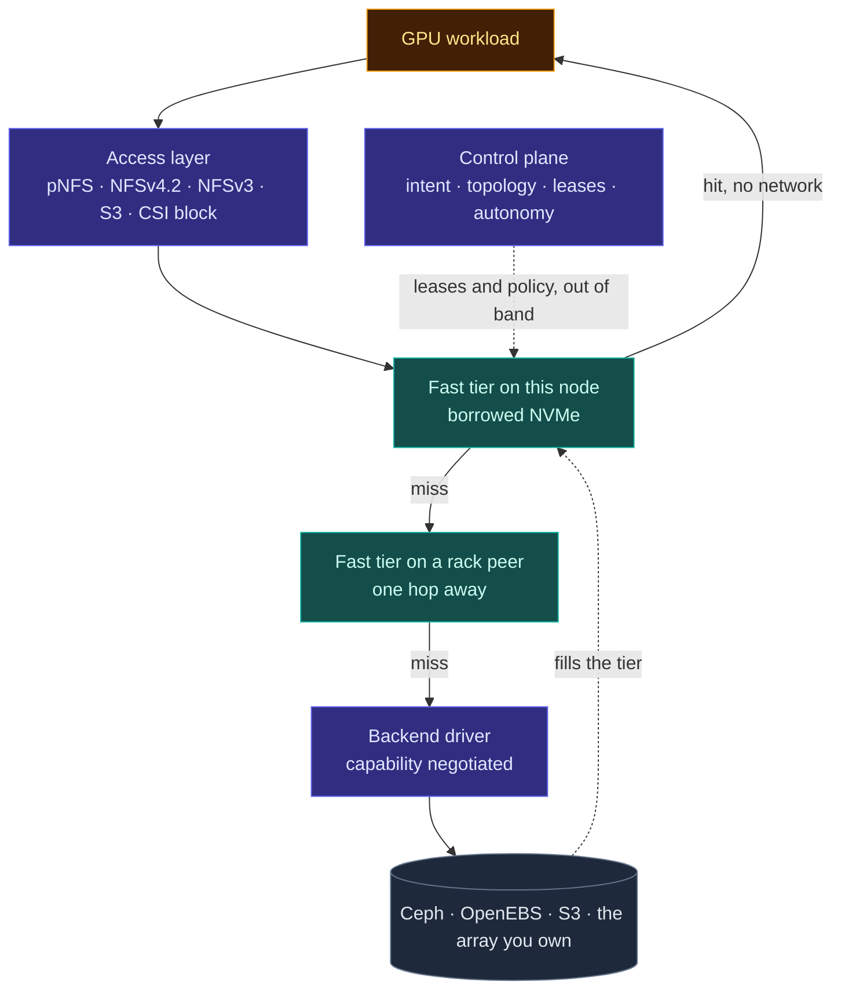
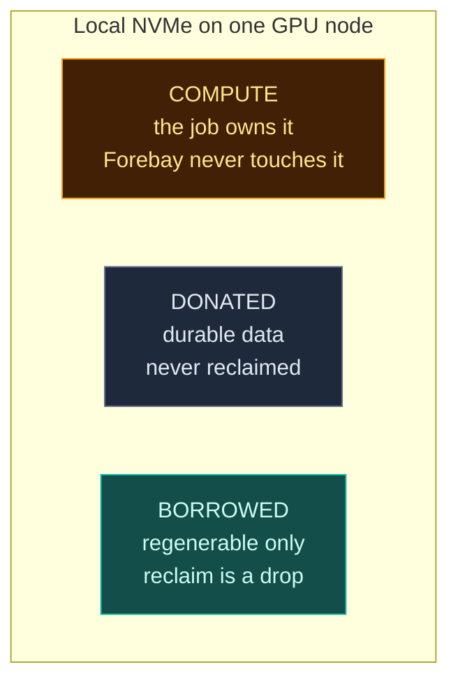
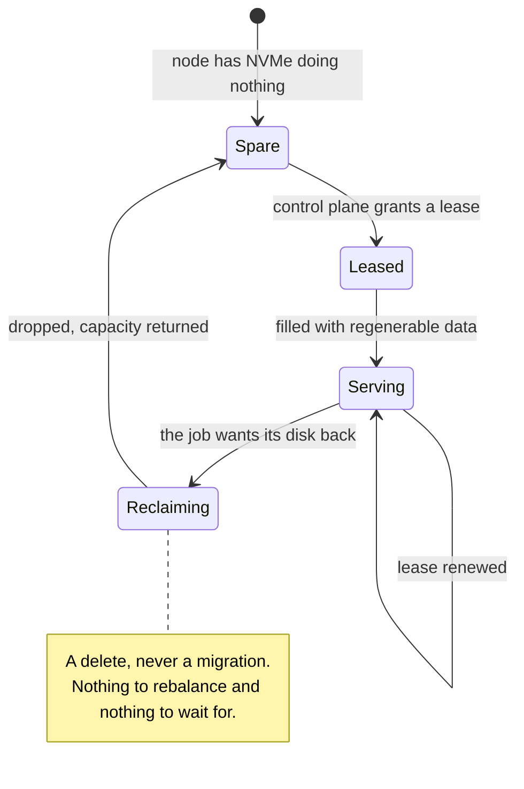
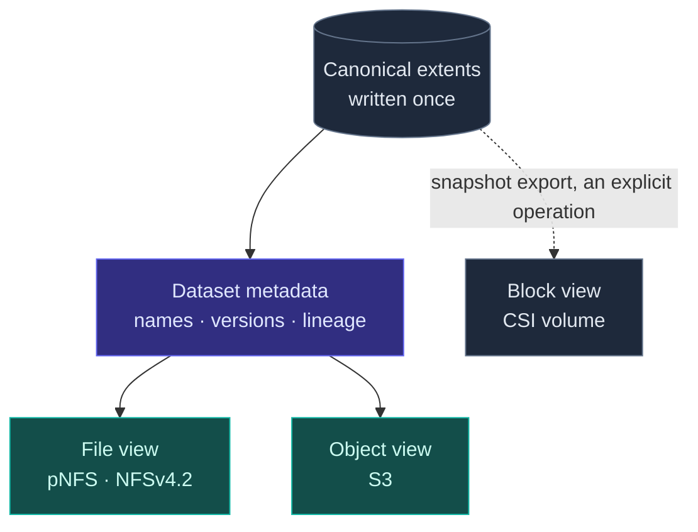
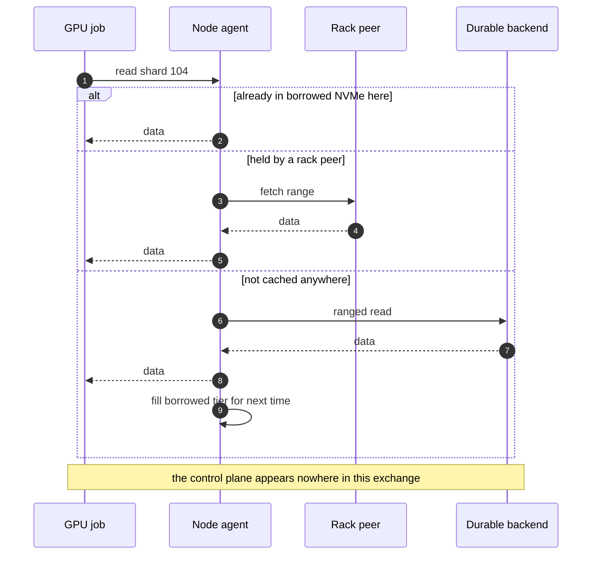
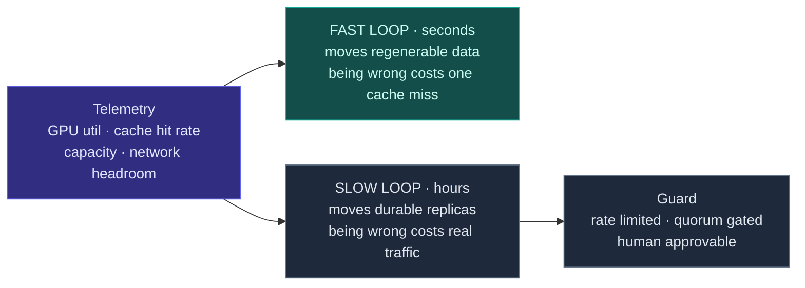

<p align="center">
  <picture>
    <source media="(prefers-color-scheme: dark)" srcset="docs/brand/logo-dark.svg">
    
  </picture>
</p>

<h3 align="center">Write once. Read it any way. Copy it never.</h3>

<p align="center">
  The open, Kubernetes-native storage control plane for AI infrastructure —<br>
  intent-driven, backend-agnostic, and built to keep accelerators fed.
</p>

<p align="center">
  <a href="LICENSE"></a>
  
  
  <a href="docs/rfcs/README.md"></a>
  <a href="CONTRIBUTING.md"></a>
</p>

<p align="center">
  <a href="#the-30-second-version">Architecture</a> ·
  <a href="#no-copies">No copies</a> ·
  <a href="#write-once-read-any-way">Multi-protocol</a> ·
  <a href="#what-it-does-for-you">Capabilities</a> ·
  <a href="#what-the-api-will-look-like">API sketch</a> ·
  <a href="#roadmap">Roadmap</a> ·
  <a href="docs/rfcs/README.md">RFCs</a> ·
  <a href="#getting-involved">Contribute</a>
</p>

<p align="center">
  
</p>

---

> ### Status: design phase
>
> **There is no code in this repository yet.** The architecture is being worked out in the open, one
> RFC at a time, and every line of the [capability table](#capabilities) reads `Planned` or
> `Specified`. Nothing reads `Shipped`.
>
> Design review is worth more here than any patch. Start with
> [RFC-0001](docs/rfcs/0001-thesis-scope-and-non-goals.md) and try to break it.

A forebay is the basin upstream of a hydro turbine. Its only job is to hold enough water that the
turbine never starves, and to absorb surges without passing them downstream. That is the whole idea
here, with GPUs in place of turbines.

## The 30-second version

Forebay borrows unused compute-local NVMe, turns it into a rack-aware cache and scratch tier, and
hands capacity straight back the moment the compute job wants it. Durable storage stays wherever you
already keep it.



Protocols plug in above. Durable backends plug in below. The fast tier in the middle is the part
Forebay owns, and the only part it refuses to make pluggable.

## Three pools, one rule

Every node's NVMe is split into three pools with different owners and different rules.



Borrowed capacity never holds anything whose loss matters, so reclaiming it is a **delete rather than
a migration**. No rebalance storm, no waiting, no negotiation with the job that needs its disk back.



That single rule is load bearing. It is why elasticity is safe, and it is why durable data is never
allowed on borrowed capacity.

## No copies

Storage systems spend most of their time copying bytes that did not need to move, and almost none of
those copies appear on anyone's invoice. Forebay holds itself to one rule.

> **A byte is written once. Everything else is a reference.**

| Rule | What it means in practice |
| --- | --- |
| **No copy to clone** | Cloning a 40 TB dataset for an experiment moves zero bytes |
| **No copy to version** | v18 shares every unchanged extent with v17. Only the difference is written |
| **No copy to serve another protocol** | The S3 reader and the pNFS reader touch the same extents |
| **No copy to ingest** | Data already in your backend is registered in place, never rewritten |
| **No copy to reclaim** | Borrowed capacity is dropped, not migrated |
| **No copy to promote** | Filling the fast tier is a cache fill that can be abandoned, not a migration that must finish |
| **Fewest copies in the IO path** | Direct IO, io_uring and RDMA where the platform has them, detected rather than assumed |

Copies stay legitimate in exactly three places: replicas, because durability is the point; the fast
tier, because that duplicate is regenerable and abandonable; and a backend that genuinely cannot
clone server-side, in which case the control plane **says so** rather than copying quietly and
calling it instant.

Details and the failure modes this creates in [RFC-0020](docs/rfcs/0020-no-copy-policy.md).

## Write once, read any way

A dataset version is written once and then immutable. Immutability is what makes multi-protocol
access consistent for free: there is no partial-write window during which two readers could disagree.



**Where the honest line sits**, because the marketing version of this feature is not true:

| | |
| --- | --- |
| File and object over the same bytes, concurrently | **Yes.** This is the feature |
| Block over the same bytes as file or object, concurrently | **No.** Not possible in any meaningful sense |
| Block under the same control plane, namespace, policy, snapshots and clones | **Yes** |
| Converting between block and object by snapshot export | **Yes**, as an explicit operation |

A block volume is an opaque range of bytes with a client-owned filesystem inside it. There are no
objects in there to serve. Any system claiming concurrent block, file and object access to one copy
means separate copies kept in sync, block that is really a file underneath, or read-only export of a
quiesced snapshot. Forebay offers the third and says which.

See [RFC-0021](docs/rfcs/0021-single-copy-multi-protocol.md), which supersedes the unified-namespace
non-goal in RFC-0001. That reversal is recorded rather than edited away.

## What it does for you

<p align="center">
  
</p>

You describe an outcome. Forebay decides how to reach it, continuously, from what it observes on both
the storage and the compute side. The work that disappears is the work that used to be yours: sizing
a cache tier by hand, migrating data to free up space, buying capacity the fleet already has, and
guessing why a GPU is waiting.

<details>
<summary><b>The read path in detail</b></summary>

<br>



With pNFS this stops being a discipline the project maintains and becomes a property of the protocol.
pNFS separates a metadata server from data servers: the client asks for a layout, then reads bulk
data directly and in parallel from the data servers. The control plane is the metadata server. Node
agents are the data servers. A mature in-kernel client for it already ships with Linux, which is why
Forebay does not write one.

</details>

<details>
<summary><b>How autonomy stays safe</b></summary>

<br>

Actuation is split by the cost of being wrong.



Almost all visible intelligence lives in the loop where a wrong decision costs a cache miss and is
corrected on the next pass. That asymmetry is what makes autonomy something an operator will leave
switched on rather than something they disable after the first surprise.

</details>

## What the API will look like

> **Design sketch. None of this is implemented.** It is here so you can argue with the shape before
> it is built, which is much cheaper than arguing afterwards. Disagree in an
> [issue](../../issues/new/choose).

```yaml
apiVersion: forebay.io/v1alpha1
kind: Dataset
metadata:
  name: imagenet-shards
spec:
  source:
    backend: ceph-main               # a registered durable backend
    path: datasets/imagenet/v17
  intent:
    durability: rack                 # survive the loss of a rack
    latency: near-gpu                # keep it in the fast tier, close to the reader
    cost: balanced
  manifest:
    shards: 1024
    order: sequential                # lets the prefetcher work ahead of the dataloader
```

Capacity is policy, not a mount option. The reclamation contract is a field, because a promise that
is not written down is not a promise.

```yaml
apiVersion: forebay.io/v1alpha1
kind: CapacityPolicy
metadata:
  name: gpu-nodes
spec:
  nodeSelector:
    node.kubernetes.io/instance-type: gpu-8x
  donated: 2Ti                       # permanent. holds durable data
  borrowed:
    max: 4Ti                         # elastic. regenerable data only
    class: elastic                   # guaranteed | elastic | opportunistic
    reclaimWithin: 30s               # the contract. capacity comes back this fast
```

An intent no backend can satisfy is **refused**, not quietly downgraded. Silent degradation is how
data ends up less durable than its owner believes it to be.

## Capabilities

Full matrix with per-item status in [ROADMAP.md](ROADMAP.md).

| Area | Highlights | Status |
| --- | --- | --- |
| **Data doctrine** | Write once, no copy to clone, version, ingest, tier or serve a second protocol; minimum-copy IO path | Specified |
| **Data services** | Snapshots, instant CoW clones, extent sharing between versions, thin provisioning, compression, replication, encryption, tiering | Planned |
| **Access** | pNFS and NFSv4.2, NFSv3, S3, CSI block, one copy served as file **and** object | Specified / Planned |
| **Management** | Intent-based API, multi-tenancy, RBAC, quotas, QoS, audit, capacity reporting, non-disruptive upgrade | Planned |
| **Kubernetes** | CRDs, operator, CSI, DaemonSet agent, scheduler-driven reclamation | Planned |
| **Extensibility** | Backend driver contract with capability negotiation, conformance suite, protocol plug-ins | Specified / Planned |
| **Needs to see the compute** | Elastic NVMe leases, reclaim by deletion, accelerator-aware placement, rack-local tier, shard-aware prefetch, checkpoint fast-ack, **data-aware scheduling**, **warm start**, **lineage to model**, **GPU hours lost to storage**, cross-cluster datasets | Specified / Planned |

The last row is why Forebay exists. Everything above it is table stakes a storage platform has to
earn before anyone will trust the interesting part.

## Kubernetes native

Not an appliance with a Kubernetes adapter bolted on. Kubernetes is the only orchestrator in the MVP,
its objects are the API, and the signals that drive reclamation come from the scheduler itself.

- **CRDs are the interface**, with an operator reconciling desired state.
- **CSI** covers volumes and ephemeral volumes. Snapshots and clones go through the Kubernetes API,
  not a side channel.
- **The node agent is a DaemonSet**, and it learns that compute wants its capacity back from pod
  admission, ephemeral-storage requests and eviction pressure.

## Extensible by contract

Both seams are contracts a third party can implement against without forking.

Each backend driver **declares what it can do** — snapshots, clones, thin provisioning, replication,
topology hints, ranged reads — and the control plane uses what exists and refuses what does not. A
conformance suite lets an out-of-tree driver prove itself.

The fast tier is deliberately **not** pluggable. A system that is pluggable everywhere can only
express what its backends have in common, and can only act through knobs they expose, which makes
autonomous optimisation impossible by construction. Owning exactly one layer is what stops this
becoming an orchestrator for other people's storage.

## The claim, stated so it can be disproved

Two claims, kept separate because they are not equally certain.

1. **Idle compute-local NVMe can be harvested safely** — lent to the fabric and taken back without
   migrating data, without a rebalance storm, and without measurably slowing the job on the node.
2. **That tier delivers more GB/s per GPU** than an equal-cost external array.

Claim 1 is a correctness argument, made now, on paper, in the RFCs. Claim 2 is a performance argument
and **we have not measured it.** Every throughput number here is labelled unproven until a benchmark
says otherwise.

We publish the counterexample too, because it is the most likely way this turns out to be pointless.
In one measured environment, fetching a 226 MiB object from Ceph RGW across eleven OSDs in four
parallel ranges took **0.23 s**; reading the same payload from the node's own local disk took
**1.71 s**. Aggregate fan-out beat locality by roughly seven times. Different hardware to what Forebay
targets, but the lesson stands: *node-local is not automatically fast.* Locality wins only when a
node's device bandwidth exceeds its achievable share of backend fan-out, and where that crossover
sits is what [RFC-0018](docs/rfcs/0018-benchmark-and-falsification-suite.md) exists to measure.

[RFC-0001](docs/rfcs/0001-thesis-scope-and-non-goals.md) lists five conditions under which this
project should be abandoned.

## Roadmap

| Phase | What | Ends when |
| --- | --- | --- |
| **0 · Design** | Architecture and RFCs, in the open, before there is code to defend | The MVP RFCs are accepted and a stranger can say where they are wrong |
| **1 · Prove the thesis** | Node agent, leases, backend drivers, fast tier, pNFS, Kubernetes, benchmarks | A GPU job runs while its spare NVMe serves the fabric, capacity is reclaimed mid-job unnoticed, and the benchmark reports a number either way |
| **2 · Intent and autonomy** | Intent model, the two control loops, observability | The system moves data on its own, every decision is explainable, and operators leave it on |
| **3 · The AI layer** | Prefetch and manifests, dataset and version objects, checkpoint path | Forebay stops looking like generic storage |
| **4 · Production** | Failure model, multi-tenancy and QoS, non-disruptive upgrades | The boring reasons people trust storage are all present |

Each phase in [ROADMAP.md](ROADMAP.md) also names what would make us stop.

<details>
<summary><b>Why not just use what already exists</b></summary>

<br>

Existing systems are good at what they were built for, and Forebay is not trying to replace most of
them.

An enterprise array sees its own media and nothing else. It cannot know that a GPU is idle, that a
cache is missing, or that a node's NVMe is doing nothing this hour, because none of that is visible
from inside the array. A control plane that watches compute *and* storage can act on facts an array
cannot observe, let alone express. That difference is structural and needs no benchmark to be true.

Burst buffers, BeeGFS On Demand and converged deployments of commercial parallel filesystems have all
established that compute-local media can serve storage, and
[RFC-0001](docs/rfcs/0001-thesis-scope-and-non-goals.md) says so plainly rather than claiming
novelty. What none of them appears to do is treat the boundary between compute and storage as
continuously negotiable at fleet scale. That is the part worth attacking.

</details>

<details>
<summary><b>Design principles and non-goals</b></summary>

<br>

- **The control plane is never in the IO path.** pNFS makes that a property of the protocol.
- **Compute always wins.** A job asking for its disk back is not negotiated with.
- **Nothing irreplaceable on borrowed capacity.** This is what makes instant reclamation possible.
- **Refuse rather than degrade silently.** An intent no backend can satisfy is an error.
- **We do not write a client.** The in-kernel Linux pNFS client is the client.
- **We do not write a durable store.** Ceph, OpenEBS and S3 already exist and are good.
- **Unproven means unproven.** Numbers are labelled until they are measured.

Forebay does not clone any incumbent array's feature set and is not an array replacement. It does not
put durable data on borrowed capacity. It does not offer concurrent block access to the same bytes as
file and object, because that is not achievable. It is not a fork of Ceph. For v1 there is no GPUDirect Storage and no machine-learned access
prediction, because manifests and plain heuristics have to be shown to fall short first. Reasons for
each are recorded in [ROADMAP.md](ROADMAP.md).

</details>

## Getting involved

The design is unfinished on purpose, and the useful contribution today is argument, not code.

**Good places to start**, all unclaimed:

| RFC | Why it is a good entry point |
| --- | --- |
| [0003 · Topology model](docs/rfcs/0003-topology-model.md) | Self-contained, and mostly about discovery rather than distributed systems |
| [0006 · Backend driver contract](docs/rfcs/0006-durable-backend-driver-contract.md) | Ideal if you know Ceph, OpenEBS or S3 well |
| [0017 · Observability](docs/rfcs/0017-observability.md) | Decides how the whole project gets judged |
| [0018 · Benchmark suite](docs/rfcs/0018-benchmark-and-falsification-suite.md) | The most important document in Phase 1 |
| [0022 · Data-aware scheduling](docs/rfcs/0022-data-aware-scheduling.md) | Telling the scheduler where the data already is. High impact, contained scope |
| [0024 · Efficiency accounting](docs/rfcs/0024-efficiency-accounting.md) | Defines the number this whole project is judged by |

- Read [docs/architecture.md](docs/architecture.md) for the long version.
- Browse [the RFC index](docs/rfcs/README.md). Anything marked `Not started` has a problem statement
  and the questions it must answer.
- **Disagree in an [issue](../../issues/new/choose).** A well-argued objection to RFC-0001 is worth
  more than a patch right now.
- [CONTRIBUTING.md](CONTRIBUTING.md) covers process, [GOVERNANCE.md](GOVERNANCE.md) covers who
  decides, [SECURITY.md](SECURITY.md) covers disclosure.

## Licence

Apache 2.0. See [LICENSE](LICENSE).
