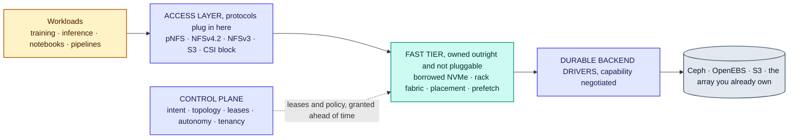
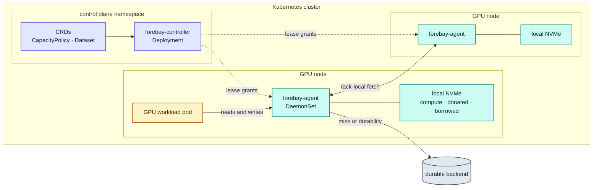
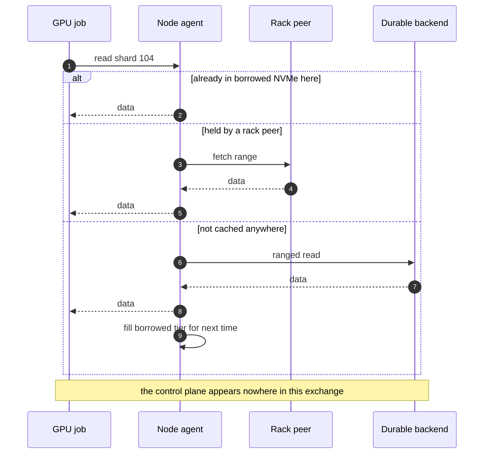
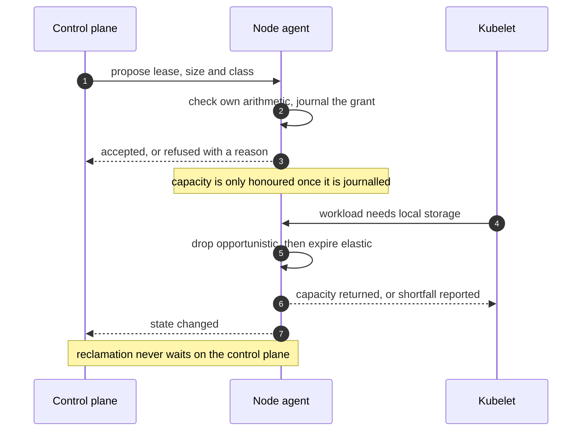
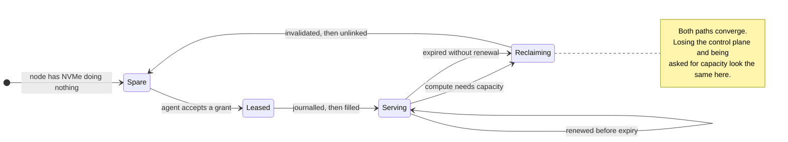
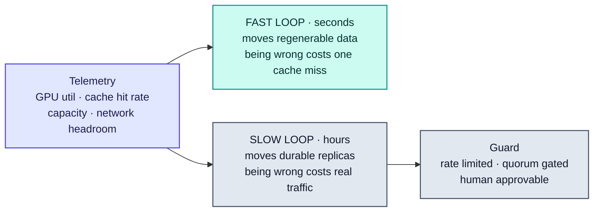

# High-level design

This is the design in full. [RFC-0002](rfcs/0002-architecture-overview.md) is the normative version
and each component has its own RFC, listed in the [index](rfcs/README.md). Where this page and an RFC
disagree, the RFC is right.

Nothing here is shipped. See [ROADMAP.md](../ROADMAP.md) for what exists.

## 1 · Context

A GPU cluster holds two expensive things: accelerators, and the NVMe attached to the nodes they live
in. The accelerators are scheduled carefully. The NVMe usually is not, so a node between jobs, or one
running a small working set, leaves fast media idle while the same cluster reads its training data
across the network from a central system serving every node at once.

Forebay is a control plane that borrows that idle capacity, serves it as a rack-aware tier, and hands
it back the instant the workload wants it. Durable data stays in whatever backend the operator
already runs.

| Actor | Uses Forebay for |
| --- | --- |
| Training and inference jobs | Reading datasets, writing checkpoints and scratch |
| Platform operators | Declaring capacity policy, quotas and durability intent |
| The compute scheduler | Reclaiming node capacity, and placement hints in the other direction |
| Existing storage | Remaining the durable system of record, unchanged |

## 2 · System overview

Pluggable at the edges, owned in the middle. Protocols plug in above, durable backends below, and the
fast tier between them is the only layer Forebay implements itself. A system pluggable everywhere can
express only what its backends have in common and act only through knobs they expose, which makes
autonomous optimisation impossible; owning exactly one layer is what stops this becoming an
orchestrator for other people's storage.

The control plane appears on no vertical edge. It grants leases and sets policy ahead of time, out of
band.

## 3 · Components

| Component | Responsibility | Runs as | RFC |
| --- | --- | --- | --- |
| Control plane | API, tenancy, intent, topology, lease grants, dataset metadata, autonomy | Deployment | [0002](rfcs/0002-architecture-overview.md), [0009](rfcs/0009-intent-and-policy-model.md), [0010](rfcs/0010-autonomy-engine.md) |
| Node agent | Device and topology discovery, pool accounting, lease enforcement, serving the fast tier | DaemonSet | [0004](rfcs/0004-node-agent.md) |
| Access layer | Protocol termination, pNFS layouts and recall | With the agent | [0008](rfcs/0008-access-layer-pnfs.md) |
| Backend drivers | Durable storage behind a capability-negotiated contract | In the control plane | [0006](rfcs/0006-durable-backend-driver-contract.md) |
| CSI driver | Volumes and ephemeral volumes | DaemonSet plus controller | [0014](rfcs/0014-kubernetes-integration.md) |

## 4 · Deployment view

The agent is the only Forebay component on the node, and the only one in the data path. A control
plane outage stops new grants and leaves reads and reclamation working.

## 5 · Capacity model

Every node's NVMe divides three ways. The division is bytes, not devices.

| Pool | Sized by | Holds | Returned |
| --- | --- | --- | --- |
| Compute | Whatever the node has not given away | Whatever the workload writes | Never held by Forebay |
| Donated | Operator configuration | Durable data, through a backend driver | Never |
| Borrowed | Outstanding leases | Regenerable data only | On reclamation, by deletion |

Borrowed capacity never holds anything whose loss matters, so reclaiming it is a delete rather than a
migration. That single rule is why elasticity is safe, and it is deliberately load bearing.

**The node agent is the authority on its own capacity.** The control plane proposes a grant; the
agent accepts it only if its own arithmetic says the capacity exists. Two control planes cannot
overcommit a node because neither is doing the arithmetic, a stale control-plane view causes a
rejected grant rather than an overallocation, and reclamation never needs to reach the control plane.

## 6 · Key flows

### 6.1 Reading

### 6.2 Lending and reclaiming

### 6.3 Lease lifecycle

Renewal needs the control plane. Reclamation does not, so a partition drifts toward giving capacity
back to compute, which is the safe direction to fail in.

## 7 · Autonomy

Actuation is split by the cost of being wrong.

Almost all visible intelligence lives where a wrong decision costs a cache miss and is corrected on
the next pass. That asymmetry is what makes autonomy something an operator leaves switched on.

## 8 · Data handling

**A byte is written once.** Clones, versions and protocol views are references. Data already in a
backend is registered in place rather than rewritten. The fast tier is the one permitted duplicate,
and only because it is regenerable and abandonable. See [RFC-0020](rfcs/0020-no-copy-policy.md).

**One copy, several views.** A published dataset version is immutable, which is what lets file and
object readers share extents without a consistency problem. Block shares the control plane, namespace
and snapshots but not the representation, because a block volume has no objects inside it to serve.
See [RFC-0021](rfcs/0021-single-copy-multi-protocol.md).

## 9 · Failure model

| Failure | Effect | Why |
| --- | --- | --- |
| Node lost | Cache miss | Borrowed contents are regenerable; donated contents are the backend's problem |
| Control plane lost | No new grants, reads and reclamation unaffected | It is not in the IO path, and leases expire toward returning capacity |
| Agent restarts | Leases recovered from the journal | Journalled before honoured, reconciled on replay |
| Journal unreadable | Borrowed pool discarded, node starts empty | Everything it described was regenerable |
| Rack lost | Larger cache miss, durability unaffected | Durable placement spans failure domains |
| Node slow rather than dead | The dangerous case | The miss path never triggers, so detection must be latency based |
| Split brain | Cannot overcommit a node | The agent, not the control plane, does the arithmetic |

Detail in [RFC-0015](rfcs/0015-failure-model.md).

## 10 · Cross-cutting

**Tenancy and security.** The agent is privileged and holds capacity that passes between tenants, so
reclaimed capacity must carry nothing into its next holder. A denial of service against the compute
workload counts as a security problem, because compute always winning is a promise.
See [RFC-0016](rfcs/0016-multi-tenancy-qos-and-security.md).

**Observability.** The unit of management is GB per second per GPU and accelerator time lost waiting
on storage, not IOPS. Autonomy without measurement is guessing with extra steps.
See [RFC-0017](rfcs/0017-observability.md) and [RFC-0024](rfcs/0024-efficiency-accounting.md).

## 11 · What is unresolved

Three things could still change this design substantially.

Whether locality pays at all on target hardware, which [RFC-0001](rfcs/0001-thesis-scope-and-non-goals.md)
treats as the central risk and [RFC-0018](rfcs/0018-benchmark-and-falsification-suite.md) exists to
settle. A spike established that pNFS revocation does not depend on the client cooperating and that
reclaim by unlink takes milliseconds, so the deadline is not set by the filesystem; end-to-end
revocation latency under load is still unmeasured.

Whether the rack-local tier earns its place, or whether a node should go straight to a fanned-out
backend on a local miss. That is the same crossover question, asked one hop further out.

Whether the access layer should be loosely or tightly coupled, which decides whether revocation
fences one client or every reader of an extent.

## 12 · Reading order

[RFC-0001](rfcs/0001-thesis-scope-and-non-goals.md) for what is claimed and what would disprove it,
then [RFC-0002](rfcs/0002-architecture-overview.md) for the structure,
[RFC-0005](rfcs/0005-capacity-pools-and-elastic-leases.md) for the lease model that carries the first
claim, and [RFC-0020](rfcs/0020-no-copy-policy.md) with
[RFC-0021](rfcs/0021-single-copy-multi-protocol.md) for how one copy is served several ways. The
[index](rfcs/README.md) lists everything else.
