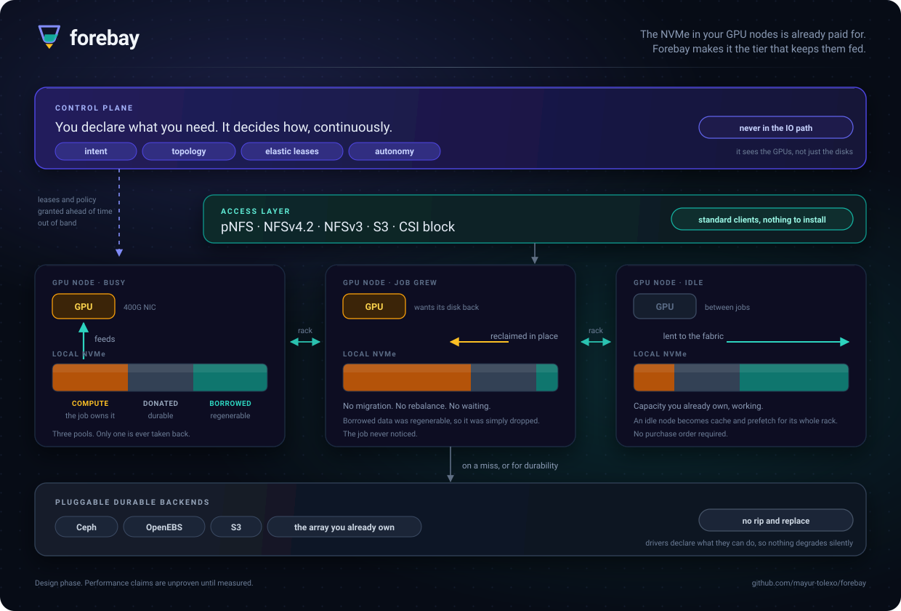
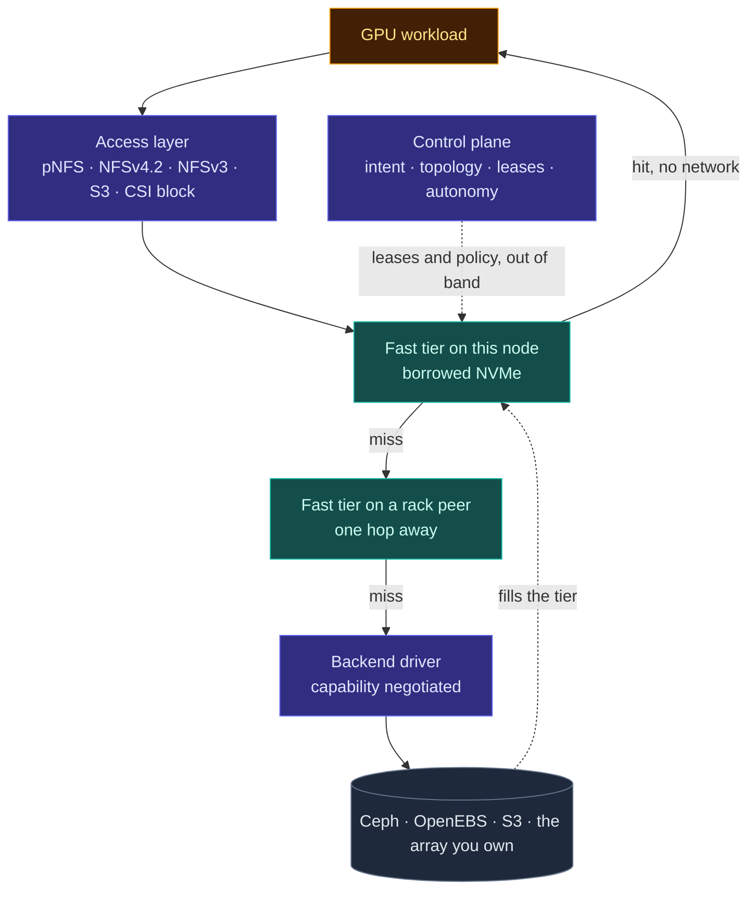
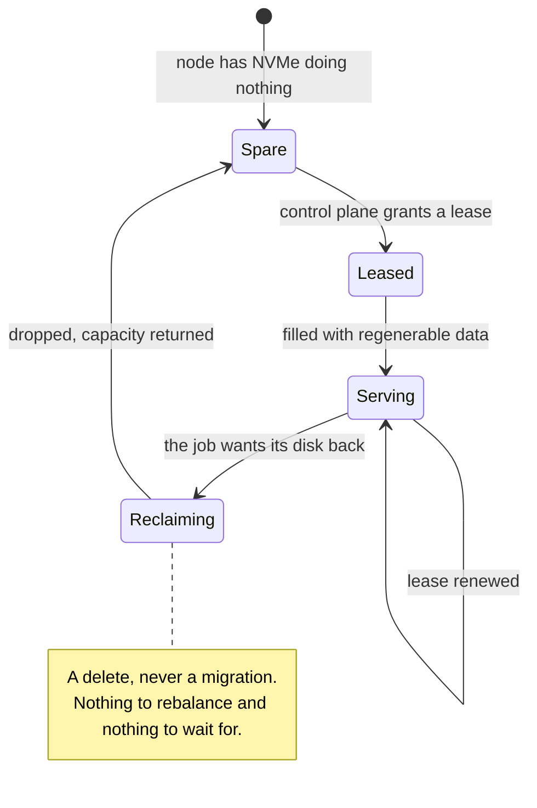
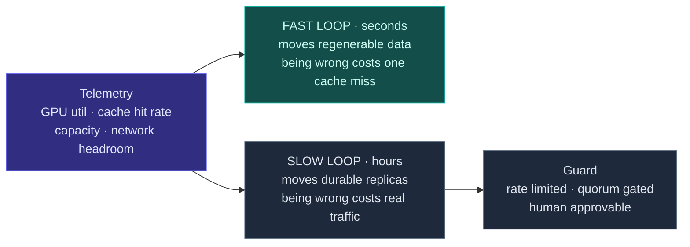

# Architecture

This is the narrative version. The normative version is
[RFC-0002](rfcs/0002-architecture-overview.md), and where the two disagree, the RFC is right.

## The shape in one paragraph

A control plane observes compute and storage together and decides how much of each node's NVMe the
storage fabric may hold. Node agents enforce that decision, serve a fast tier out of borrowed
capacity, and hand capacity back the instant the compute job wants it. Durable data lives in whatever
backend the operator already runs. Clients reach the fast tier over pNFS, which puts the control
plane out of the data path as a property of the protocol rather than as a rule the project has to
keep.

## Why it is built this way

**Pluggable at the edges, opinionated in the middle.** Protocols plug in above, durable backends plug
in below, and the fast tier in between is owned outright. A system that is pluggable everywhere can
only express what its backends have in common and can only act through knobs they expose, which makes
autonomous optimisation impossible. Owning exactly one layer is what stops the control plane from
becoming an orchestrator for other people's storage.

**Three pools, one rule.** Compute capacity is never touched. Donated capacity is permanent and holds
durable data. Borrowed capacity holds only regenerable data, which is what makes reclaiming it a
delete rather than a migration. That single rule is why elasticity is safe, and it is deliberately
load bearing: relaxing it later would change the reclamation contract, the failure model and the
lease design at the same time.

**A byte is written once.** Clones, versions and protocol views are references, not copies. Data
already in a backend is registered in place rather than rewritten. The fast tier is the one permitted
duplicate, and only because it is regenerable and can be abandoned mid-fill. See
[RFC-0020](rfcs/0020-no-copy-policy.md).

**One copy, several views.** A published dataset version is immutable, which is what lets file and
object readers share extents without a consistency problem. Block shares the control plane, namespace
and snapshots, but not the representation, because a block volume has no objects inside it to serve.
See [RFC-0021](rfcs/0021-single-copy-multi-protocol.md).

**Two loops on different clocks.** A fast loop moves regenerable data every few seconds where a
mistake costs one cache miss. A slow loop adjusts durable placement over hours where a mistake costs
real traffic, and is guarded accordingly. Putting almost all the intelligence where being wrong is
cheap is what makes autonomy something an operator will leave switched on.

**No client, no durable store.** Both are enormous ongoing costs and both already exist. The
in-kernel Linux pNFS client is the client. Ceph, OpenEBS and S3 are the durable stores.

## What is unresolved

Three things could still change this design substantially.

The first is whether locality pays at all on target hardware, which
[RFC-0001](rfcs/0001-thesis-scope-and-non-goals.md) treats as the project's central risk and
[RFC-0018](rfcs/0018-benchmark-and-falsification-suite.md) is meant to settle.

The second is whether pNFS layout recall behaves acceptably when a lease is reclaimed underneath an
active reader. If it does not, the access layer needs rethinking, and the constraint against writing
a client makes that rethink genuinely difficult.

The third is whether the rack-local tier earns its place, or whether a node should simply go to a
fanned-out backend on a local miss. That is the same crossover question as the first, asked one hop
further out.

## Reading order

Start with [RFC-0001](rfcs/0001-thesis-scope-and-non-goals.md) for what is being claimed and what
would disprove it, then [RFC-0002](rfcs/0002-architecture-overview.md) for the structure,
[RFC-0020](rfcs/0020-no-copy-policy.md) for the copy doctrine and
[RFC-0021](rfcs/0021-single-copy-multi-protocol.md) for how one copy is served several ways. The
[index](rfcs/README.md) lists everything else.
