# The platform surface

Forebay is a full storage control plane, not a cache with ambitions. This page lays out the whole
surface and compares it honestly against a mature array platform.

The normative source for any single capability is its RFC. Status for every line is in
[ROADMAP.md](../ROADMAP.md).

Forebay is a full storage control plane. Block, file and object access; snapshots, clones,
replication, encryption and QoS; multi-tenancy, quotas and audit; capacity planning and
non-disruptive operations. The kind of surface a team expects from a mature storage platform, built
open and running on hardware you already own.

  

### Parity: what any serious storage platform must have

None of this is novel and all of it is required. A platform without these does not get trusted with
anything that matters, however clever the rest of it is.

The right-hand column says how far along each row is, on this page's own scale rather than the RFC
lifecycle: **Built** means code exists and has run, **Specified** means a design document is written,
and **Planned** means an RFC is numbered and stubbed. Nothing here is production-hardened.

| | A mature array platform | Forebay |
| --- | --- | --- |
| Snapshots and instant clones | Yes, mature | Planned · [0012](rfcs/0012-dataset-object-model.md) |
| Replication and disaster recovery | Yes, mature | Specified · [0006](rfcs/0006-durable-backend-driver-contract.md) |
| Thin provisioning and compression | Yes, mature | Specified · [0006](rfcs/0006-durable-backend-driver-contract.md). Compression is delegated to the backend rather than applied on ingest, see [0020](rfcs/0020-no-copy-policy.md) |
| Encryption at rest and in flight | Yes, mature | Planned · [0016](rfcs/0016-multi-tenancy-qos-and-security.md) |
| QoS, quotas, multi-tenancy, RBAC | Yes, mature | Planned · [0016](rfcs/0016-multi-tenancy-qos-and-security.md) |
| Audit and capacity reporting | Yes, mature | Planned · [0017](rfcs/0017-observability.md) |
| Non-disruptive upgrade | Yes, mature | Planned · [0019](rfcs/0019-upgrades-and-operations.md) |
| File, object and block access | Yes, mature | Specified · [0021](rfcs/0021-single-copy-multi-protocol.md) |

**We are years behind on this column and say so.** Thirty years of data services, certifications and
field-hardening is not something a young project matches by wanting to, and any roadmap claiming
otherwise is selling something. Parity here is the price of admission, not the pitch.

### Beyond: what an array structurally cannot do

This is the pitch. Every row below requires seeing the compute, and an array cannot see the compute —
not because its vendor lacks skill, but because the GPUs are on the other side of a cable it does not
terminate.

| | A mature array platform | Forebay |
| --- | --- | --- |
| Capacity that appears from idle compute nodes and returns itself | No. It sells you the array | Built · [0005](rfcs/0005-capacity-pools-and-elastic-leases.md). The agent lends real preallocated extents and takes them back when a workload eats the free space, on a GPU node, and reads are served from that capacity. An NFS client has read through it once, against a patched server |
| Placement that follows the accelerator, by GPU, NUMA and PCIe topology | No. It sees its own media only | Built · [0003](rfcs/0003-topology-model.md), for the discovery half. Nothing places by it yet |
| Telling the scheduler where the data already is | No. It has no scheduler to talk to | Planned · [0022](rfcs/0022-data-aware-scheduling.md) |
| Pre-filling a rack before the pod is admitted | No | Planned · [0022](rfcs/0022-data-aware-scheduling.md) |
| GB/s per GPU and GPU hours lost to storage, as the unit of management | No. It reports IOPS | Planned · [0024](rfcs/0024-efficiency-accounting.md) |
| Prefetch driven by dataset manifests and dataloader hints | No | Planned · [0011](rfcs/0011-prefetch-and-dataset-manifests.md) |
| Checkpoint fast-ack with a stated durability policy | Partially, generically | Planned · [0013](rfcs/0013-checkpoint-path.md) |
| Datasets, versions and experiments instead of volumes and LUNs | No | Planned · [0012](rfcs/0012-dataset-object-model.md) |
| Runs on the storage you already bought, from any vendor | No, by design | Partly built · [0006](rfcs/0006-durable-backend-driver-contract.md). The contract exists and refuses anything a driver did not declare, and the conformance suite is importable so a third party can prove a driver for a store this project has never seen. No Ceph or S3 driver is written |
| Open source, no licence per terabyte | No | Apache 2.0 |

The honest summary: **a mature array is better than Forebay at being an array, and will be for a long
time.** Forebay is aiming at something an array cannot be, which is a control plane that watches the
accelerators and the storage at once and moves capacity between them while the cluster runs.

