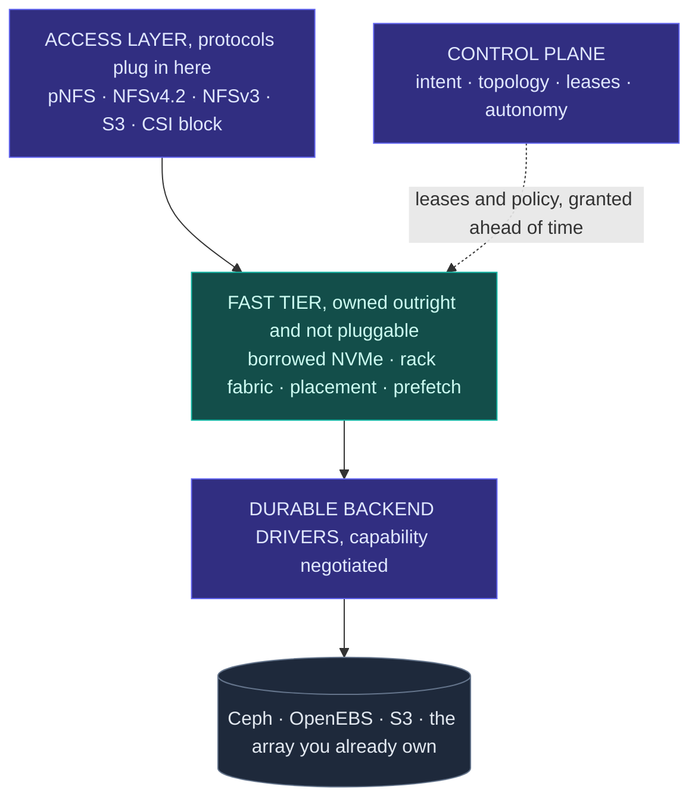
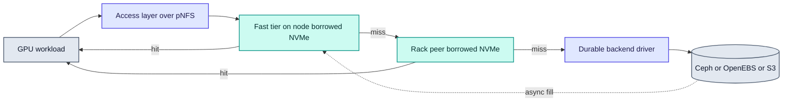

# RFC-0002: Architecture overview

| | |
| --- | --- |
| **Status** | Draft |
| **Phase** | 0 |
| **Depends on** | 0001 |

## Problem

RFC-0001 argues that the boundary between compute and storage should be a running decision rather
than a provisioning choice. This RFC describes the shape of a system that can make that decision,
and fixes the vocabulary the rest of the RFCs use.

It is an overview. Every component named here gets its own RFC, and where this document and a later
one disagree, the later one is right.

## Design

Pluggable at the edges, owned in the middle. The control plane touches none of the vertical path.

### Two seams and one owned middle

Forebay is pluggable at the edges and opinionated in the middle. That division is the single most
important structural decision in the project.

**Above** is the access layer: the protocols clients speak. pNFS first, with NFSv3, S3 and CSI block
as the obvious additions.

**Below** are durable backend drivers: Ceph, OpenEBS, S3, or an array that is already paid for.

**In between** is the fast tier, which Forebay owns outright and does not make pluggable. It is the
borrowed NVMe, the rack-local fetch path, the placement decisions and the prefetch machinery.

The reason the middle is not pluggable is that it is the only part that is differentiated. A system
that is pluggable everywhere can only express the lowest common denominator of its backends and can
only act through knobs those backends expose, which makes autonomous optimisation impossible by
construction. Owning one layer is what keeps the control plane from degenerating into an
orchestrator for other people's storage.

### Backends declare capabilities

The driver contract is not a lowest common denominator. Each driver declares what it can do:
snapshots, clones, thin provisioning, replication, topology hints, ranged reads. The control plane
uses what a backend offers and refuses an intent a backend cannot satisfy, rather than silently
substituting something weaker.

Refusing loudly is the point. Silent degradation in a storage system is how data ends up less
durable than its owner believes it to be. RFC-0006 specifies the contract.

### Three pools per node

Every node's NVMe is divided into three pools with different owners and different rules.

| Pool | Owned by | Holds | Reclaimed by |
| --- | --- | --- | --- |
| Compute | The job on the node | Anything the job wants | Never touched |
| Donated | Forebay, permanently | Durable data via a backend driver | Never reclaimed |
| Borrowed | Forebay, revocably | Regenerable data only | Dropping it |

The rule that makes elasticity safe is the last row. Borrowed capacity never holds anything whose
loss matters, so reclaiming it is a delete rather than a migration: no rebalance, no waiting, no
negotiation with the job that needs its disk back.

The cost of that rule is that borrowed capacity can never be the durable pool. Durability comes from
the donated slice and from the backends, which is why Forebay's array-replacement story rests on
donated capacity while its elasticity story rests on borrowed capacity. Conflating the two is the
mistake this split exists to prevent. RFC-0005 specifies lease classes and the reclamation contract.

### The read path

The control plane appears nowhere on that path. It grants leases and sets policy ahead of time, out
of band.

With pNFS this stops being a discipline the project has to maintain and becomes a property of the
protocol. pNFS separates a metadata server from data servers: a client asks for a layout, then reads
bulk data directly and in parallel from the data servers. The control plane is the metadata server.
Node agents are data servers. The architecture Forebay wants is the architecture the protocol
already specifies, and a mature in-kernel client for it ships with Linux.

Whether layout recall behaves acceptably when a lease is reclaimed mid-read is the largest open
question in this design. RFC-0008 has to answer it before the access layer is settled.

### Two control loops on different clocks

Autonomy is split by the cost of being wrong.

| | Fast loop | Slow loop |
| --- | --- | --- |
| Period | Seconds | Hours |
| Actuator | Borrowed tier | Durable placement via backend |
| Moves | Regenerable data | Durable replicas |
| Cost of a mistake | One cache miss | Rebalance traffic |
| Guard | None needed | Rate limited, quorum gated, approvable |

Almost all visible intelligence lives in the fast loop, where a wrong decision costs a cache miss
and is corrected on the next pass. That asymmetry is what makes autonomy shippable rather than
alarming: an operator can leave the fast loop on because it cannot do lasting damage, and the slow
loop is rare enough to be supervised. RFC-0010 specifies both.

### Components

| Component | Responsibility | RFC |
| --- | --- | --- |
| Control plane | API, tenancy, intent, topology, leases, dataset metadata, autonomy | 0002, 0009, 0010 |
| Node agent | Device and topology discovery, pool management, lease enforcement, serving the fast tier | 0004 |
| Fast tier | Cache, prefetch, scratch, checkpoint staging, rack-local peer fetch | 0007 |
| Access layer | Protocol termination, pNFS layouts | 0008 |
| Backend drivers | Durable storage behind a capability-negotiated contract | 0006 |
| Kubernetes integration | CRDs, operator, CSI | 0014 |

## Alternatives considered

| Alternative | Trade-off | Why not |
| --- | --- | --- |
| Control plane drives Ceph directly, no owned tier | Smallest system, fastest to something real | Autonomy is limited to Ceph's knobs, and its actuator is a slow rebalance. It also puts Ceph in the hot read path, which RFC-0001 rules out |
| Full driver abstraction from the start, several backends at once | Most flexible, most faithful to a pluggable data plane | An abstraction designed before two real implementations exist is reliably the wrong abstraction, and nothing works end to end for far longer |
| Pluggable fast tier as well | Maximum flexibility, adopters could bring their own cache | Removes the only differentiated component. The control plane would have nothing it could actually optimise |
| No access layer, a custom client instead | Complete control of the data path | Shipping a client across kernels and distributions is the cost that sinks storage projects, and pNFS already specifies this architecture |

## Failure modes

Detailed treatment is RFC-0015. The shape of the problem at this level:

- **Node loss.** Borrowed contents are regenerable, so the loss is a cache miss. Donated contents are
  the backend's problem, and Ceph already solves it.
- **Control plane loss.** No effect on the read path, by design. New leases cannot be granted and
  existing ones must have defined behaviour on expiry, which is the interesting case rather than the
  outage itself.
- **Split brain.** Two control planes granting conflicting leases is the dangerous failure. Leases
  must be safe under partition, which constrains their design more than any performance requirement.
- **Slow node.** A degraded node serving the fast tier is worse than a dead one, because the miss
  path never triggers. Detection has to be latency based, not liveness based.

## Complexity

The fast tier and the lease model are new code and are where the difficulty lives. The access layer
is largely integration work, and its risk is concentrated in whether pNFS behaves under reclamation.
Backend drivers are mostly mechanical.

The lasting constraint this architecture imposes is the regenerable-only rule on borrowed capacity.
Relaxing it later would mean introducing migration, which would change the reclamation contract, the
failure model and the lease design at once. It is deliberately load bearing.

## Open questions

- pNFS layout recall semantics under lease reclamation, which RFC-0008 must settle.
- Whether rack-local peer fetch beats going straight to a fanned-out backend. This is the same
  crossover question as RFC-0001 and may make the rack tier unnecessary.
- Whether the donated pool should be a backend of its own or simply devices contributed to an
  existing Ceph cluster. The second is far less work and probably correct.
