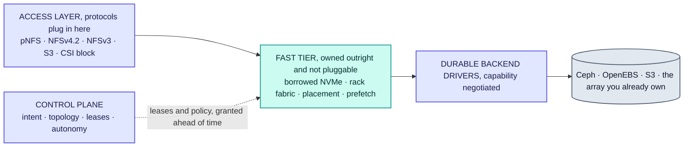
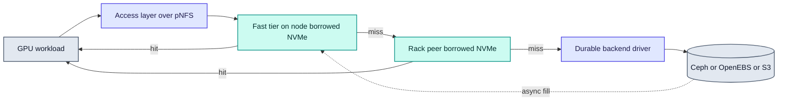

# RFC-0002: Architecture overview

| | |
| --- | --- |
| **Status** | Accepted |
| **Phase** | 0 |
| **Depends on** | 0001 |

## Problem

RFC-0001 argues that the boundary between compute and storage should be a running decision rather
than a provisioning choice. This RFC describes the shape of a system that can make that decision,
and fixes the vocabulary the rest of the RFCs use.

It is an overview. Every component named here gets its own RFC, and where this document and a later
one disagree, the later one is right.

## What of this is built

The architecture is mostly unbuilt, and the parts that exist are the ones nearest the node. Named
here because this document is the overview, so a reader arrives at it first and would otherwise take
the whole picture as description.

| Part of the architecture | State |
| --- | --- |
| The split between what may be lent and what may not, and the arithmetic between them | Built, `internal/pool` |
| The node agent's authority over its own capacity | Built, a grant it cannot honour is refused |
| Lease classes, the reclaim ladder and the journal | Built, `internal/lease` |
| The agent's startup: lock, replay, reconcile, then accept | Built, `internal/agent` |
| The fast tier, and anything that serves data | Built, `internal/fasttier` and `internal/dataserver`, and joined to the agent in one process so a read reaches the tier and misses to the backend. Owned by [RFC-0007](0007-fast-tier-data-path.md) |
| The access layer | **A spike, not the layer.** An FSAL over NFS-Ganesha lets a stock NFS client read bytes that came through Forebay, and advertises the flexible file layout, but nothing serves a layout or revokes one. Owned by [RFC-0008](0008-access-layer-pnfs.md) |
| Backend drivers and capability negotiation | Built, `driver`, with a file and an S3 driver and a conformance suite. An undeclared capability is refused before the driver is reached. Owned by [RFC-0006](0006-durable-backend-driver-contract.md) |
| Both autonomy loops | **Not built.** Owned by [RFC-0010](0010-autonomy-engine.md) |
| Kubernetes integration, and any control plane at all | **Not built**, beyond the agent reading pods from its node's own kubelet to see pressure before it lands. Nothing reconciles a CRD and there is no control plane. Owned by [RFC-0014](0014-kubernetes-integration.md) |
| The copy doctrine and single-copy multi-protocol access | **Not built.** Owned by [RFC-0020](0020-no-copy-policy.md) and [RFC-0021](0021-single-copy-multi-protocol.md) |

## Assumptions

| Assumption | Basis | Risk if wrong |
| --- | --- | --- |
| Owning exactly one layer buys enough leverage to be worth the maintenance | Reasoned | Either we own too little to optimise anything, or too much to be adopted beside existing storage |
| Protocols and backends can plug in without their differences leaking upward | Unverified | The seams become lowest common denominators and the control plane can only express what every backend shares |
| pNFS can serve as the access layer without shipping a client | Partly verified. The flexfiles driver ships in the target node OS and fencing is server-side, see RFC-0008. Behaviour under load is unmeasured | The access layer is redesigned, possibly around a client this project has refused to write |
| A tier holding only regenerable data is large enough to matter | Reasoned, from cache, prefetch, scratch and staging patterns | The borrowed pool is a rounding error and only donated capacity is useful |
| Splitting autonomy by the cost of being wrong makes it safe to leave on | Reasoned | Operators disable the loops, and an autonomous control plane that nobody trusts is a dashboard |

## Design

Pluggable at the edges, owned in the middle. The control plane touches none of the vertical path.

### Two seams and one owned middle

Forebay is pluggable at the edges and opinionated in the middle. That division is the single most
important structural decision in the project.

**Above** is the access layer: the protocols clients speak. pNFS first, with NFSv3, S3 and CSI block
as the obvious additions.

**Below** are durable backend drivers: Ceph, OpenEBS, S3, or an array that is already paid for.

**In between** is the fast tier, which Forebay owns outright and does not make pluggable. It is the
borrowed NVMe, the rack-local fetch path, the placement decisions and the prefetch machinery.

The reason the middle is not pluggable is that it is the only part that is differentiated. A system
that is pluggable everywhere can only express the lowest common denominator of its backends and can
only act through knobs those backends expose, which makes autonomous optimisation impossible by
construction. Owning one layer is what keeps the control plane from degenerating into an
orchestrator for other people's storage.

### Backends declare capabilities

The driver contract is not a lowest common denominator. Each driver declares what it can do:
snapshots, clones, thin provisioning, replication, topology hints, ranged reads. The control plane
uses what a backend offers and refuses an intent a backend cannot satisfy, rather than silently
substituting something weaker.

Refusing loudly is the point. Silent degradation in a storage system is how data ends up less
durable than its owner believes it to be. RFC-0006 specifies the contract.

### What a node may lend, and what it may not

Every node's NVMe divides into what Forebay may lend and what it may not.

| | Owned by | Holds | Reclaimed by |
| --- | --- | --- | --- |
| Reserved | Everyone else | The operating system, images, the job, and any durable data donated to another store | Never touched |
| Borrowed | Forebay, revocably | Regenerable data only | Dropping it |

The rule that makes elasticity safe is the last row. Borrowed capacity never holds anything whose
loss matters, so reclaiming it is a delete rather than a migration: no rebalance, no waiting, no
negotiation with the job that needs its disk back.

The cost of that rule is that borrowed capacity can never be the durable pool. Durability comes from
the donated slice and from the backends, which is why Forebay's array-replacement story rests on
donated capacity while its elasticity story rests on borrowed capacity. Conflating the two is the
mistake this split exists to prevent. RFC-0005 specifies lease classes and the reclamation contract.

### Who decides how much a node lends

The control plane proposes a grant. **The node agent decides whether it is real**, accepting only if
its own arithmetic says the capacity exists.

Putting the authority at the node rather than in the control plane is what makes several otherwise
awkward problems tractable at once. Two control planes cannot overcommit a node, because neither of
them is doing the arithmetic. A stale control-plane view produces a rejected grant rather than an
overallocation. And reclamation never has to reach the control plane, so a partition cannot block it
at the moment it matters most.

The cost is that the control plane's view of fleet capacity is permanently a slightly stale cache,
and capacity reporting has to say so rather than presenting a number as exact. RFC-0005 specifies it.

### The read path

The control plane appears nowhere on that path. It grants leases and sets policy ahead of time, out
of band.

With pNFS this stops being a discipline the project has to maintain and becomes a property of the
protocol. pNFS separates a metadata server from data servers: a client asks for a layout, then reads
bulk data directly and in parallel from the data servers. The control plane is the metadata server.
Node agents are data servers. The architecture Forebay wants is the architecture the protocol
already specifies, and a mature in-kernel client for it ships with Linux.

Whether layout recall behaves acceptably when a lease is reclaimed mid-read is the largest open
question in this design. RFC-0008 has to answer it before the access layer is settled.

### Two control loops on different clocks

Autonomy is split by the cost of being wrong.

| | Fast loop | Slow loop |
| --- | --- | --- |
| Period | Seconds | Hours |
| Actuator | Borrowed tier | Durable placement via backend |
| Moves | Regenerable data | Durable replicas |
| Cost of a mistake | One cache miss | Rebalance traffic |
| Guard | None needed | Rate limited, quorum gated, approvable |

Almost all visible intelligence lives in the fast loop, where a wrong decision costs a cache miss
and is corrected on the next pass. That asymmetry is what makes autonomy shippable rather than
alarming: an operator can leave the fast loop on because it cannot do lasting damage, and the slow
loop is rare enough to be supervised. RFC-0010 specifies both.

### What the architecture does with data

Two rules constrain every component above, and neither is visible from the layer diagram.

**A byte is written once.** Clones, versions and protocol views are references rather than copies,
data already in a backend is registered in place rather than rewritten, and the fast tier is the only
duplicate the design permits, because it is regenerable and can be abandoned mid-fill. See
[RFC-0020](0020-no-copy-policy.md).

**One copy is served several ways.** A published dataset version is immutable, which is what lets
file and object readers share extents with no consistency problem between them. Block shares the
control plane, the namespace and the snapshot machinery but not the representation, because a block
volume is an opaque range with a client's filesystem inside it and has no objects to serve. See
[RFC-0021](0021-single-copy-multi-protocol.md), which supersedes the unified-namespace non-goal in
RFC-0001.

### Components

| Component | Responsibility | RFC |
| --- | --- | --- |
| Control plane | API, tenancy, intent, topology, leases, dataset metadata, autonomy | 0002, 0009, 0010 |
| Node agent | Device and topology discovery, pool accounting and **the authority over it**, lease enforcement, serving the fast tier | 0004, 0005 |
| Fast tier | Cache, prefetch, scratch, checkpoint staging, rack-local peer fetch | 0007 |
| Access layer | Protocol termination, pNFS layouts | 0008 |
| Backend drivers | Durable storage behind a capability-negotiated contract | 0006 |
| Kubernetes integration | CRDs, operator, CSI | 0014 |

## Alternatives considered

| Alternative | Trade-off | Why not |
| --- | --- | --- |
| Control plane drives Ceph directly, no owned tier | Smallest system, fastest to something real | Autonomy is limited to Ceph's knobs, and its actuator is a slow rebalance. It also puts Ceph in the hot read path, which RFC-0001 rules out |
| Full driver abstraction from the start, several backends at once | Most flexible, most faithful to a pluggable data plane | An abstraction designed before two real implementations exist is reliably the wrong abstraction, and nothing works end to end for far longer |
| Pluggable fast tier as well | Maximum flexibility, adopters could bring their own cache | Removes the only differentiated component. The control plane would have nothing it could actually optimise |
| No access layer, a custom client instead | Complete control of the data path | Shipping a client across kernels and distributions is the cost that sinks storage projects, and pNFS already specifies this architecture |

## Failure modes

Detailed treatment is RFC-0015. The shape of the problem at this level:

- **Node loss.** Borrowed contents are regenerable, so the loss is a cache miss. Donated contents are
  the backend's problem, and durable stores have solved node loss for years.
- **Control plane loss.** No effect on the read path, by design. New leases cannot be granted and
  existing ones must have defined behaviour on expiry, which is the interesting case rather than the
  outage itself.
- **Split brain.** Two control planes granting conflicting leases would be the dangerous failure, and
  the design removes it rather than mitigating it: the node does the arithmetic, so neither control
  plane can overcommit a device that neither of them can see.
- **Slow node.** A degraded node serving the fast tier is worse than a dead one, because the miss
  path never triggers. Detection has to be latency based, not liveness based.

## Performance implications

Predicted except where noted, and the architecture makes two structural bets rather than tuning
choices.

Keeping the control plane out of the IO path is not a target that can be missed by a few per cent; it
either is on the path or it is not, and with pNFS the protocol enforces it rather than the project
having to. Reclaiming by deletion rather than migration is the same kind of bet, and the filesystem
half of it is measured: reclaiming through the agent takes 2.8 ms for 7 GiB, rising to 7.4 ms under
concurrent write load, so reclaim latency is set by detecting the need and revoking readers, not by
the disk.

Everything else here is unproven. Whether the fast tier beats a fanned-out backend at all is
RFC-0001's central risk, and whether a rack-local hop beats going straight to the backend is the same
question asked one hop further out.

## Complexity

The fast tier and the lease model are new code and are where the difficulty lives. The access layer
is largely integration work, and its risk is concentrated in whether pNFS behaves under reclamation.
Backend drivers are mostly mechanical.

The lasting constraint this architecture imposes is the regenerable-only rule on borrowed capacity.
Relaxing it later would mean introducing migration, which would change the reclamation contract, the
failure model and the lease design at once. It is deliberately load bearing.

## Security and tenancy

Three properties of this architecture create most of its security surface, and all three are
consequences of the shape rather than of any component.

The node agent sits beside customer workloads and holds capacity that passes from one tenant to the
next, so reclaimed capacity must carry nothing into its next holder. The agent fetches from the
durable backend on a miss, so every node holds credentials that read it, which is a much larger loss
than a cache if a node is compromised. And the control plane holds broad authority over the systems
it manages, so an authorisation gap there has a wider blast radius than its code suggests.

A denial of service against the compute workload counts as a security problem here rather than a
performance one, because compute always winning is a promise the design makes. RFC-0016 owns all of
it.

## Open questions

- End-to-end revocation latency under load. The load-bearing half of this is settled: flexfiles
  fencing is server-side and does not depend on the client cooperating, so reclamation never waits
  out an NFS lease period. What is unmeasured is how long revocation actually takes against a running
  metadata server, which RFC-0008 owns and RFC-0018 has to measure.
- Whether to couple the metadata server and the data servers loosely or tightly, which decides
  whether revocation fences one client or every reader of an extent. RFC-0008 owns it.
- Whether rack-local peer fetch beats going straight to a fanned-out backend, which may make the
  rack tier unnecessary. This is RFC-0001's crossover question asked one hop further out, and it is
  owned by [RFC-0018](0018-benchmark-and-falsification-suite.md) along with the original.
- Whether the donated pool should be a backend of its own or simply devices contributed to a durable
  store that is already running. The second is far less work and probably correct. Owned by
  [RFC-0006](0006-durable-backend-driver-contract.md), which already carries the question.
