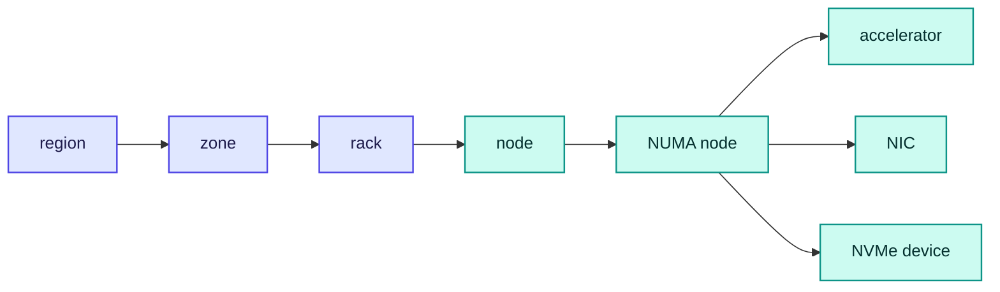

# RFC-0003: Topology model

| | |
| --- | --- |
| **Status** | Accepted |
| **Phase** | 1 |
| **Depends on** | 0002 |

## Problem

Forebay places data by proximity to the accelerator that will read it, so it has to know what the
hardware looks like: which nodes share a rack, which NVMe device sits behind the same PCIe root
complex as which GPU, which NUMA node a NIC is attached to, and what the fabric between two nodes can
do.

Some of that is discoverable. Some is discoverable only sometimes. Some is a label a person typed,
and is wrong more often than anyone admits. A placement engine that treats all three as equally true
will confidently make things worse, so this document is mostly about representing what is not known.

### What a real node actually reports

Probed first on a dev node without accelerators, 2026-09-01, Ubuntu 24.04, kernel 6.8. This is what
the model gets when it asks a machine that cannot answer. The same probe was then repeated on a real
GPU node, below.

| Asked for | Answer |
| --- | --- |
| NUMA nodes | One, `possible=0` |
| PCI device NUMA affinity | `numa_node` reads **-1** on every device, meaning not applicable rather than not populated |
| NIC link speed | `speed` reads **-1** on the physical interface, and the virtual ones have no `device/numa_node` at all |
| RDMA | No `infiniband` class, so none |
| A GPU, by PCI class | Found `0000:00:02.0`, which is the VM's **virtual display adapter** |
| Rack, row or zone labels | None on the node |

### The same questions on real GPU hardware

Repeated on a node with two NVIDIA RTX 5090s, 2026-09-01, from the same unprivileged pod.

| Asked for | Answer |
| --- | --- |
| Accelerators, by PCI class | Two devices at `0000:01:00.0` and `0000:04:00.0`, class **`0x030000`** |
| Their vendor and device | `0x10de` and `0x2b85`, which is what identifies them |
| PCI device NUMA affinity | `numa_node` reads **-1**, as on the virtual node |
| NUMA nodes | One |
| NVMe | Present, `nvme0n1` of roughly 1.86 TiB, which is the capacity this project exists to borrow |
| NIC link speed | **10000**, readable here where the virtual node reported -1 |
| RDMA | No `infiniband` class, so none |

**The class match result is the important one.** A real RTX 5090 reports class `0x030000`, and so did
the virtual display adapter on the other node. They are indistinguishable by class, which is direct
evidence from both sides for the rule below: identification needs a positive signal, and vendor plus
device is the signal that separates them. Had only the virtual node been probed, the rule would have
rested on one example and an argument.

Two other things changed and one did not. NIC speed is readable on real hardware and was not on the
virtual node, so that fact is sometimes available rather than never. NVMe is present and large.
NUMA affinity is still -1, on a desktop-class single-socket board where it genuinely does not apply,
so the unavailability this document is built around is not an artefact of virtualisation.

**How much privilege that took.** The first probe used a privileged debug container that had entered
the host filesystem, which proves the files exist and are readable by root and nothing more. Repeated
from an ordinary pod running as uid 65534, non-root, with every capability dropped, a read-only root
filesystem and **no hostPath mount at all**, every one of those reads still worked: PCI devices
listed, `class` and `numa_node` read, NUMA topology read, block devices listed, and the absence of
the `infiniband` class correctly observed.

That matters beyond this document. RFC-0004 grants the agent read-only mounts of `/sys` and `/proc`
for discovery, and on this kernel it does not appear to need them, because a container is given
`/sys` from the host already. The agent may be able to discover topology with no host mounts
whatsoever, which is a smaller privilege surface than that RFC currently asks for.

Three of those are answers: the node has one NUMA node, it definitively has no RDMA, and it
definitively carries no topology labels, the last being the expected input for a declared fact rather
than a discovery failure. Two are unknown, and one is a false positive.

The ratio is not the point, though, and stating it as five of six would have been inflating a finding
that is strong without help. The point is **which** facts were unavailable: NUMA affinity and link
speed are precisely what placement by proximity depends on, and both came back as `-1`. A design that
treats those as normally available has the common case backwards.

## What of this is built

`internal/topology` implements the model and the discovery, and the agent uses it: capacity is read
from the machine unless an operator overrides it. It is read from the filesystem the pools are on,
found through the mount table, rather than summed across every local device: a node with four drives
and pools on one can lend what that one holds.

| Part of the design | State |
| --- | --- |
| Provenance on every fact, with unknown unreadable as a value | Built, `internal/topology` |
| An unknown never satisfying a requirement, in both rack questions | Built |
| Accelerator identification by vendor rather than class | Built |
| NUMA, disks, and RDMA presence discovered from sysfs | Built |
| Rack accepted as a declaration, and only as one | Built |
| Distinguishing local devices from network ones | Built |
| Region, zone and row | **Not built.** Nothing places by them yet |
| Reading the model periodically, or noticing it got poorer | **Not built.** Owned by [RFC-0017](0017-observability.md) |
| Attributing capacity to the filesystem holding the pools | Built. The mount table names the backing device and `statfs` sizes it |
| Reserving that capacity against everything else on the filesystem | Built. What the filesystem already holds for others becomes the compute reserve |
| Noticing that reserve change while the agent runs | **Not built.** It is measured once at startup. Owned by [RFC-0017](0017-observability.md) |

The device under a pool is usually a partition, not a whole namespace, and the first version of the
locality rule matched only whole namespaces. It read a real local NVMe partition as unknown and
refused to lend it, which the model got right in principle and wrong on the machine.

Knowing which filesystem holds the pools is not the same as knowing what may be lent from it. The
filesystem's size is not the agent's to offer: on the GPU node the disk is 1.83 TiB and 559 GiB of
it was already held by the operating system, container images and other workloads. An agent that
lends the total offers half a terabyte that does not exist, and filling it fills the node's root
filesystem, which takes the kubelet and every pod down with it. So what the filesystem can deliver is what
is free on it plus what Forebay already holds there, and everything above that becomes the compute
reserve. Forebay's own bytes are added back because that space is ours to hand out again: free
space alone would shrink the ceiling by everything currently lent, and a node would forget a little
more of its own capacity on every restart.

That ceiling holds however capacity arrived. An operator who declares one with `--capacity-bytes`
is checked against the same figure, because the refusal that sends them to that flag is the one
about unprovable locality, and a guard that switched itself off when an operator took our own
advice would be worse than no guard.

Deployed across the dev fleet as a DaemonSet, only the node with local NVMe started. Every other
node found no capacity it could prove was local and refused, which is the designed outcome rather
than a failure: a machine whose only storage might be an iSCSI LUN or a Ceph volume has nothing this
project is willing to lend.

Running it on real hardware corrected the design four times, which fixtures alone would not have. The node
carried an attached Ceph RBD device alongside its NVMe, and counting it offered ninety gigabytes of
somebody else's networked storage as compute-local capacity, which is the one thing this project is
not. Locality is now a fact like any other: known local, known remote, or unknown, and only known
local counts. A SCSI disk stays unknown, because an iSCSI LUN presents as an ordinary one and sysfs
does not distinguish them.

The same run listed sixteen unused network block devices of zero size, burying the disk that mattered
under noise. A device of known zero size holds nothing lendable and is skipped, while one whose size
could not be read is still reported, since unknown is not zero.

The third correction came from reviewing the classifier rather than running it, and is the sharpest.
Locality was decided from the device name, which is wrong twice over. An NVMe over fabrics namespace
is called `nvme0n1` exactly as a local drive is, and this project plans to use NVMe over fabrics, so
the name would have offered a network as local capacity in precisely the deployment it targets. The
kernel answers in `/sys/class/nvme/nvmeN/transport`, which reads `pcie` locally and `tcp` or `rdma`
over a fabric. A virtio disk has the same problem in reverse: local from inside the guest and
routinely backed by network storage the guest cannot see, so it is unknown rather than local.

A fourth correction is the one that would have cost the most. Capacity summed every local device
without asking whether any of them were built from the others, so a node with its NVMe drives in a
RAID would have reported the array and its members and lent twice the storage that exists. That is a
common arrangement on GPU nodes. A device assembled from other devices is skipped in favour of the
devices underneath it, which are what physically hold bytes, and sysfs names them in the slaves
directory.

The accelerator rule had drifted the same way. This document requires a vendor **and** device
identifier naming real compute hardware, and the implementation matched on vendor alone, which would
have identified an Intel integrated display adapter as an accelerator, since `0x8086` covers both
that and an Intel datacentre card. A bound compute driver is the second half of the signal, and the
fixtures now carry both an integrated adapter and a datacentre card that differ only in it.

## Assumptions

| Assumption | Basis | Risk if wrong |
| --- | --- | --- |
| Device, NUMA and PCIe facts can be read from `/sys` without extra privilege | **Measured**, from an unprivileged pod, as recorded above under how much privilege that took. The first probe did not show this and was corrected | The agent needs privilege this project is trying not to take, see RFC-0004 |
| NUMA and PCIe affinity are frequently unavailable rather than occasionally | **Measured**, every PCI device reported -1 on the probed node | Nothing: the design assumes this and would only get better |
| Rack membership cannot be discovered and must be declared | **Measured**, no topology labels existed, and no mechanism exists to derive one | Placement has no failure-domain information at all, which it must then say rather than assume |
| Identifying accelerators needs more than a PCI class match | **Measured on both sides.** A class match found a virtual display adapter on one node, and two real RTX 5090s report the identical class on another | Forebay places data near a device that cannot compute |
| Operators will label racks if asked | Unverified | Rack-aware placement degrades to node-local and nothing else |

## Design

### The model is small on purpose

The temptation is to model everything a datacentre has. The model instead holds only what a placement
decision can act on, because a fact nothing consumes is a fact nobody maintains.

The colours are the important part. Everything above the node is **declared** by an operator and
cannot be discovered. Everything at or below it is **discovered** by the agent and cannot be
trusted to a person's memory. Row is deliberately absent: nothing in the design places by row today,
and it can be added when something does.

### Every fact carries where it came from

A fact is a value plus its provenance, and provenance decides what may be done with it.

| Provenance | Source | Trusted for |
| --- | --- | --- |
| `discovered` | The agent reading `/sys` on the node itself | Anything. It is the machine describing itself |
| `declared` | Operator configuration or a node label | Failure domains, which cannot be discovered at all |
| `unknown` | Asked and not answered, including `-1` | Nothing. It is not a value |

The third row is why this exists. A kernel returning `-1` for NUMA affinity is not saying zero, and
code that reads it as a number will place data as if every device shared one NUMA node.

### An unknown is resolved against whoever is asking

This is the rule the rest of the design hangs on, and it is not "assume the worst" in a single
direction, because the worst differs per question.

| Question | If the answer is unknown | Because |
| --- | --- | --- |
| Are these two nodes in the same rack? **Locality** | Answer no | Treating unknown as near would place data far away and call it close |
| Are these two nodes in different racks? **Durability** | Answer no | Treating unknown as separate would put both replicas in one failure domain |

Both answers are no, which looks contradictory and is not: **an unknown never satisfies a
requirement**, whichever requirement is being asked. It cannot be used to claim closeness and it
cannot be used to claim separation. The consequence has two halves and they behave differently.

Placement **degrades**: a fleet with no rack labels gets node-local placement, because nothing can be
shown to be near anything else. That is a worse cache, not a broken one.

Durability **refuses**: a dataset declaring rack-level durability on a fleet that cannot answer which
rack a node is in is unsatisfiable, and must be refused rather than quietly downgraded. Silently
storing two replicas that only look separated is the failure this whole rule exists to prevent, so it
must not be reachable by omission.

That is the same principle RFC-0006 and RFC-0009 already apply, and a different cause. Both of those
documents refuse an intent when no **backend** can satisfy it. This one is unsatisfiable regardless
of backend: a perfectly capable durable store still cannot place replicas in separate racks when
nobody knows which rack anything is in. RFC-0009 owns intent resolution and now carries the case.

The difference is that a missed cache is recoverable and a durability promise that was never true is
not. RFC-0017 has to make both visible, rather than letting a fleet with no labels look like a fleet
that is fine.

### Identifying an accelerator

Matching PCI class alone finds virtual display adapters, as the probe demonstrates. Identification
therefore requires a positive signal rather than the absence of a negative one: a vendor and device
identifier that names real compute hardware, or a device node that a driver has created, or the
accelerator being advertised to Kubernetes as a resource. A candidate that only matches the class is
recorded as `unknown`, not as an accelerator.

Being wrong here is worse than being uninformed, because it moves data towards a device that will
never read it.

### Capability detection

RFC-0026 depends on this document knowing what the fabric can do, and the rule is the same as
everywhere else: capabilities are detected and absence is a supported state, not an error.

**A capability has the same three states as any other fact.** Present, absent, and unknown, where
unknown means the probe could not run rather than that it ran and found nothing.

Capabilities differ from topology in having a real absent. A node with no rack label is not
definitively rack-less, it is unknown, which is why topology has only present or unknown. A kernel
with no `infiniband` class genuinely has no RDMA, so absent is a fact here rather than a gap.

Both negatives lead to the same behaviour: do not use the capability, because using one that might
not be there is worse than not using one that is. What they must not share is the report. A fleet
where detection failed is not a fleet without RDMA, and an operator asking why everything runs over
TCP needs to tell those apart before concluding they need to buy hardware.

| Capability | Present when | Unknown when | Both negatives mean |
| --- | --- | --- | --- |
| RDMA, RoCE, InfiniBand | The kernel's `infiniband` class exists and holds a usable device | `/sys` is unreadable, so the class cannot be checked at all | The transport is TCP, which is correct and slower |
| GPUDirect Storage | Not settled, see below | Not settled either, since the conditions a check fails under cannot be stated before the check is | Data goes through host memory, as it does today |
| NVMe over fabrics | The kernel subsystem is present | `/sys` is unreadable | Block access uses the ordinary path |

**GPUDirect detection is not settled and is listed as open rather than described in a phrase.** Every
other row names something checkable. Saying the vendor stack must be present and functional rather
than merely installed states a requirement without a mechanism: establishing that it works plausibly
means moving data, which is not something to do on every node at startup against a stack that may
need an accelerator allocated first. Whoever implements this from prose alone will either invent a
criterion or report GPUDirect absent everywhere, and both are worse than admitting it is unresolved.

A cluster missing all three is a supported cluster. The alternative, requiring a fabric most
clusters do not have, would exclude nearly everyone in exchange for a benchmark number.

### Topology changes, and decisions made against it do not

Hardware is replaced, nodes are relabelled, and a node can move rack between one boot and the next.
The model therefore carries a generation that increments whenever a node's facts change, and a
placement decision records the generation it was made against.

That does not make old decisions wrong, it makes them **identifiable**. Data placed for a rack the
node has since left is not corrupt, it is merely no longer where the intent asked for, and the slow
loop in RFC-0010 can find it precisely because the generation says so.

### When discovery and a label disagree

The node wins about itself. An operator label claiming a node has four accelerators when the node
reports two is wrong about the node, and no amount of authority changes the hardware.

Above the node the operator wins, because there is nothing to disagree with: a rack label is the only
source there is. The failure mode is not disagreement but confident error, an operator labelling two
nodes into the same rack when they are not, which the model cannot detect and must not pretend to.
RFC-0017 should make rack membership visible enough that a human notices.

## Alternatives considered

| Alternative | Trade-off | Why not |
| --- | --- | --- |
| Model everything a datacentre has, including rows, PDUs and switches | Complete, and ready for placement rules nobody has written | Facts nothing consumes are facts nobody maintains, and a stale model is worse than a small one |
| Treat unknown as a default value, such as NUMA node 0 | Simpler code, no provenance to carry | This is the defect the probe found waiting to happen: `-1` read as a number places everything as though it shared one NUMA node |
| Require operators to declare the full topology | No discovery code, no ambiguity | Nobody will maintain it, and the parts that can be discovered are exactly the parts a person gets wrong |
| Infer racks from network latency between nodes | No labels needed, self-maintaining | Latency is not rack membership, and a wrong inference here is a durability failure rather than a slow read |

## Failure modes

**A label that is confidently wrong.** Two nodes labelled into one rack when they are not, so
replicas that look separated are not. The model cannot detect this, which is stated rather than
mitigated, and it is the strongest argument for making rack membership visible in RFC-0017.

**Discovery regressing after a kernel or driver change.** A fact that was discovered becomes unknown,
and placement quietly degrades. The generation makes the change visible, and a node whose facts got
poorer should be reported rather than silently accepted.

**A false accelerator.** Placement optimises towards a device that will never read the data. The
positive-signal rule exists for this, and it is the reason a class match alone is not enough.

**Everything unknown.** The honest outcome, and it must look like one: node-local placement, no
rack-level durability, and an operator who can see that this is what they have.

## Performance implications

Predicted. Discovery is a handful of reads from `/sys` at startup and on change, which is not on any
hot path. The model is consulted during placement, which is the control plane rather than the IO
path, so its cost is bounded by how often placement runs and not by how much data moves.

The performance question this document actually decides is whether placement can act on affinity at
all. On the probed node it could not, and a fleet like that gets no benefit from any of RFC-0026's
transport work either.

## Complexity

Discovery is mechanical. Provenance and the unknown rule are where the difficulty is, and they are
difficult because they must be honoured by every consumer: a single caller reading a value without
its provenance reintroduces the defect for everyone.

The lasting constraint is that the model may not invent values. Any later convenience that defaults
an unknown to something plausible undoes the whole design.

## Security and tenancy

Topology is not tenant data, but it describes the machine a tenant is running on, and a tenant that
can read the model learns which other workloads share its node, its rack and its NUMA node. That is
an inference channel rather than a disclosure, and the model should be visible to operators rather
than to tenants. RFC-0016 owns the boundary.

## Open questions

- **Whether operators will label racks at all**, since rack-aware placement is worth nothing without
  it and no engineering substitutes for the labels. No RFC owns this, deliberately: it is the same
  class of question as whether operators will donate capacity, and it is deferred to the first real
  deployment.
- **Which positive signals identify an accelerator across vendors**, without taking a dependency on
  any one vendor's stack. The rule is settled here, that a class match alone is not enough, and the
  mechanism is not. No other RFC owns this: it is discovery, which is this
  document's subject, and it is answered when discovery is implemented.
- **How GPUDirect Storage is detected**, given that installed is not the same as working and
  establishing the difference plausibly means moving data, which is not something to do on every node
  at startup. No other RFC owns this: detection is this
  document's subject, and RFC-0026 depends on the answer without being able to supply it.
- **Whether the model should be re-read periodically or only on events**, and how a node reports that
  its own facts got poorer. Owned by [RFC-0017](0017-observability.md).
- **How placement expresses a partially known topology** rather than falling back to node-local for
  everything. Owned by [RFC-0007](0007-fast-tier-data-path.md), which owns placement in the fast
  tier.
