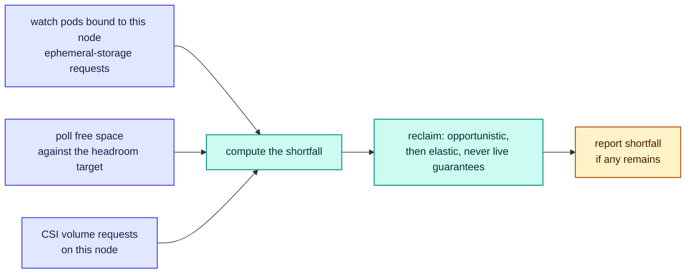

# RFC-0004: Node agent

| | |
| --- | --- |
| **Status** | Accepted |
| **Phase** | 1 |
| **Depends on** | 0002, 0003 |

## Problem

The agent is the only Forebay component on the node and the only one in the data path. It discovers
the device, owns the split between capacity the workload keeps and capacity lent to the fabric,
enforces lease decisions, and serves the fast tier.

It is also privileged, sits beside customer workloads, and holds capacity that passes from one tenant
to the next. That combination makes its blast radius larger than its line count suggests, and makes
two of its properties load bearing rather than incidental: it must never make a node worse than one
without Forebay, and it must keep working when the control plane cannot be reached.

RFC-0005 left this document one explicit obligation, which is discharged below rather than being a
dependency in either direction. The lease manager refuses grants until its
journal has been replayed, but who replays it, and in what order relative to everything else the
agent does at startup, is settled here.

## What of this is built

`internal/agent` implements the startup path and nothing else. The table says which, because a
document that reads as description while most of it is intention is how someone comes to rely on
behaviour nobody wrote.

| Part of the design | State |
| --- | --- |
| Separate pool directories, with sharing and nesting refused | Built, `internal/agent` |
| The node lock, and exiting rather than starting beside another agent | Built |
| Startup ordering: lock, replay, reconcile, then accept grants | Built |
| Reconciling both ways: orphan extents unlinked, leases without extents dropped | Built |
| Refusing a lease identifier that could name a path outside the borrowed pool | Built |
| Expiring leases whose term lapsed while the node was down | Built |
| Surviving an unreadable journal by starting empty | Built |
| Device and topology discovery | Built, `internal/topology`, and the agent discovers its own capacity |
| The pressure watch, and the headroom target it maintains | Built with one of the three inputs. Free space is polled and the shortfall reclaimed; the two that would give warning before a workload writes need Kubernetes and are owned by [RFC-0014](0014-kubernetes-integration.md), so the watch is reactive rather than anticipatory |
| The headroom target's value | Built as a duration, `--headroom-for` with `--headroom-min-bytes`, converted each pass against what the workload is observed to consume. The rate is corrected for what the agent itself gave back or took, so a reclaim does not read as the workload slowing down. The correction assumes the filesystem shows a reclaim by the next poll, which [RFC-0018](0018-benchmark-and-falsification-suite.md) has since measured on an idle filesystem and found immediate: the space was there on the first reading after the unlink returned. Under concurrent writing that measurement cannot attribute what it sees, so the assumption is confirmed where the node is quiet and untested where it is not. Where it fails the rate reads high and the floor comes out too large, which is the safe direction. A fixed `--headroom-bytes` remains, and a watch with neither is still refused rather than guessed. The multiplier over the measured product is not applied: an operator asking for a second of writing gets a second of writing. Measured by [RFC-0018](0018-benchmark-and-falsification-suite.md) |
| Timing reclamation against the deadline | Built for the part that exists. A reclaim is timed and one that overruns is an error, but the span covers choosing leases and unlinking extents, not invalidating readers, which is where RFC-0005 expects the time to go |
| The liveness that breaks a wedged lock | Built. The agent publishes a heartbeat and `--liveness` judges it from outside, since a wedged process cannot answer for itself. The pressure watch keeps it fresh, so `--watch` is what makes the probe mean anything; without it the binary still starts, reports and exits |
| Readiness computed from latency | **Not built.** It needs a serving path to have a latency |
| Serving the fast tier | **Not built.** Owned by [RFC-0007](0007-fast-tier-data-path.md) |
| Any interface to a control plane | **Not built.** Grants arrive as local calls |

### Verified on a real node

The startup path was run on a GPU node with two RTX 5090s and roughly 1.86 TiB of NVMe, 2026-09-01,
from an unprivileged container. What it does and what it refuses both behave as this document says.

| Behaviour | Result |
| --- | --- |
| Reports the capacity split and what startup corrected | Yes, against 1.86 TiB of real device |
| Unlinks an extent no lease accounts for | Yes, one planted orphan removed |
| Refuses a journal kept inside the pool it reaps | Yes, naming the directory startup would remove |
| Refuses to start with no reclaim deadline | Yes, since every elastic grant would otherwise be refused |
| Refuses accounting that does not add up | Yes, `pools exceed device capacity` |
| Admits one agent per node | Twenty started at once, nine refused by the lock and none proceeding beside another |
| Reclaims when a workload takes space nobody declared | Yes, on a 512 MiB filesystem with a 128 MiB lease and a 256 MiB target. Two quiet passes while free space was sufficient, then a workload wrote 200 MiB, free fell to 184 MiB, the agent saw a 72 MiB shortfall and returned the lease |
| Keeps the heartbeat fresh while it runs | Yes, and this is what makes the liveness probe mean anything: before the watch the binary exited and the heartbeat went stale at once |
| Kills a wedged holder so its replacement can take the lock | Yes, under a real kubelet probe. A stand-in agent held the lock, heartbeated for 20 s and then hung. The probe failed, the kubelet killed it about 10 s later, and the replacement logged that it took the lock. Restarts arrived on a 30 s cadence, which is the 20 s of health plus the detection window |

The lock result needs its caveat. The binary starts, reports and exits, so it holds the lock only
briefly and the twenty runs serialised rather than nine failing outright. What the run shows is that
contention is detected and refused, not that a long-lived agent excludes another for its lifetime.
Demonstrating that needs a serving path to stay running for.

## Assumptions

| Assumption | Basis | Risk if wrong |
| --- | --- | --- |
| Reclaiming by unlink is fast enough to be irrelevant to the deadline | **Measured**: 2.6 ms for 4 GiB, 2.5 ms for 8 GiB across four files under concurrent `O_DIRECT` write load | The deadline has to be derived from the filesystem after all, and the class deadlines change |
| Kubernetes gives a usable signal before a node is under real pressure | Unverified | Reclamation becomes reactive to `DiskPressure`, which is already too late |
| Reading `/sys` is enough for device, NUMA and PCIe discovery | Reasoned, and the subject of RFC-0003 | The agent needs broader privilege than this document grants it |
| One agent per node can be enforced | Reasoned | Two agents would each believe they own the pool directory, and the accounting of both would be wrong |
| Backend read credentials can be scoped per node and short lived | Unverified | A compromised node yields durable-store credentials, which is a much larger failure than losing a cache |

## Design

### What the agent is, and is not

| Does | Does not |
| --- | --- |
| Discover devices and topology | Decide placement, which is the control plane's job |
| Own pool accounting and enforce leases | Grant leases to itself |
| Serve the fast tier and fetch on a miss | Hold durable data outside the donated pool |
| Reclaim capacity on demand | Negotiate with the workload about reclaiming |

### Deployment shape

A DaemonSet, one per node, running unprivileged.

| Needs | Why | Granted as |
| --- | --- | --- |
| Read `/sys` and `/proc` | Device, NUMA, PCIe and NIC discovery | Read-only mounts |
| Read and write two host directories | The borrowed and the donated pool, kept apart | Two hostPaths, not the whole filesystem |
| A network port for the data path | Clients and rack peers read from it | See below |

It does not need `privileged: true`, and asking for it would be the easy answer to problems this
document would rather solve properly. Discovery is reads from `/sys`. Pool management is file
operations inside one directory. Neither requires the node.

The data path wants `hostNetwork` so a read does not traverse an extra network hop, and that is a
real cost rather than a free win: it means port conflicts with anything else on the node and less
isolation for the agent itself. The alternative is an ordinary pod network with a Service, paying a
hop on every miss. The choice should be configurable and the default decided by measurement, not
here.

### The pools are separate directories

Borrowed and donated capacity never share a directory.

Two recoveries in this document are deliberately blunt: unlinking extents that no journal entry
accounts for, and dropping the whole borrowed pool when capacity is demanded before a replay. Both
are safe only because everything they touch is regenerable, which is true of borrowed capacity and of
nothing else. Donated capacity holds durable data.

A rule of the form "delete whatever cannot be accounted for" will be implemented exactly as written,
so the boundary it operates within has to be a directory rather than an intention. Separate
directories also make the accounting auditable from outside the agent, since an operator can measure
each pool without asking it.

### Exactly one agent owns a node's pool

Two agents on one node, which a botched upgrade can produce, would each believe they own the pool
directory. Both would journal, both would reclaim, and both would be wrong.

The agent therefore takes an exclusive lock on the pool directory at startup and holds it for its
lifetime. An agent that cannot take the lock exits rather than starting in a degraded state, because
a second writer is not a condition to degrade through.

A hung agent still holds its lock, so the lock on its own would let a wedged process block its
replacement forever while reclaiming nothing, leaving capacity lent that nobody will give back. That
is the case liveness exists for. An agent that has stopped making progress is killed, which releases
the lock and lets a replacement take it, and readiness cannot substitute because a process that is
merely not ready still holds its file descriptors.

### Startup ordering

RFC-0005 hands this document two things and both are discharged here: the startup ordering below, and
reconciling the journal against the device, which that RFC records as not built and explicitly owned
by the agent.

This is the obligation RFC-0005 handed over. Capacity must not be lent before the agent knows what it
already lent.

Reconciliation is two sided. An extent on disk with no journal entry is unlinked, because capacity
nobody has a record of lending has leaked. A journal entry with no extent is dropped, because the
lease describes capacity that is not there.

**Reclamation is available before any of this completes.** An agent asked for capacity before it has
replayed cannot tell which extents are whose, so it drops the contents of the borrowed directory,
which by construction holds nothing that is not regenerable. That is a blunt
answer and a safe one: everything in that pool is regenerable, and compute is not made to wait on a
replay. It is also rare, since the request has to arrive inside the startup window.

### Configuring the lease manager

The agent constructs the lease manager, so the manager's configuration is the agent's
responsibility and one field in it is not optional.

An elastic lease is refused outright if no reclaim deadline is configured, because a zero deadline
would make elastic capacity reclaimable immediately, which is the opportunistic class under another
name. An agent that leaves `ReclaimWithin` unset therefore refuses every elastic grant it is offered,
which is the most common class. The refusal is loud rather than silent by design, but the agent has
to set the field, and a startup that cannot determine a deadline should fail rather than run as a
node that lends nothing and cannot say why.

The other tuned values, the guaranteed cap, the post-reclaim cooldown and the churn budget, have
defaults that are conservative guesses rather than measurements.

### Learning that compute wants its capacity back

Waiting for the kubelet to report `DiskPressure` is waiting until the node is already in trouble.
**Reaching `DiskPressure` from pressure the agent could have seen coming should be treated as an
agent defect**, not as the signal the agent is built around. A workload can always write faster than
any reclaim loop, and one that declares no ephemeral-storage request gives no warning at all, so not
every such event is the agent's fault. What is its fault is reaching `DiskPressure` while still
holding reclaimable capacity it had the time and the signal to release.

The agent instead maintains a headroom target and reclaims to keep it.

Three inputs, deliberately overlapping. Watching pods bound to the node gives warning before a
workload writes anything. Polling free space catches whatever the watch missed, including writes by
workloads that never declared a request. CSI requests are the explicit case. Any of them can raise
the shortfall; none of them is trusted alone.

**The shortfall is the largest of the three, never their sum.** A pod's declared request also shows
up in polled free space once it starts writing, so adding them double counts and reclaims cache the
node did not need to lose.

The headroom target is the floor the agent keeps free on top of what is already committed. Sizing it
is a trade: too small and a burst of writes beats the reclaim, too large and the node lends less than
it could.

**It is configured as a duration, not a size.** What the floor has to cover is whatever the workload
can write while the watch is not looking, and [RFC-0018](0018-benchmark-and-falsification-suite.md)
measured that: the deficit a workload opens before the watch closes it tracks the write rate times
the poll interval, within a factor of one in nine runs of ten. A size cannot express that, because
the rate is a property of the moment rather than of the node. One drive measured between 92 and
5792 MiB/s depending only on whether its write cache was spent, both figures being what four writers
achieved together, so a floor set while it was fast is sixty times too small once it is not, on the
same hardware, in the same hour.

So an operator says how long the node may be behind, and the agent turns that into bytes:

| | |
| --- | --- |
| Configured | `--headroom-for`, a duration |
| Kept free | the observed write rate times that duration |
| Rate from | what the workload took between two polls, which is the fall in free space plus whatever the agent gave back in between |
| Floor | a configured minimum, since a node that is currently writing nothing would otherwise keep nothing free |

The rate needs no new input. The watch polls free space every interval already, and a target that
adapts to it is arithmetic on a series the agent has rather than a loop that has to be built.

**The fall in free space is not the rate.** Free space also rises when the agent reclaims, so between
two polls it moves by what the workload took less what the agent gave back. Reading the fall as the
rate would understate it by exactly the amount reclaimed, which is largest during the pressure the
floor exists for: the estimate would be lowest when it needs to be highest, and each reclaim would
argue for a smaller floor than the one that had just proved necessary. The agent knows what it
returned, because it returned it, so the rate is the fall corrected by its own effect on the
filesystem. The same correction covers a grant, which takes free space without a workload writing a
byte.

Two floors, for different reasons. The target must not fall to nothing when the node goes quiet,
because the next burst arrives before the next poll does, which is what the configured minimum is
for. And the first poll of a run has no previous sample to difference, so it has no rate: the
minimum stands until a second poll gives one.

### What survives the control plane going away

| Works | Does not |
| --- | --- |
| Serving reads from the fast tier | New lease grants |
| Fetching from the backend on a miss | Lease renewal, so leases decay toward expiry |
| Reclaiming capacity for compute | Publishing state, which resumes when the link does |
| Expiring leases whose term ran out | |

The degradation runs in one direction: toward giving capacity back to compute. A partition that
outlasts every lease term ends with a node that has no fast tier and no incident.

### Degraded rather than dead

A slow agent is worse than a stopped one, because clients keep waiting on it instead of missing to
the backend.

The agent separates the two health signals it exposes rather than collapsing them into one.
Readiness gates new grants, so an agent that is struggling stops being lent more capacity while it
continues to serve and reclaim. Readiness is an ordinary Kubernetes condition and the control plane
watches it, rather than discovering the same thing later through a failed grant. Liveness is reserved for states it cannot recover from, since
restarting an agent that is merely slow throws away a warm cache to no purpose.

An agent that misses a reclaim deadline reports it and keeps reclaiming. It does not restart itself,
and it does not stop serving.

**Detecting the miss is the agent's job and nothing does it yet.** RFC-0005 states the deadline and
validates that one is configured, and stops there: the lease manager drops a lease in microseconds
and has no idea how long the surrounding work took. The time is spent invalidating readers and
unlinking extents, both of which are the agent's. So the agent times reclamation from the moment the
shortfall is computed to the moment the capacity is observably free, compares that against the
deadline of the cheapest class it had to touch, and reports the distribution rather than a count.
What matters operationally is how far past the deadline it goes, not whether it ever does.

### Upgrades

The fast tier lives on the host directory and the leases live in the journal, so neither is in the
container. Stopping an agent and starting a new one loses no cached data and no lease state: the new
agent takes the lock, replays, reconciles and carries on.

That property is not free and must be protected. Any future design that keeps fast-tier state only in
the agent's memory would turn every upgrade into a cold cache, and RFC-0019 should treat that as a
constraint rather than a preference.

## Alternatives considered

| Alternative | Trade-off | Why not |
| --- | --- | --- |
| Run privileged | Every discovery and device question becomes easy | The agent sits beside customer workloads and holds cross-tenant capacity, so its privilege is the thing most worth spending effort to reduce |
| Drive reclamation from `DiskPressure` alone | One signal, no pod watching, much simpler | It fires once the node is already in trouble, and the promise is that compute never waits |
| Let the control plane drive reclamation | The control plane already knows the fleet's intent | Reclamation would depend on reaching it, which fails exactly when a partition and a pressure event coincide |
| Keep lease state only in memory | No journal, no replay ordering, less code | An agent restart forgets what it lent, and capacity nobody has a record of lending has leaked |
| Allow more than one agent per node | Rolling upgrades get simpler | Both would own the same pool and both accountings would be wrong |

## Failure modes

**Agent crashes.** Leases and cache survive on the host. The replacement replays and reconciles. The
window between crash and replacement is one in which nothing reclaims, so a pressure event during it
is handled by the kubelet as it would be on a node without Forebay.

**Agent cannot take the pool lock.** It exits. A node with no agent lends nothing, which is the safe
failure.

**Journal and disk disagree.** Extents without entries are unlinked, entries without extents are
dropped, and both are reported. Silent reconciliation would show up much later as a node with
mysteriously less capacity than it should have.

**Agent is slow rather than stopped.** The dangerous case, because the miss path never triggers.
Readiness has to be latency based rather than a liveness ping, which RFC-0017 has to make measurable.

**Reclaim misses its deadline.** Reported, and reclamation continues. What matters is the
distribution of how far past, not whether it ever happens.

**The node is genuinely full.** Every reclaimable byte is returned and compute still cannot be
satisfied. The node is then in the state it would have been in anyway, and the failure belongs to
capacity planning.

## Performance implications

Predicted except where noted. Reclaim through the agent is measured at 2.8 ms for 7 GiB and 7.4 ms
under four concurrent `O_DIRECT` writers, so load costs about two and a half times and still leaves
four orders of magnitude inside a thirty second deadline. The agent's reclaim latency is therefore
dominated by detecting the need and by invalidating readers, not by the filesystem. Both belong in RFC-0018.

The polling interval for free space is a direct trade between reclaim latency and idle cost, and has
no defensible value yet.

## Complexity

The lease manager and journal already exist. What this RFC adds is discovery, the pool directory and
its lock, the pressure watch, and the serving path. The serving path is the largest piece and mostly
belongs to RFC-0007 and RFC-0008.

The constraint it imposes on everything later is that fast-tier state stays outside the agent
process. Losing that would make every upgrade a cold cache.

## Security and tenancy

**The agent needs read credentials for the durable backend**, because it fetches on a miss. That is
the largest new attack surface in this document and it is easy to overlook, since the agent is
otherwise unprivileged. A node that is compromised should not yield credentials that read the whole
durable store, which argues for per-node, short-lived, read-scoped credentials issued by the control
plane rather than a shared secret in a DaemonSet. RFC-0016 owns the mechanism.

**Reclaimed capacity is re-lent to a different tenant.** Contents must not survive that transition.
Doing so cheaply, without overwriting an extent at the worst possible moment, is not solved here.

**A compromised agent can starve its own node.** Containing that to one node is exactly why the agent
is the authority on its own capacity rather than the control plane, but it is a denial of service
against the workload it hosts and RFC-0016 should say so plainly.

## Open questions

- **Whether the agent needs host mounts of `/sys` and `/proc` at all.** A probe from an ordinary pod
  running as a non-root user, with every capability dropped and no hostPath, read PCI class, NUMA
  affinity, NUMA topology and block devices successfully, because a container is given `/sys` from
  the host already. If that holds on the target kernels, the privilege surface in this document is
  larger than it needs to be. Owned by [RFC-0003](0003-topology-model.md), which owns discovery.
- **The headroom target** is answered on both halves it had. Its value was measured by
  [RFC-0018](0018-benchmark-and-falsification-suite.md), and the measurement decided the second
  question rather than leaving it open: it adapts, because a constant is wrong by the ratio of a
  drive's fastest state to its slowest. It does not belong to
  [RFC-0010](0010-autonomy-engine.md), as this document previously said. Differencing a series the
  watch already polls is not an autonomy loop, and putting it there would make a floor the node needs
  every second depend on a component that does not exist. What remains open is the margin: nine runs
  in ten sat at or under the rate times the interval and the tenth reached six times it, so the
  multiplier over that product is a judgement this document has not yet made.
- **Whether `hostNetwork` is worth its cost**, which is a measurement rather than an opinion. Owned
  by [RFC-0018](0018-benchmark-and-falsification-suite.md).
- **Whether the pressure watch can be driven from the kubelet directly** rather than from the API
  server, which would keep working through an API server outage. Owned by
  [RFC-0014](0014-kubernetes-integration.md), which owns what the agent may depend on in Kubernetes.
- **How readiness is computed from latency**, since a slow agent is worse than a stopped one and a
  liveness ping cannot tell them apart. Owned by [RFC-0017](0017-observability.md).
- **Whether a cached extent can go stale** against a backend object that changed underneath it. The
  agent is where it would be noticed, but the consistency model is owned by
  [RFC-0007](0007-fast-tier-data-path.md).
- **Whether the agent should refuse to start when it cannot reach the control plane**, or start and
  serve what it can replay. The second is more useful, giving a node that lends nothing and serves
  everything it already holds. No RFC owns this, deliberately: it is an operational preference that
  should be settled by running the thing, and it is deferred to the first real deployment.
