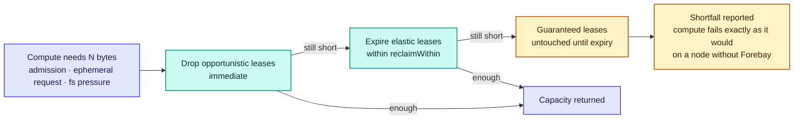
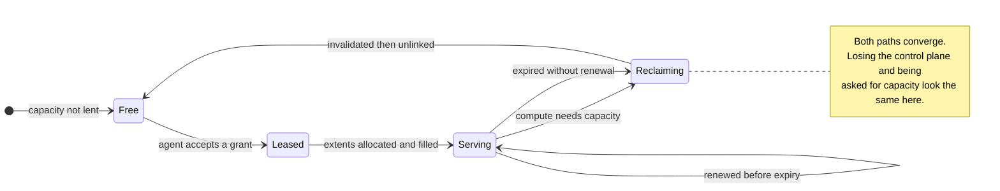

# RFC-0005: Capacity pools and elastic leases

| | |
| --- | --- |
| **Status** | Draft |
| **Phase** | 1 |
| **Depends on** | 0002, 0004 |

## Problem

Forebay's first claim is that idle compute-local NVMe can be lent to a storage fabric and taken back
without migrating data, without a rebalance, and without measurably slowing the job that owns the
node. This RFC is where that claim is either made good or shown to be false.

The architecture already supplies the idea that makes it plausible: borrowed capacity holds only
regenerable data, so reclamation is a delete. That idea settles *what* reclamation does. It settles
none of the things that actually break lease systems, which are timing, authority and partition.

Three questions have to be answered precisely, because a wrong answer to any of them turns a storage
system into something that occasionally freezes a training job.

1. When compute wants capacity back, how long may Forebay take, and what happens if it cannot?
2. Who decides how much capacity a node has lent, when the control plane and the node disagree?
3. What happens when the control plane is unreachable and a lease is still outstanding?

## Assumptions

| Assumption | Basis | Risk if wrong |
| --- | --- | --- |
| Unlinking preallocated extents returns capacity in well under a second | Reasoned, from filesystem behaviour on large files | The reclaim deadline cannot be met and the class deadlines need rethinking |
| Kubernetes gives a usable early signal that a pod needs local storage | Unverified, and the subject of RFC-0014 | Reclamation becomes reactive to pressure rather than anticipatory, which is slower and worse |
| A reclaim deadline of tens of seconds is compatible with pod admission | Unverified | The default is wrong and has to be derived from measurement |
| Worst-case pNFS layout recall fits inside the elastic deadline | Unverified, and the subject of RFC-0008 | Reclamation cannot honour its contract while pNFS is the access path |
| Regenerable data is genuinely regenerable, including partially written extents | Reasoned | A reclaimed extent could be served as valid, which is data corruption rather than a cache miss |

The last one is the dangerous assumption in this document, and the design treats it as a correctness
requirement rather than a hope.

## Design

### Pools

Every node's NVMe divides into three pools. The division is bytes, not devices, and a pool is not a
filesystem.

| Pool | Sized by | Holds | Returned |
| --- | --- | --- | --- |
| Compute | Whatever the node has not given away | Whatever the workload writes | Not applicable, Forebay never holds it |
| Donated | Operator configuration | Durable data, through a backend driver | Never |
| Borrowed | Outstanding leases | Regenerable data only | On reclamation, by deletion |

Donated capacity is not leased. It is given once, and if an operator wants it back they drain the
node like any other storage maintenance. Everything below concerns the borrowed pool.

### The node agent is the authority

The control plane grants leases. **The node agent decides whether a grant is real.**

This inversion is the load-bearing decision in this RFC. The agent holds the only ground truth about
its own device: total capacity, what the kubelet has committed, what is donated, and what is
currently lent. A grant from the control plane is a proposal, which the agent accepts only if its own
accounting says the capacity exists.

Everything awkward about distributed leases becomes tractable once authority sits at the node.

- Two control planes cannot over-commit a node, because neither of them is doing the arithmetic.
- A stale control-plane view cannot cause over-allocation, only a rejected grant.
- Reclamation never requires reaching the control plane, so it cannot be blocked by a partition.

The cost is that the control plane's view of fleet capacity is always a slightly stale cache, and
capacity reporting has to say so rather than presenting it as exact.

### Lease classes

A lease is a grant of up to N bytes on one node, in one class, until an expiry. The class determines
only one thing: how quickly the capacity can be taken back.

| Class | Reclaim deadline | For | Reclaimed |
| --- | --- | --- | --- |
| `opportunistic` | None, immediate | Prefetch, speculative fill | First, without warning |
| `elastic` | Bounded, `reclaimWithin` | Cache, scratch | Second, within the deadline |
| `guaranteed` | Not before expiry | Checkpoint staging in progress | Never early. The expiry is the promise |

`guaranteed` exists because some regenerable data is expensive to regenerate at a bad moment. A
checkpoint staged halfway through a synchronised write across a thousand ranks is regenerable in
principle and catastrophic to drop in practice. The class buys a bounded window, never an open one,
and a guaranteed lease that cannot be granted is refused rather than downgraded silently.

### The reclaim ladder

Within a step of the ladder, already-expired leases go first because releasing them costs nothing at
all, and the remainder are dropped oldest-first, age standing in as a proxy for coldness. Nothing
better is available without hit-rate data per lease, which is a thing to revisit once RFC-0017 can
supply it.

The last box is the invariant that matters most, and it is stated here as a rule the implementation
is held to:

> **Forebay must never leave a node worse off than if Forebay were not installed.**

If every reclaimable byte has been returned and compute still cannot be satisfied, the node is in the
state it would have been in anyway, and the failure belongs to the cluster's capacity planning rather
than to Forebay. A design that could exceed that bound, for instance by holding guaranteed leases
covering most of a device, is a design that can take a node down. Guaranteed capacity is therefore
capped, and the cap is enforced by the agent at grant time.

**The cap is a fraction of device capacity, not of the borrowed pool.** An earlier draft of this
document said the borrowed pool, which is wrong: the borrowed pool shrinks as capacity is reclaimed,
so a cap with that denominator would loosen at exactly the moment it needed to bind. A node under
pressure would find its guarantee ceiling falling towards the guarantees it had already issued. The
device is a stable denominator and bounds the real quantity, which is how much of a node can be
pinned at once.

### Reclamation must be an unlink

Borrowed capacity is allocated as whole preallocated extents, large and few, never as many small
files. Reclaiming is then unlinking a handful of large objects, which returns capacity without
writing anything.

This matters because reclamation happens exactly when the node is under pressure. Any reclaim path
that needs to write, compact or rewrite in order to free space will be at its slowest precisely when
it is most needed. The design forbids it.

### In-flight reads become misses, never errors

An extent can be reclaimed while a client is reading it. The rule is that the reader observes a cache
miss and refetches from the durable backend. It must never observe an IO error, and it must never
observe stale or partial bytes.

The agent therefore invalidates before it unlinks. An extent moves to `invalid` first, at which point
new reads refuse it and in-flight reads are failed with a retryable signal that the access layer
converts into a backend fetch. Only once no reader holds it is it unlinked.

**This is where the elastic deadline meets the access layer, and it is a hard constraint on
RFC-0008.** With pNFS the reader holds a layout, and invalidating an extent means recalling that
layout. If worst-case layout recall takes longer than `reclaimWithin`, the deadline cannot be
honoured while pNFS is the access path, and either the deadline grows or the access design changes.
That question is not settled here, and RFC-0008 cannot be accepted without answering it.

### Leases expire, and expiry is fail-safe

Renewal requires the control plane. Reclamation does not.

Under a partition the agent keeps serving existing leases until they expire, then returns the
capacity. Forebay degrades toward giving capacity back to compute, which is the correct direction to
fail in, and the fleet loses cache rather than gaining a hazard. A partition that outlasts every
lease term ends with a cluster that has no fast tier and no incident.

### Thrash

A node whose job repeatedly grows and shrinks could churn capacity continuously, paying the cost of
filling a cache that is about to be dropped.

Two mechanisms, both at the agent since it holds the facts:

- **A post-reclaim cooldown.** For a configured period after returning capacity, the agent declines
  new grants, so a reclaim followed immediately by a grant cannot oscillate. It bounds only lending,
  never reclamation, because compute is not made to wait for a cooldown.
- **A churn budget.** The agent tracks reclamations per unit time and declines new grants once a node
  exceeds its budget, reporting itself as churning. The control plane routes cache elsewhere and
  RFC-0017 surfaces the node, since chronic churn is usually a scheduling problem wearing a storage
  costume.

### Surviving an agent restart

Leases are journalled to local disk before they are honoured. A grant that cannot be written is not
honoured at all, because capacity lent with no record of the lending leaks the moment the agent comes
back. On restart the agent replays the journal, reconciles it against what is actually on the device,
expires anything past its deadline, and only then accepts new grants. Extents present on disk with no
journal entry are unlinked, because capacity that nobody has a record of lending is capacity that has
leaked.

**The journal is rewritten whole rather than appended to.** A node holds tens of leases, so writing
the entire set costs nothing, and it avoids torn records, replay ordering and compaction, none of
which earn their keep at that volume. The write goes to a temporary file that is flushed and renamed
over the target, with the directory flushed too, since a rename is only durable once its directory
entry is.

**A journal that cannot be read is recoverable rather than fatal.** Everything it describes is
regenerable, so an agent that cannot parse its own journal discards the borrowed pool, starts empty
and reports the failure. There is no repair path because there is nothing worth repairing. This is
the regenerable-only rule paying for itself in code that does not have to exist.

**Reconciliation drops as well as restores.** A lease whose term ran out while the node was down is
gone. So is one the accounting can no longer fit, because the node's shape may have changed while it
was away and compute keeps whatever it now needs. Duplicate identifiers are treated as corruption
rather than collapsed, since lending for a record twice and keeping it once would leave the
accounting permanently above the leases justifying it, with the difference unreclaimable.

**A node that has not replayed its journal lends nothing.** Accepting a grant before the replay would
count that capacity twice as soon as the replay caught up, so the refusal is enforced rather than
left to whoever starts the agent. Reclamation is deliberately not gated the same way: handing
capacity back to compute is safe from any state, and making compute wait on a replay would invert the
rule the whole design rests on.

### Accounting

The agent publishes, and the control plane caches, one number per pool. Compute is derived from node
allocatable minus what the kubelet has committed. Donated is configuration. Borrowed is the sum of
accepted leases. The three plus free space must equal device capacity, and the agent reports a
discrepancy rather than papering over it, because in a system whose entire promise is about capacity,
arithmetic that does not balance is a defect and not a rounding detail.

## Alternatives considered

| Alternative | Trade-off | Why not |
| --- | --- | --- |
| Control plane is authoritative on capacity | One place to reason about, simpler mental model | Reclamation would depend on reaching it, which breaks the promise exactly when a partition coincides with pressure. Split brain would also become able to over-commit a node |
| No classes, one reclaim deadline | Much simpler, one number to explain | Either prefetch is treated as precious, wasting the cheapest reclaim available, or checkpoint staging is treated as disposable, which loses work |
| Reclaim by migrating extents elsewhere | Preserves the cache, avoids refetch cost | This is the rebalance storm the architecture exists to avoid, and it is slowest when the node is busiest |
| Leases without expiry, released explicitly | No renewal traffic, simpler steady state | A lost control plane leaves capacity lent forever, so the failure mode is capacity leaking away from compute, which is the wrong direction |
| Let guaranteed leases cover the whole borrowed pool | Strongest promise to a checkpoint writer | Makes it possible for Forebay to starve a node, which violates the never-worse-off invariant |

## Failure modes

**Reclaim misses its deadline.** The agent reports the shortfall and continues reclaiming. Compute
sees the delay it would have seen on a full node. The metric that matters here is not whether it ever
happens but how far past the deadline it goes, which RFC-0017 must expose as a distribution rather
than an average.

**A reader holds an extent open indefinitely.** Invalidation cannot complete, so unlink cannot
proceed. The agent must be able to break the reference after a bounded wait, which means the access
layer needs a forced revocation path. If that path does not exist, one stuck client can pin capacity
that a job needs.

**The journal disagrees with the disk.** Treated as a leak and cleaned up on the disk side, never by
inventing a lease. Silent divergence here would show up much later as a node that mysteriously has
less capacity than it should.

**A partially written extent is served after reclamation.** This is the only failure in this document
that is data corruption rather than a slowdown. Invalidate-before-unlink and refusing reads on
`invalid` extents are what prevent it, and both belong in the earliest tests rather than in hardening.

**Clock skew between agent and control plane.** Expiry is evaluated on the agent's clock. Grants
carry a duration rather than an absolute time, so a skewed control plane cannot extend a lease past
what the agent believes it agreed to.

## Performance implications

Predicted, not measured. Nothing here has run.

The intended cost of reclamation on the compute path is close to the cost of unlinking a few large
files, which should be well under a second. Whether that holds under simultaneous IO pressure is
unknown and belongs in RFC-0018 as a named experiment: reclaim latency while the node is saturated,
reported as a distribution.

The cost of being wrong about a reclaim is a cache miss and a refetch from the backend, which is the
same cost the fast tier exists to avoid. A node that churns therefore pays continuously, which is why
the churn budget exists.

## Complexity

The agent-side lease manager, its journal and the invalidate-before-unlink path are new and are
where the difficulty concentrates. The control-plane side is comparatively ordinary bookkeeping.

The constraint this imposes on everything downstream is the never-worse-off invariant. Any later
feature that wants to hold capacity harder, for any reason, has to argue against it, and the
guaranteed class already shows what that argument has to look like: a bounded window, a cap, and a
refusal rather than a silent downgrade.

## Security and tenancy

Reclaimed capacity is re-lent to a different tenant. Contents must not survive that transition, which
means an extent is not returned to the free pool until its contents are unrecoverable by the next
holder. Doing that cheaply, without writing over the whole extent at the worst possible moment, is
not solved in this document and is owned by RFC-0016.

A node agent that accepts grants it should not, or reports capacity it does not have, can starve its
own node's compute. The agent is the authority on capacity precisely so that this is contained to one
node rather than fleet-wide, but a compromised agent is a denial of service against its own workload
and RFC-0016 has to say so explicitly.

## Open questions

- The default value of `reclaimWithin`. Thirty seconds appears in the API sketch and is currently a
  guess. It should be derived from pod admission behaviour and measured reclaim latency, not chosen.
- Whether the forced revocation path required by pNFS layout recall is achievable inside the elastic
  deadline. RFC-0008 owns this and it is the largest external risk to this design.
- Whether the guaranteed cap should be a fixed fraction or set by policy, and whether a node may
  refuse guaranteed leases entirely.
- How the churn budget and the cooldown are chosen, and whether either should adapt rather than
  being configured. The shipped defaults are conservative guesses, not measurements.
- Whether oldest-first is the right tiebreak within a class once per-lease hit rates exist.
- Whether donated capacity should ever be reclaimable under extreme compute pressure. The current
  answer is no, and it is worth revisiting once operators have opinions.
