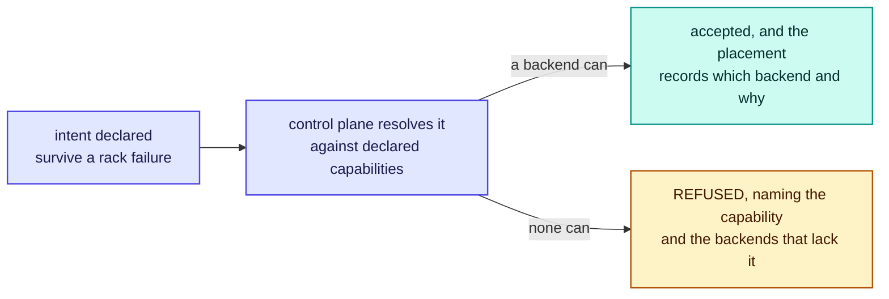

# RFC-0006: Durable backend driver contract

| | |
| --- | --- |
| **Status** | Accepted |
| **Phase** | 1 |
| **Depends on** | 0002 |

## Problem

Forebay does not write a durable store. It drives somebody else's, and the contract between the
control plane and those backends is one of the project's two seams.

The obvious way to build that seam is the wrong one. A contract that exposes only what every backend
has in common reduces Ceph, an existing array and an object store to their intersection, which is
roughly "read some bytes", and throws away the reason each of them was worth adopting. The contract
therefore has to let a backend say what it can do, and let the control plane use it without
pretending every backend is the same.

## What of this is built

The contract is built and nothing production uses it, because the fast tier that would call a driver
is not built.

| Part of the design | State |
| --- | --- |
| The mandatory core, and a declaration without it refused | Built, `driver` |
| Capabilities declared rather than probed, and binary | Built |
| An unknown capability name ignored rather than refused | Built, so an older control plane can drive a newer driver |
| A driver may not emulate what it lacks | Built as a mechanism rather than a rule. An undeclared capability is refused before the driver is reached, so an implementation that exists cannot be called |
| Refusals distinguishable from failures | Built, `ErrNotSupported` |
| The conformance suite | Built, `driver/conformance`, and importable so a third party can demonstrate a driver without us reviewing it. It returns findings rather than only failing a test, so it can be run against a real backend outside `go test`, repeatedly, and it removes what it created wherever the backend allows |
| Ceph and S3 drivers | **Not built.** Both need a real backend to develop against, which is [RFC-0018](0018-benchmark-and-falsification-suite.md)'s open question about what the suite runs against |
| Anything calling a driver | **Not built.** The fast tier is the caller, and it is [RFC-0007](0007-fast-tier-data-path.md) |

`driver/filedriver` serves objects from a directory. It exists so the contract has something real to
be exercised against and is the simplest case of register-in-place: files already there are readable
objects without anything rewriting them. It declares three capabilities of ten and refuses snapshot
and clone, because a filesystem cannot do either without copying and a clone that copies is not one.

The suite was tested against a driver that is wrong on purpose as well as one that is right, since a
suite only ever run against a correct driver demonstrates nothing about what it would catch.

## Assumptions

| Assumption | Basis | Risk if wrong |
| --- | --- | --- |
| Every candidate backend can serve a ranged read of an immutable object | Reasoned. Ceph, S3 and every array do this | The mandatory core is smaller still, or Forebay cannot use that backend at all |
| Backends differ enough that a common denominator would be worthless | Reasoned, from S3 having no block semantics and an array having no object ones | A simpler uniform interface would have done and this contract is over-built |
| A driver author can state capabilities honestly | Unverified, and the reason the conformance suite exists | A driver claims a capability it lacks, and the failure appears as data loss rather than as a refusal |
| Two implementations are enough to design a contract against | Reasoned. One implementation designs a contract shaped like that implementation | The contract fits Ceph and S3 and nothing else, which the third driver discovers |

## Design

### The mandatory core is one operation

A driver must be able to read a byte range of an immutable object. That is all.

Everything the fast tier does on the read path is that operation, and the read path is what Phase 1
has to prove. A backend that can do nothing else is a legitimate backend: it can hold datasets, serve
misses and be cached in front of. It cannot satisfy an intent asking for snapshots, and it says so at
the point the intent is declared rather than at the point somebody needs a snapshot.

**A read-only backend is useful because of register-in-place.** [RFC-0020](0020-no-copy-policy.md)
requires that data already sitting in a backend becomes a dataset without being rewritten, so a store
Forebay cannot write to still holds datasets that arrived by every other route. Without that rule a
read-only backend would be an empty one, and `write-object` would have to be mandatory.

Keeping the core this small is what makes the seam real rather than decorative. A contract whose
mandatory half is large is a contract only one backend implements.

### Capabilities are declared, and the declaration is the contract

A driver states what it supports. The control plane believes it, because the alternative is probing
a production store to find out, and a probe that mutates is unacceptable while a probe that only
reads cannot establish that a write will work.

The consequence is that a dishonest declaration is a serious failure, and the conformance suite below
exists precisely because the declaration is trusted.

A declaration is binary. A driver either has a capability against the backend it was configured for,
or it does not, and there is no third state: the control plane resolves intents against these
answers, and something it cannot act on is the same as a no. The columns below are what the two
shipped drivers declare against a representative deployment, not claims about what those
technologies can be made to do in general.

| Capability | Means | Ceph | S3 |
| --- | --- | --- | --- |
| `read-range` | Read a byte range of an object. **Mandatory** | yes | yes |
| `write-object` | Create an immutable object | yes | yes |
| `delete-object` | Remove one | yes | yes |
| `snapshot` | Point-in-time capture the backend manages | yes | no |
| `clone` | A writable copy that shares storage rather than copying it | yes | no |
| `replicate` | Redundancy the backend maintains, with a stated failure domain | yes | no |
| `thin` | Space allocated on write rather than on create | yes | no |
| `compresses` | Stored data is compressed by the backend, whether or not anyone asked | yes | yes |
| `compress-on-request` | Forebay can ask the backend to compress a given object | yes | no |
| `topology-hint` | Placement can be influenced, such as by failure domain | yes | no |

The two compression capabilities are separate because RFC-0020 needs different answers from each. A
backend that compresses transparently, with no control surface, is common: an object store may store
everything compressed and offer no way to ask. That backend declares `compresses` and not
`compress-on-request`, and both answers are true. Collapsing them into one capability would force it
to claim either that Forebay can direct compression it cannot direct, or that data is uncompressed
when it is not.

The distinction is load bearing rather than tidy. `compresses` tells the copy policy whether Forebay
should compress what it writes into that backend, since compressing twice wastes CPU for nothing.
`compress-on-request` tells intent resolution whether a request for compression can be satisfied at
all.

That the same technology can be deployed differently is why the declaration belongs to the configured
driver rather than to the product. An object store fronted by cross-region replication would declare
`replicate`, and one backed by a single bucket would not, and both are the same S3 driver pointed at
different infrastructure. What a driver may not do is answer "it depends", because the control plane
has nothing to resolve against.

The last column is the point of the table. S3 declares four of ten capabilities and is still a
first-class backend, because what it lacks is refused when an intent is declared rather than
discovered later.

### Refusal happens when the intent is declared, not when the data is needed

Refusing at declaration is what makes the refusal useful. A user asking for rack-level durability
learns immediately that no configured backend offers a failure domain, while there is still nothing
stored and the decision is cheap to change. Refusing later, when a snapshot is actually wanted, would
mean the data already exists under a promise that was never true.

The refusal names the capability and the backends that lack it. "Cannot satisfy this intent" sends a
user to read source code; "no configured backend declares `snapshot`, and `s3-main` is the only one
holding this dataset" does not.

### One operation, different primitives

The contract is expressed in what Forebay wants, not in how a backend achieves it. `clone` means a
writable copy that shares storage; on Ceph that is an RBD clone and on a filesystem it might be a
reflink, and the control plane does not care which. A driver that cannot do it in any way declines
rather than emulating it by copying, because a clone that copies is not a clone and the caller chose
it precisely to avoid the copy.

That rule generalises: **a driver may not emulate a capability it lacks.** Emulation is silent
degradation wearing a costume, and RFC-0020's no-copy policy exists partly to prevent exactly this
kind of quiet copy.

### Versioning

Capabilities are additive and named. A driver declares the contract version it implements and the
capabilities it has within it.

An unknown capability name is ignored rather than refused, so an older control plane can drive a
newer driver and simply not use what it does not understand. A capability the control plane requires
and does not find is a refusal, which is the same path as a backend that never had it. The result is
that adding a capability never breaks an existing driver, and never silently changes what an existing
intent resolves to.

### Conformance proves two things

A driver passes the suite the project ships. The suite tests what the driver claims, and it also
tests what the driver does not claim, which is the half that is usually forgotten.

| The suite checks | Because |
| --- | --- |
| Every declared capability behaves as specified | A declaration is trusted, so it has to be true |
| Every undeclared capability is refused cleanly | An undeclared capability that half works is worse than one that fails, since the control plane will not have planned for it |
| Ranged reads are correct at boundaries, including the last byte and past the end | It is the mandatory operation and the one the fast tier leans on entirely |
| Refusals are distinguishable from failures | "I do not do that" and "I could not do that just now" require different responses from the caller |

The third-party driver story rests on this: someone can write a driver for a store we have never seen
and demonstrate it works, without us reviewing it.

### The donated pool is not a driver

RFC-0002 left this open. The answer is that donated capacity is devices contributed to a durable
store that is already running, not a backend Forebay implements.

Making it a driver would mean Forebay providing durability itself, which RFC-0001 explicitly refuses,
and would put replication, recovery and consistency inside a project that has said it will not build
them. Contributing devices to an existing Ceph cluster gets all of that from something that has
solved it, and the donated pool becomes an operational matter rather than a code one.

## Alternatives considered

| Alternative | Trade-off | Why not |
| --- | --- | --- |
| A lowest-common-denominator interface | One code path, no capability logic, no refusals to explain | Reduces every backend to reading bytes and throws away the reason anyone adopted theirs |
| Probe capabilities rather than declare them | No trust required, and no dishonest declarations | A probe that mutates is unacceptable against a production store, and one that only reads cannot establish that a write will work |
| Let drivers emulate what they lack | Every backend supports everything, and callers need no capability logic | A clone that copies is not a clone. Emulation is silent degradation, which this project refuses everywhere else |
| Make the donated pool a driver | One uniform way to talk about all capacity | Forebay would be implementing durability, which RFC-0001 refuses |
| Version the whole contract rather than name capabilities | Simpler to reason about, one number | Every addition becomes a breaking change, and drivers stop being written by anyone but us |

## Failure modes

**A driver declares a capability it does not have.** The worst failure available here, because the
control plane will have planned around it and the discovery comes when the capability is used. The
conformance suite exists for this and does not eliminate it, since a driver can pass the suite and
misbehave in production. Nothing in this design detects that, which is stated rather than mitigated.

**A backend that is present but degraded.** Reads succeed slowly, or succeed for some objects. This
is not a capability question and the contract cannot express it, so it belongs to health rather than
to declaration, and RFC-0015 owns it.

**A capability that exists but is not usable by this tenant**, because of permissions on the backend
rather than the backend's own limits. The declaration is per backend and the truth is per credential,
which the contract does not currently model.

**A refusal that arrives too late anyway.** Backends can be reconfigured, and a capability can be
removed under a dataset already relying on it. Declaration is a snapshot of a moving thing, and
RFC-0017 has to make a capability disappearing visible.

## Performance implications

Predicted. The contract is on the control path, not the data path: capability resolution happens when
an intent is declared, which is rare, and the fast tier's fill is the one mandatory operation with no
negotiation in it.

The one performance-relevant decision is that `read-range` is mandatory and everything else optional,
so the hot path never consults a capability. If it ever does, that is a design mistake rather than a
tuning problem.

## Complexity

The contract itself is small. The complexity is in the conformance suite, which has to test refusals
as carefully as it tests behaviour, and in the two shipped drivers being genuinely different rather
than two spellings of the same store, which is why S3 was chosen alongside Ceph.

The lasting constraint is that emulation is forbidden. A future driver author will want to emulate a
missing capability to make their backend look complete, and the answer has to stay no.

## Security and tenancy

**A driver is code Forebay runs with credentials to a durable store.** A third-party driver is
therefore a supply-chain surface, and the conformance suite proves behaviour rather than
trustworthiness. Whether out-of-tree drivers are loaded at all, and with what isolation, is not
settled here and RFC-0016 owns it.

**Credentials are per backend and the agent needs read credentials on every node**, because the fast
tier fetches on a miss. That is RFC-0004's finding and the largest credential surface in the design.

**Capability declarations are not tenant data**, but a refusal names backends and their limits, which
tells a tenant something about the infrastructure. That is a small inference channel and probably
acceptable, and RFC-0016 owns whether it is.

## Open questions

- **Whether a capability can be declared per credential rather than per backend**, since a tenant may
  lack permission for something the backend itself supports, so the declaration is per backend while
  the truth is per credential. Owned by
  [RFC-0016](0016-multi-tenancy-qos-and-security.md).
- **Whether out-of-tree drivers are loaded at all**, and with what isolation, given a driver holds
  credentials to a durable store. Owned by [RFC-0016](0016-multi-tenancy-qos-and-security.md).
- **How a capability disappearing under a dataset that relies on it is noticed.** Owned by
  [RFC-0017](0017-observability.md).
- **What the conformance suite runs against**, since testing a driver needs a real backend and a
  contributor may not have one. Owned by
  [RFC-0018](0018-benchmark-and-falsification-suite.md), which owns what the project can test and
  where.
