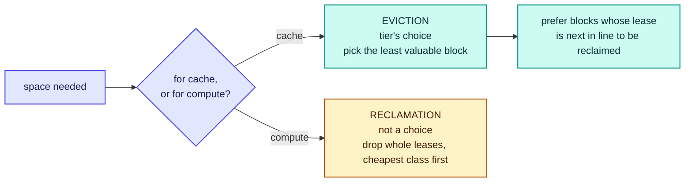
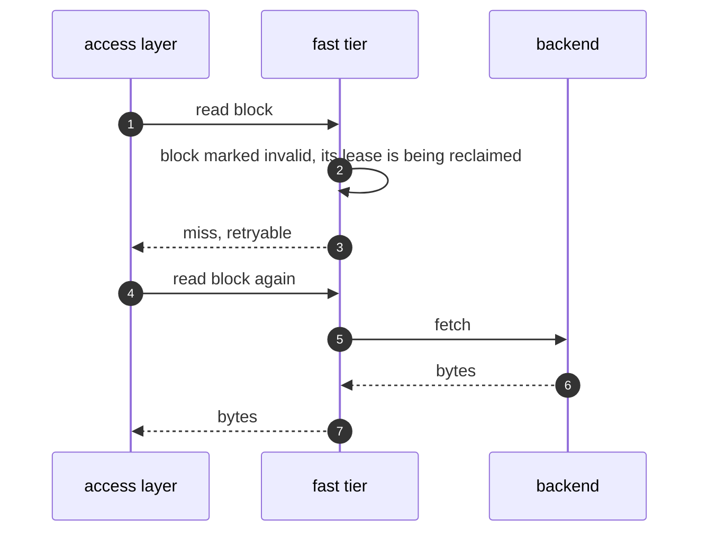

# RFC-0007: Fast tier data path

| | |
| --- | --- |
| **Status** | Accepted |
| **Phase** | 1 |
| **Depends on** | 0005, 0006 |

## Problem

The fast tier is the layer Forebay owns outright and does not make pluggable. Everything
differentiated about the project happens in it, and so does most of the difficulty.

Its unusual constraint is that the storage underneath it can be taken away on someone else's
schedule. An ordinary cache owns its media. This one holds capacity on loan from the compute
scheduler, which can demand it back mid-read, and the design has to make that a cache miss rather
than an error, a stall, or a wrong answer.

## What of this is built

The node-local half is built, in `internal/fasttier`. Nothing above it reads: there is no access
layer, so the tier has a caller only in tests.

| Part of the design | State |
| --- | --- |
| Cache and scratch as separate roles | Built for cache, which is the read path. Scratch is not held by the tier |
| Immutable content keyed by identity, so there is nothing to invalidate | Built |
| The fixed-size block as the unit | Built. Blocks are slots inside a lease's extent, because RFC-0005 allocates capacity as extents that are large and few |
| Admission on the second read, prefetch bypassing it | Built |
| The record of first reads, bounded | Built. Its size is unmeasured, and a bound too small admits nothing |
| Eviction: the tier's own choice, least valuable first | Built. It prefers a lease that is leaving anyway, from the order the lease manager already keeps, and takes the least recently used block within it. Recency is the only notion of value: nothing weighs how often a block is read or what it cost to fetch |
| A revoked read becoming a miss, never an error or stale bytes | Built, and the harder half with it: a read runs outside the cache lock so readers do not queue behind each other, which lets a slot be refilled mid-read. Each occupancy is stamped and the stamp checked afterwards, so a block whose slot was taken reads as a miss rather than as another object's content |
| Blocks never shared between tenants, and the record per tenant too | Built |
| Peer fetch and the rack tier | **Not built,** deliberately. The tier is designed as removable there and [RFC-0018](0018-benchmark-and-falsification-suite.md) owns whether it earns its place |
| Anything that reads from the tier | **Not built.** The caller is the access layer, [RFC-0008](0008-access-layer-pnfs.md) |

Run on a GPU node against a real agent extent. A first epoch over 32 blocks admitted nothing and
left the cache empty, a second admitted all of them, and a third served every one. A reclaim then
dropped all 32 at once and every subsequent read was a miss, none an error.

Those numbers say the path works. They are not evidence for the thesis and must not be quoted as
any: there was no backend arm, so nothing was compared against anything, which is the confound
RFC-0018's comparability rule exists to prevent.

## Assumptions

| Assumption | Basis | Risk if wrong |
| --- | --- | --- |
| Published dataset versions are immutable, so cached content cannot go stale | Reasoned. A constraint the project adopts, stated as a non-goal in [RFC-0001](0001-thesis-scope-and-non-goals.md): mutable data is not cached. [RFC-0012](0012-dataset-object-model.md) owns the naming and identity mechanics, and [RFC-0021](0021-single-copy-multi-protocol.md) relies on the same constraint | The tier needs invalidation and a coherence protocol, which is a different and much larger design |
| Most of what an AI workload reads repeatedly is immutable dataset content | Reasoned, from training reading the same shards each epoch | The cache holds little worth holding and the tier is a prefetch buffer rather than a cache |
| A rack-local fetch beats a fanned-out backend read | Unverified, and the same crossover as RFC-0001 | The rack tier is removed and a local miss goes straight to the backend, which is simpler |
| Refetching revoked blocks is cheap enough to be the answer to revocation | Reasoned, per block. Reclamation drops whole leases, so a reader pays one backend read for each block it still needs, and how many that is has not been measured | Reclamation is expensive for readers in bursts rather than singly, and the deadline in RFC-0005 has to grow |
| Blocks can be shared between readers of the same tenant without coordination | Reasoned, because the content is immutable | Sharing needs locking, which puts coordination on the read path |

## Design

### Borrowed capacity does two jobs, and only one of them is a cache

They look alike, are both regenerable, and behave differently enough that conflating them causes
mistakes.

| Role | Holds | Regenerable because | Shared |
| --- | --- | --- | --- |
| **Cache** | Copies of immutable content that exists in a backend | It can be fetched again | Between readers on the node, within one tenant |
| **Scratch** | Working data a job wrote itself | The job can recreate it, and has said it may vanish | No, it belongs to one workload |

Only cache is on the read path this document describes. Scratch occupies borrowed capacity and is
subject to the same reclamation, but nobody fetches it from a peer and losing it is the job's problem
rather than a miss. Treating them as one thing would mean either replicating scratch, which is
pointless, or making cache private, which wastes the tier.

### The tier caches only immutable content, so there is nothing to invalidate

This is the decision that removes the hardest part of the problem.

A published dataset version does not change; a change produces a new version with a new identity.
Cached content is therefore keyed by an identity that already includes the version, and a cached
block can never disagree with the backend. There is no invalidation, no coherence protocol between
nodes, and no window during which two readers see different bytes.

The stub for this document asked what a reader is promised when the underlying object changes, and
the answer is that it cannot, because a changed object is a different object. What can happen is that
a version is deleted while a reader holds blocks from it, which is a lifecycle question owned by
[RFC-0012](0012-dataset-object-model.md) rather than a consistency one.

Mutable data is not cached. It is scratch, it is node-local, and it is never fetched from a peer.

### The unit is a fixed-size block

Content is addressed as `(backend, object identity including version, byte range)` and cached in
fixed-size blocks. A small object occupies one block; a large shard occupies many.

| Alternative unit | Why not |
| --- | --- |
| The whole object | A dataloader reading one shard of a multi-gigabyte object would pull all of it, and eviction would be all-or-nothing on objects of wildly different sizes |
| The shard, as the dataset defines it | Shards vary by orders of magnitude between datasets, so accounting and eviction would have no common currency |
| An arbitrary byte range per request | Every read produces a differently shaped cache entry, and the index has to reason about overlap |

Fixed blocks give uniform accounting, uniform eviction cost and no overlap. What size is not settled
here: it trades index size against read amplification, and the number should come from measurement
rather than from taste.

### Admission: not everything read is worth keeping

A cache that admits on first touch is emptied by any single sequential pass over a large dataset,
which is precisely what a training epoch looks like from below.

Blocks are admitted when they are **read a second time**, or when something asked for them ahead of
time, which is prefetch under [RFC-0011](0011-prefetch-and-dataset-manifests.md). A first read
streams through without displacing anything.

That rule is deliberately crude, and the interesting part is that prefetch bypasses it: a manifest
saying a job will read these shards is better evidence than a second access, because it arrives
before the first.

A block that was not admitted leaves nothing behind, so the tier cannot recognise a second read
without keeping a record of first ones. That record is a bounded set of recently seen block
identities holding no data, and it has to be bounded, because it is sized by the read stream rather
than by the cache.

The motivating case sets a demanding bound. Training reads the same shards each epoch, so the second
read of a block arrives a whole epoch after the first, and the record has to still hold that identity
when it does. For a dataset larger than the record, it will not: the identity is evicted during the
epoch that first saw it, every read looks like a first read, and the cache admits nothing. That is
the same empty cache this rule exists to prevent, reached from the other side. Sizing the record is
therefore not a detail of the policy, it is whether the policy functions, and the number is a
measurement rather than a preference.

### Eviction, and its relationship with reclamation

Eviction and reclamation both free space and are not the same thing. Eviction makes room for more
cache and is the tier's own decision. Reclamation returns capacity to compute and is not negotiable.

The one place they meet is that eviction should prefer blocks sitting in a lease that is likely to be
reclaimed soon, because that capacity is leaving anyway and evicting from a lease that is staying
throws away something the tier could have kept. That is a hint rather than a rule: the tier asks the
lease manager which leases are cheapest, and the lease manager already orders them.

### A read whose capacity is revoked

The rule is that a reader observes **a cache miss and never anything else**: not an error, not a
stall, and above all not stale or partial bytes.

The reader here is the access layer, not the application. A retryable miss is a contract between two
layers Forebay owns, and it is deliberately not something an application sees: an NFS client has no
way to be told to try again, so the access layer absorbs the retry and the client experiences a
slower read. Turning this contract into something a client understands is owned by
[RFC-0008](0008-access-layer-pnfs.md), which is also where a miss that cannot be satisfied at all
has to become an error someone can act on.

The cost of being revoked is therefore one backend read per block, which is exactly the cost the tier
exists to avoid, paid once per block. That is what makes reclamation affordable to the reader and is
why RFC-0005 can promise capacity back on a deadline.

Per block is not the same as per event, and the difference matters. Reclamation drops whole leases,
so every block a lease held dies together and a reader mid-epoch pays one backend read for each
block it still needs. The cost arrives as a burst sized by the lease rather than as a single read,
and how large that burst is depends on how much of a reader's working set one lease holds, which
nothing has measured.

Invalidate before unlink, from RFC-0005, is what makes this safe: a block becomes unreadable before
its bytes are released, so no reader can be handed a range that is being freed underneath it.

### Rack-local fetch, and when it is switched off

A local miss can be served from a peer in the same rack instead of from the backend, if a peer has
the block and if the peer is genuinely near.

**If the topology cannot establish that a peer is near, rack fetch is disabled rather than guessed.**
RFC-0003 is explicit that an unknown never satisfies a requirement, and "is this peer close to me" is
a requirement. A fleet with no rack labels therefore gets node-local caching and backend misses,
which is a worse cache and a correct one. Guessing would produce a tier that sometimes fetches across
a datacentre while reporting a rack-local hit.

Whether the rack tier earns its place at all is the same crossover question as RFC-0001, one hop
further out, and is owned by [RFC-0018](0018-benchmark-and-falsification-suite.md). This document
designs it as removable for that reason: nothing above it may assume a rack tier exists.

## Alternatives considered

| Alternative | Trade-off | Why not |
| --- | --- | --- |
| Cache mutable data too, with invalidation | A larger cache, covering scratch and working sets | Invalidation across nodes is a coherence protocol, which is a different project. Immutability is already paid for by the dataset model and buys the entire consistency model, at the price of not caching mutable data at all |
| Admit every block on first read | Simplest possible policy | A single epoch over a large dataset evicts everything worth keeping, which is the common case rather than an edge one |
| Let eviction and reclamation share one mechanism | One thing to reason about | They differ in whether they can be refused, and merging them would make eviction able to say no to compute |
| Share blocks between tenants when content matches | A materially larger effective cache | It reveals that two tenants hold identical data, which RFC-0020 already flags, and the capacity saved is not worth the inference channel |
| Serve a stale block when the backend is unreachable | Higher availability during a backend outage | The tier would be promising bytes it cannot verify, and the immutability argument is what lets it promise anything at all |

## Failure modes

**A peer that is slow rather than dead.** The worst case for any tier: the miss path never fires and
the reader waits. Peer fetch needs a deadline after which it abandons the peer and goes to the
backend, and that deadline has to be shorter than the backend read it is trying to avoid or it is
worse than not trying.

**A block whose backend object was deleted.** The cached copy is still valid bytes for an identity
that no longer exists. Serving it is arguably correct and definitely surprising. Owned by RFC-0012.

**Cache thrash under reclamation churn.** Capacity repeatedly lent and reclaimed means blocks are
admitted and dropped without ever being read twice. The churn budget in RFC-0005 bounds it from the
capacity side, and the tier should report it rather than absorb it silently.

**Everything is a miss.** With no rack labels, no prefetch and single-pass reads, the tier holds
nothing and every read reaches the backend. That is not a malfunction, it is what the design does
when nothing about the workload is cacheable, and it must look like that rather than like a fault.

## Performance implications

Predicted, all of it, and this document is where the project's central bet is either paid or lost.
The measurements that matter are owned by [RFC-0018](0018-benchmark-and-falsification-suite.md), and
there are five: whether a local hit beats a fanned-out backend read at all, whether a rack hit beats
it, what the block size should be, how long to wait on a peer before giving up on it, and how large
the record of first reads has to be for admission to fire. A sixth sizes the cost of reclamation
rather than the tier itself: how much of a reader's working set one lease holds.

One prediction worth stating so it can be wrong: reclamation should show up in tail latency rather
than in the mean, because each revoked block costs one backend fetch and nothing waits on a lock.
The prediction is weaker than it first looks, since whole leases are dropped at once and a large
enough burst moves the mean by itself. What would falsify the design rather than the sizing is
reclamation costing a reader more than one backend read per block it still needs.

## Complexity

The block index and the invalidate-before-unlink path are the hard parts. The record of first reads
is a second index and arguably the harder one: it holds no data, but the block index has an obvious
sizing rule and this one has none, and a bound chosen badly means admission never fires at all.
Peer fetch is a distributed-systems problem hiding inside what looks like a cache, and it is
designed as removable partly so that Phase 1 can ship without it.

The lasting constraint is the immutability rule. Any later feature that caches mutable content brings
invalidation with it, and invalidation across nodes is a coherence protocol, which is a different and
much larger project than this one.

## Security and tenancy

**Blocks are not shared between tenants**, even when the content is identical. Sharing would reveal
that two tenants hold the same bytes, and the capacity saved does not pay for an inference channel.
The cost is a smaller effective cache on a node running many tenants, which is accepted.

**The record of first reads is per tenant too**, for the same reason and less obviously. It holds no
data, but it is keyed by the same block identities, so one record spanning tenants would let one
tenant's first read combine with another's to admit a block. That is the same inference channel
arriving through admission rather than through storage, and it is refused on the same terms.

A tenant can still infer something from timing: a fast read suggests the block was already resident,
which suggests somebody read it recently. That is a general property of shared caches rather than a
defect introduced here, and RFC-0016 owns whether it needs answering.

Reclaimed capacity is re-lent to another tenant, so a block's bytes must not survive into the next
holder. That is RFC-0005's residual-data problem and RFC-0016 owns the mechanism.

## Open questions

- **Whether a block cache addressed by slot can hold variable-length blocks**, deferred here by
  [RFC-0020](0020-no-copy-policy.md), which wants the option of compressing what Forebay writes into
  the tier. The slab addresses a block by slot and a fixed size, so compression is a change to how a
  block is found rather than a flag. Owned by this document, which owns that structure. Whether the
  CPU it takes from the dataloader is repaid is a separate question, owned by
  [RFC-0018](0018-benchmark-and-falsification-suite.md).
- **Whether prefetch may evict**, deferred here by
  [RFC-0011](0011-prefetch-and-dataset-manifests.md), which says no on reasoning rather than
  evidence: letting a prediction choose a victim makes a bad prediction able to evict a block about
  to be read, under exactly the conditions where predictions are least reliable. Owned by this
  document, which owns eviction.
- **The block size**, which trades index size against read amplification. Owned by
  [RFC-0018](0018-benchmark-and-falsification-suite.md), because it is a measurement.
- **Whether the rack tier earns its place at all**, which may remove peer fetch entirely. Owned by
  [RFC-0018](0018-benchmark-and-falsification-suite.md), and this document designs it as removable
  for that reason.
- **How much of a reader's working set one lease holds**, which is what turns the per-block refetch
  cost into the size of the burst a reader actually feels when a lease is reclaimed. Owned by
  [RFC-0018](0018-benchmark-and-falsification-suite.md), because it is a measurement.
- **The peer-fetch deadline**, after which a slow peer is abandoned for the backend. It has to be
  shorter than the backend read it avoids, and the number needs measurement. Owned by
  [RFC-0018](0018-benchmark-and-falsification-suite.md).
- **Whether admission on second read is good enough**, or whether it needs to know about access
  patterns it cannot currently see. Owned by
  [RFC-0011](0011-prefetch-and-dataset-manifests.md), which owns what the tier can be told in advance.
- **How large the record of first reads has to be** for admission to fire at all, since it is sized
  by the read stream rather than by the cache and a bound too small admits nothing. Owned by
  [RFC-0018](0018-benchmark-and-falsification-suite.md), because it is a measurement.
- **What a reader holding blocks from a deleted dataset version should see.** No RFC owns this yet as
  a consistency question because it is a lifecycle one, and
  [RFC-0012](0012-dataset-object-model.md) owns the lifecycle.
