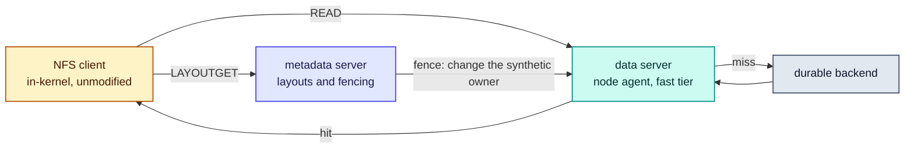

# RFC-0008: Access layer over pNFS

| | |
| --- | --- |
| **Status** | Draft |
| **Phase** | 1 |
| **Depends on** | 0007 |

## Problem

pNFS separates a metadata server from data servers: a client requests a layout, then reads bulk
data directly and in parallel from the data servers. That is the architecture Forebay wants, already
standardised, with a mature in-kernel client shipped by Linux. The control plane becomes the metadata
server and node agents become data servers.

The risk sits precisely where the protocol meets the lease model. Forebay reclaims capacity on the
compute scheduler's timetable, which means layouts have to be recalled from clients that are actively
reading. Whether that is fast and well behaved, or slow and ugly, decides whether this approach
survives.

## What a spike already established

Investigated 2026-08-31, from the specification and against a dev cluster. Recorded here so this RFC
starts from the answer rather than the question.

**Revocation does not depend on the client cooperating.** [RFC 8435](https://www.rfc-editor.org/rfc/rfc8435.html)
defines fencing for the flexible file layout: the metadata server changes the synthetic uid or gid
owning the data file on the storage device, which implicitly revokes the credentials the client was
given. Reclamation therefore never has to wait out an NFS lease period, which was the failure this
RFC was most at risk of.

In the loosely coupled model that fencing is not per client: "the metadata server is not able to
fence off a single client, it is forced to fence off all clients." For Forebay that is tolerable,
because every fenced reader takes a cache miss on regenerable data. Because Forebay owns both the
metadata server and the data servers, the tightly coupled model is also available, where revocation
is per client through `NFS4ERR_BAD_STATEID`. Choosing between them is now a real decision this RFC
has to make rather than an unknown.

**The client exists on the target OS.** Stock Ubuntu 24.04, kernel 6.8, ships
`CONFIG_PNFS_FLEXFILE_LAYOUT=m` with the driver present as `nfs_layout_flexfiles`, alias
`nfs-layouttype4-4`, alongside `CONFIG_NFS_V4_1=y` and `CONFIG_NFS_V4_2=y`. The commitment in
RFC-0001 not to write a client survives contact with a real node image.

**What is still unmeasured** is end-to-end revocation latency under load with a real metadata server,
since neither of the findings above involved a running pNFS deployment. That measurement belongs in
RFC-0018.

## What of this is built

**None of it.** No metadata server exists, no data server speaks NFS, and nothing reads from the fast
tier, which is the thing this layer exists to expose. `internal/fasttier` has a caller only in tests.

## Assumptions

| Assumption | Basis | Risk if wrong |
| --- | --- | --- |
| Flexfiles fencing revokes a layout without the client cooperating | **Measured against the specification**, RFC 8435, not against a running server | Reclamation waits out a lease period, and RFC-0005's deadline cannot be met while pNFS is the access path |
| A metadata server can be built on an existing NFS server rather than written | **Unverified, and the highest risk here.** NFS-Ganesha's FSAL architecture is the presumed seam, and whether it can host a flexfiles metadata server the way this design needs has not been tried | The access layer becomes an NFSv4.1 implementation, which is a different project and one RFC-0001 would not have started |
| Fencing all readers of an extent is acceptable because they take a miss on regenerable data | Reasoned, from the fast tier holding only what can be fetched again | The loosely coupled model is unusable and tight coupling becomes mandatory, with the control protocol it costs |
| A client whose layout is fenced returns it and asks for another rather than failing the read | Reasoned, from RFC 8435's error handling | Reclamation surfaces as IO errors in jobs, which is the outcome this whole design exists to avoid |
| Reading through the metadata server is an acceptable fallback | Reasoned. It is the protocol's own answer for a client that gets no layout | A client that cannot speak pNFS cannot use Forebay at all, which narrows the addressable deployment sharply |

## Design

### Flexfiles, because fencing is the whole argument

| Layout type | Why not |
| --- | --- |
| Files, NFSv4.1 | No fencing by credential change, so revoking means recalling and waiting for a client that may be busy or gone |
| Block | The client writes to a block device it can see, which is a different trust and topology model from a node agent serving ranges |
| SCSI | The same, with a narrower device story |

Flexfiles is chosen for one reason: the metadata server can revoke a layout by changing the synthetic
credential the data file is owned by, which does not require the client to do anything. Every other
property of the layout type is secondary to that, because reclamation on somebody else's schedule is
the constraint this layer has to satisfy.

### Loosely coupled first

Forebay owns both ends, so tight coupling is available: a control protocol between the metadata
server and the data servers, and revocation per client through `NFS4ERR_BAD_STATEID`.

It is not taken, for now. Tight coupling buys the ability to fence one reader instead of all readers
of an extent, and what that saves is a cache miss on data that can be fetched again. It costs a
protocol between two components that otherwise share nothing at runtime, and that protocol becomes a
thing to version, secure and operate.

**The cost of being wrong is bounded and the cost of being early is not.** If measurement shows the
herd of misses after a fence is worse than predicted, tight coupling is added and the fencing path
changes. If tight coupling is built first and turns out unnecessary, the control protocol stays
forever.

### The read path

### A tier miss is absorbed here, not passed on

RFC-0007 answers a read whose capacity was revoked with a miss the caller must re-issue, and says
explicitly that the caller is this layer rather than an application. An NFS client cannot be told to
try again in those terms.

So the data server absorbs it: on a miss it fetches the range from the durable backend through the
driver contract and serves it. The client experiences a slower read, which is the cost of the tier
having been wrong about what to keep, and never an error.

That is also why the mandatory core of RFC-0006 is a ranged read and nothing else. The miss path is
the only thing the access layer needs a backend to do.

### Fencing, and what a client sees

| Step | What happens |
| --- | --- |
| Compute needs capacity | The agent's pressure watch computes a shortfall and asks the lease manager |
| The tier is told first | `Revoke` marks the slab unreadable, so no reader can be handed a range being freed |
| The metadata server fences | The synthetic owner of the data file changes, so the credentials in outstanding layouts stop working |
| The client's reads fail | It returns the layout and asks for another, per RFC 8435 |
| The client gets a new layout | To another node holding the data, or to read through the metadata server |
| The agent unlinks | Only now, once nothing can reach the extent |

The order is the same one RFC-0005 requires of the agent, extended by one step: invalidate the tier,
fence the protocol, then unlink.

### Clients that cannot speak pNFS

They read through the metadata server, which is the protocol's own fallback rather than something
this design adds. It is slower, because the bulk data crosses the metadata server instead of going
node to node, and it is correct.

Whether that path is fast enough to be worth offering, or whether such clients should be refused
with a clear message rather than served badly, is not settled here.

## Alternatives considered

| Alternative | Trade-off | Why not |
| --- | --- | --- |
| Write an NFSv4.1 metadata server | Complete control, no dependency on a project with its own priorities | It is a multi-year effort with a long correctness tail, and RFC-0001 chose not to build storage primitives that already exist. The same reasoning applies to protocol implementations |
| Use the in-kernel Linux server as the metadata server | Mature, already on every node, no userspace hop | Its pNFS metadata support targets block and SCSI layouts. Flexfiles is what the fencing argument rests on, so this would mean kernel work, which is a much larger commitment than a userspace FSAL |
| A custom protocol between a Forebay client and the agents | Exactly the semantics we want, no protocol impedance | Shipping and supporting a client across kernels and distributions is the non-goal RFC-0001 states most firmly. It is also how a storage project acquires a support burden it cannot put down |
| S3 as the access protocol instead of a filesystem | No layouts, no recalls, no client to install, and the ecosystem already speaks it | Training dataloaders overwhelmingly expect a filesystem, and the projects that bridge that gap add a layer this design would then sit under. It is a real alternative for a later phase and a poor one for the read path Phase 1 has to prove |
| Tight coupling from the start | Per-client fencing, no herd of misses after a reclaim | It buys avoiding a miss on regenerable data and costs a permanent control protocol. Being wrong about the herd is recoverable; an unnecessary protocol is not |

## Failure modes

**The metadata server becomes the bottleneck.** Every layout request goes through it, and a job with
many small reads asks often. The protocol's answer is that layouts cover ranges rather than reads, so
the request rate is a function of the working set rather than of the read rate. Whether that holds
for a dataloader's access pattern is unmeasured.

**Fencing takes longer than the deadline.** The specification says fencing does not wait for the
client, but a real metadata server under load has its own latency, and it is unmeasured. If it
exceeds the elastic deadline, RFC-0005's promise cannot be kept through this access path, and the
deadline or the path has to change.

**The herd after a fence.** Loose coupling fences every reader of an extent, so a reclaim converts
all of them into backend reads at once. That is the same burst RFC-0007 describes for its own
revocation, arriving at the backend instead of at one reader.

**A client that ignores the fallback.** A client that neither speaks pNFS nor tolerates reading
through the metadata server simply cannot use Forebay, and finding that out at mount time is much
better than finding it out under load.

## Performance implications

Predicted. The point of pNFS is that bulk data does not cross the metadata server, so the ceiling on
a read is what the node agent and its NVMe can do rather than what one server can forward. Whether
that beats a fanned-out backend read is RFC-0001's crossover, owned by RFC-0018.

The fallback path has the opposite shape: everything crosses the metadata server, so it scales with
that one process. It exists for correctness rather than for throughput and should not be measured as
if it were the main path.

## Complexity

The hard part is not the protocol, which is specified and implemented. It is that this layer is the
first component with a hard dependency outside the project, so its risk is somebody else's release
schedule rather than our own design.

The second is that fencing couples three things that otherwise change independently: the lease
manager's deadline, the tier's revocation, and the metadata server's credential change. Getting the
order wrong does not fail loudly, it serves bytes that should have been unreachable.

## Security and tenancy

**AUTH_SYS is not sufficient across tenants.** It asserts a uid the client chooses, so one tenant can
claim another's identity. Flexfiles already issues a synthetic credential per layout, which bounds
what a client can reach on a data server to what it was given a layout for, and that is an
authorisation mechanism rather than an authentication one.

What authenticates a tenant in the first place, and whether separate export namespaces plus network
policy is enough or `RPCSEC_GSS` is required, is owned by
[RFC-0016](0016-multi-tenancy-qos-and-security.md).

The data server holds credentials to the durable backend so it can serve a miss. A compromised node
agent therefore reaches more than its own cache, which RFC-0004 already lists as an assumption and
RFC-0016 owns.

## Open questions

- **Whether NFS-Ganesha can host this metadata server**, which is the assumption this document is
  most exposed to. It needs a spike against a running server rather than an argument, and no RFC
  owns it because it is this document's own work before it can be accepted.
- **End-to-end revocation latency under load**, with a real metadata server rather than from the
  specification. Owned by [RFC-0018](0018-benchmark-and-falsification-suite.md).
- **How often a dataloader asks for layouts**, since it decides whether the metadata server is a
  bottleneck. Owned by [RFC-0018](0018-benchmark-and-falsification-suite.md), which owns workload
  definition.
- **What authenticates a tenant**, and whether AUTH_SYS with network isolation is acceptable or
  `RPCSEC_GSS` is required. Owned by [RFC-0016](0016-multi-tenancy-qos-and-security.md).
- **Whether the read-through-metadata-server fallback is worth offering**, or whether a client that
  cannot speak pNFS should be refused at mount time with a clear message rather than served a path
  that will disappoint. No RFC owns this, because it is a product decision about who the system is
  for rather than an engineering one.

