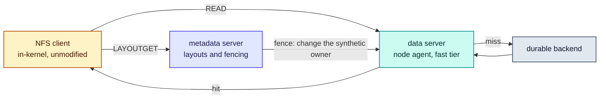

# RFC-0008: Access layer over pNFS

| | |
| --- | --- |
| **Status** | Accepted |
| **Phase** | 1 |
| **Depends on** | 0007 |

## Problem

pNFS separates a metadata server from data servers: a client requests a layout, then reads bulk
data directly and in parallel from the data servers. That is the architecture Forebay wants, already
standardised, with a mature in-kernel client shipped by Linux. The control plane becomes the metadata
server and node agents become data servers.

The risk sits precisely where the protocol meets the lease model. Forebay reclaims capacity on the
compute scheduler's timetable, which means layouts have to be recalled from clients that are actively
reading. Whether that is fast and well behaved, or slow and ugly, decides whether this approach
survives.

## What a spike already established

Investigated 2026-08-31, from the specification and against a dev cluster. Recorded here so this RFC
starts from the answer rather than the question.

**Revocation does not depend on the client cooperating.** [RFC 8435](https://www.rfc-editor.org/rfc/rfc8435.html)
defines fencing for the flexible file layout: the metadata server changes the synthetic uid or gid
owning the data file on the storage device, which implicitly revokes the credentials the client was
given. Reclamation therefore never has to wait out an NFS lease period, which was the failure this
RFC was most at risk of.

In the loosely coupled model that fencing is not per client: "the metadata server is not able to
fence off a single client, it is forced to fence off all clients." For Forebay that is tolerable,
because every fenced reader takes a cache miss on regenerable data. Because Forebay owns both the
metadata server and the data servers, the tightly coupled model is also available, where revocation
is per client through `NFS4ERR_BAD_STATEID`. Choosing between them is now a real decision this RFC
has to make rather than an unknown.

**The client exists on the target OS.** Stock Ubuntu 24.04, kernel 6.8, ships
`CONFIG_PNFS_FLEXFILE_LAYOUT=m` with the driver present as `nfs_layout_flexfiles`, alias
`nfs-layouttype4-4`, alongside `CONFIG_NFS_V4_1=y` and `CONFIG_NFS_V4_2=y`. The commitment in
RFC-0001 not to write a client survives contact with a real node image.

**The metadata server is an FSAL, not an NFS server.** Investigated 2026-09-02, reading the V4, V5
and V6 source. Ganesha moves, and the last row below is the kind of finding that changes.

| What Ganesha supplies | Evidence, in the source |
| --- | --- |
| The pNFS metadata operations | `[NFS4_OP_LAYOUTGET] = { .funct = nfs4_op_layoutget }` in the compound dispatch table, under no build flag, beside the layout return, commit and device operations |
| The hooks an FSAL implements to become one | `layoutget`, `getdeviceinfo` and `fs_layouttypes` in `fsal_api.h` |
| A flexfiles layout encoder | `FSAL_encode_flex_file_layout` in all three lines, taking `ffds_user` and `ffds_group`, which the header calls the synthetic uid for the RPC to the data server. That is the fencing lever, exposed as an argument |
| Data server registration | `pnfs_ds_insert`, `pnfs_ds_put`, `pnfs_ds_remove` |
| Six worked examples | CEPH, GLUSTER, GPFS, KVSFS, LIZARDFS and SAUNAFS. `FSAL_CEPH` sets `ops->layoutget`, `ops->getdeviceinfo` and `ops->fs_layouttypes`, which is the whole of becoming one |

**None of those six emits a flexfiles layout.** Every one advertises `LAYOUT4_NFSV4_1_FILES`, so the
encoder has no in-tree caller and Forebay would be its first.

**It is not only unused, it is unreachable.** Ganesha exports its library through a version script,
and the flexfiles helpers are absent from it, so an FSAL that calls them does not link:
`undefined reference to FSAL_encode_ff_device_versions4`. They are public in the headers,
non-static and documented, and simply left off the list. Exporting them is a patch upstream rather
than a fork.

| Symbol | Absent from the export list | Needed to link the FSAL below |
| --- | --- | --- |
| `FSAL_encode_flex_file_layout` | yes | yes |
| `FSAL_encode_ff_device_versions4` | yes | yes |
| `FSAL_encode_ipv4_netaddr` | yes | not by this one, which does not call it |
| `xdr_fsal_deviceid` | yes | not by this one, which does not call it |

That the first two are required is measured, by the link failing without them. The other two are
absent on the same terms and would stop any FSAL that calls them, which this one does not, so
whether a fuller metadata server needs them is reasoned rather than tried.

**With those exports a stock client takes a flexfiles layout.** A 172-line FSAL, built on
`FSAL_MEM`, advertises `LAYOUT4_FLEX_FILES` from `fs_layouttypes`, describes one data server from
`getdeviceinfo` and encodes a whole-file layout from `layoutget`; Ganesha's own helpers do the XDR.
Against it, Linux 6.8 reports `pnfs=LAYOUT_FLEX_FILES` in `/proc/self/mountstats`, where the same
export without the FSAL reports `pnfs=not configured`.

The two readings came from one `mountstats` holding two mounts, and the lines carry no mountpoint,
so which is which follows from the order they were made rather than from the output. The reading is
sound, since only a server advertising a layout type makes a client report one and the two servers
differed by nothing else, but it is one step short of an artifact that stands alone. Repeating it
means rebuilding Ganesha, and a repeat should capture the mountpoint beside the reading.

What that does not show is a byte moving. The client then goes to the data server for I/O, and the
address in the layout pointed at the metadata server, which is not one, so the read blocked. That is
the honest boundary of the spike: the metadata server half is answered and the data server half is
the work.

### The data server answers over a socket

A pNFS client talks to an NFS server, and the read path is Go. Rather than write NFSv4.1 a second
time, the node agent answers reads on a local socket and an FSAL inside an NFS server asks it, which
is the same shape as the metadata server: Ganesha speaks the protocol and Forebay answers the
question.

The protocol is deliberately small, because a C FSAL is its second implementation and every feature
is one somebody writes twice. One request, one reply, a fixed header, no negotiation. A frame that
is not this protocol closes the connection rather than being answered, since by then the framing is
already lost and a reply would land inside whatever the far side thinks it is reading.

It carries two questions rather than one. An NFS server answers getattrs before a client will read
anything, and it cannot invent a size: too small truncates the file and too large sends the client
reading past the end. The size is asked of the backend rather than of the tier, because a size the
tier could answer is a size for the blocks it happens to hold.

A size comes back as the reply's bytes rather than as a field in the header, so the frame every
implementation reads carries nothing that one question needs, and the operation was added without
bumping the version: it changes no existing frame's meaning, and a reader that does not know an
operation refuses it by name rather than misreading it as one it does know.

What it carries that a plain byte channel would not is the difference between a read past the end of
an object and a backend that could not answer. An NFS server owes a client different errors for
those two, and cannot tell them apart from a failed read, so the status is on the wire and a
malformed request is a third answer again: it will not come right on a retry and the other two might.

Neither side waits on the other for ever. A connection that stops asking is cut off, so is one that
stops taking its answer, and a reply that stops arriving ends the conversation, because a request
half sent and a reply half read leave the stream in the same place, which is nowhere. Bounding the
request and leaving the answer unbounded is not a bound: a reply nobody takes blocks a write with
nothing to end it, and holds its place for as long as the process lives.

Waiting and working are bounded separately, because they are different questions: how long a caller
may stay quiet, and how long an exchange may take. One clock covering both spends on the wait what
the work then needs, and a connection quiet for most of its bound is answered in whatever remains.
That is the wrong way round: the read after a quiet spell is the one most likely to miss and go to
the backend, so the slowest request would meet the smallest budget. The caller on this socket
is an NFS server with a client of its own waiting on it, so waiting indefinitely is not the neutral
choice it looks like.

There is no authentication. The far side is an NFS server on the same node and the socket's own
permissions are the boundary, which is a statement about where this may be reached from rather than
a gap to fill later.

A client has read through it. `fsal/` holds the protocol's second implementation in C and enough of
an FSAL to prove the path: with the hook in NFS-Ganesha's memory FSAL, a stock Linux 6.8 client
mounting that export read a 32 MiB object and the bytes summed to what the backend holds,
4278124615, rather than to the 3254779904 the FSAL would have returned itself. A file the backend
does not have fell back to the FSAL, so the hook is selective rather than swallowing every read.

The namespace in that spike is the FSAL's and only the bytes are Forebay's, which is the honest
boundary of it: a real FSAL carries its own namespace and handles.

**And what a distribution ships is not what upstream has.** Everything above is read from the source.
Checked against the 4.3 the target OS packages, on a dev cluster node, that build exports
`FSAL_encode_file_layout` and not the flexfiles one, so a build from a current stable line is
required rather than the distribution package.

**What is still unmeasured** is end-to-end revocation latency under load with a real metadata server,
since none of the findings above involved a running pNFS deployment. That measurement belongs in
RFC-0018.

## What of this is built

**The read path, and an FSAL whose namespace is Forebay's.** No metadata server exists in the pNFS
sense: this is a plain NFS server reading through the agent, which is the configuration a stock
client mounts today.

`fsal/forebay_fsal.c` is an NFS-Ganesha FSAL rather than a hook in somebody else's. It compiles and
links against V5-stable, and every one of the thirty-five symbols it needs is one Ganesha exports —
which is the check the pNFS spike failed, and it passes here because this calls none of the
flexfiles helpers.

Two things it does not do, and says so rather than pretending. It cannot list a directory: the
driver contract in RFC-0006 has read-range, object-size, write, delete, snapshot and clone, and no
list, so Forebay cannot enumerate a backend at all. A dataloader opening shards it already names
works; `ls` shows an empty directory. And it is read-only, because RFC-0021 makes a published
version immutable to every path Forebay controls and an FSAL that accepted a write would be the one
place that was not true.

Without listing, a lookup decides: a name the agent can give a size for is a file, and anything else
is offered as a directory a client may walk through. That is not a guess about what exists, it is
the only shape a namespace with no listing can have, and refusing instead would make every path
unreachable including the ones that are there.

The parts that need no Ganesha header are kept out of the module and checked here: the path mapping,
which the Go side cross-checks so the two views cannot silently disagree, and the connection holder,
whose behaviour with no agent to talk to is the state a node is in while the agent is starting.

`internal/dataserver` answers a byte range of an object: from the fast tier where the blocks are
resident, and from the durable backend through the driver contract where they are not. It is the
first caller `internal/fasttier` has outside its own tests.

It absorbs the miss, which is the part this document argued for. Capacity taken back mid-read becomes
a fetch and a slower answer, never an error. What stays an error is a range past the end of the
object, because a caller asking for bytes that do not exist has made a different mistake from one
whose cached bytes went away, and answering it short reads as truncation.

A read is bounded before it is answered. The answer is sized from the length asked for, and the
object's real size is not known until the backend has been asked, so a large enough number reaches
the allocator first and the process does not survive it. What the caller asks for is therefore
checked against a configured maximum rather than against the object.

The last block of an object whose size is not a multiple of the block size is the awkward case. A
whole-block fetch of it runs past the end, which the driver contract calls an error rather than
returning a short read.

Where the backend declares `object-size`, the tail is fetched at its real length and admitted like
any other block, because it is a whole block: there is nothing shorter behind it. A miss on it costs
three requests, since the whole-block read is attempted and refused before the size is asked for, and
then nothing at all once the block is resident. Where it does not,
the read asks for what it needs, serves that and does not admit it, since a short answer cannot be
told from the object being shorter than the caller believed and a partial block would be served whole
to the next reader.

That fallback is worse than it first reads, which is why the capability exists. An object smaller
than one block is entirely tail, so the carve-out swallows the whole object: five reads of a
hundred-byte object made ten backend requests and cached nothing, since each read pays a whole-block
probe that fails and a narrowed fetch that cannot be kept. Datasets of many small files are exactly
that shape and are a workload this tier is for.

## Assumptions

| Assumption | Basis | Risk if wrong |
| --- | --- | --- |
| Flexfiles fencing revokes a layout without the client cooperating | **Measured against the specification**, RFC 8435, not against a running server | Reclamation waits out a lease period, and RFC-0005's deadline cannot be met while pNFS is the access path |
| A metadata server can be built on an existing NFS server rather than written | **Measured against a running server.** A 172-line FSAL over NFS-Ganesha V6.5 advertised the flexible file layout and Linux 6.8 negotiated it. Two helper symbols had to be exported first, without which it does not link. NFS-Ganesha implements the pNFS metadata operations, exposes `layoutget`, `getdeviceinfo` and `fs_layouttypes` as FSAL hooks, and ships `FSAL_encode_flex_file_layout` taking the synthetic uid and gid this design fences with. Six in-tree FSALs already implement a metadata server, so the shape is established. What is written is an FSAL, not an NFS server | The access layer becomes an NFSv4.1 implementation, which is a different project and one RFC-0001 would not have started |
| The flexfiles encoder works, having no in-tree user | **Partly measured.** It encodes a layout a Linux 6.8 client accepts, which is more than nobody had run before. What it has not done is serve a byte, since that needs a data server, so its behaviour under a real read is still unknown | An encoder nobody runs is a body of work discovered late, and the schedule assumes an existing server rather than one being fixed |
| Fencing all readers of an extent is acceptable because they take a miss on regenerable data | Reasoned, from the fast tier holding only what can be fetched again | The loosely coupled model is unusable and tight coupling becomes mandatory, with the control protocol it costs |
| A client whose layout is fenced returns it and asks for another rather than failing the read | Reasoned, from RFC 8435's error handling | Reclamation surfaces as IO errors in jobs, which is the outcome this whole design exists to avoid |
| A read crossing from an NFS server into the node agent is affordable | **Unverified, and the cost this design chose.** Serving pNFS without writing NFSv4.1 twice puts a process boundary on the read path, and a tier meant to beat a fanned-out backend cannot leave the price of its own indirection unmeasured | The data server is written in-process after all, which means writing the protocol, or the hop is paid and the tier's advantage is smaller than the numbers that justified it |
| Reading through the metadata server is an acceptable fallback | Reasoned. It is the protocol's own answer for a client that gets no layout | A client that cannot speak pNFS cannot use Forebay at all, which narrows the addressable deployment sharply |

## Design

### Flexfiles, because fencing is the whole argument

| Layout type | Why not |
| --- | --- |
| Files, NFSv4.1 | No fencing by credential change, so revoking means recalling and waiting for a client that may be busy or gone |
| Block | The client writes to a block device it can see, which is a different trust and topology model from a node agent serving ranges |
| SCSI | The same, with a narrower device story |

Flexfiles is chosen for one reason: the metadata server can revoke a layout by changing the synthetic
credential the data file is owned by, which does not require the client to do anything. Every other
property of the layout type is secondary to that, because reclamation on somebody else's schedule is
the constraint this layer has to satisfy.

### Loosely coupled first

Forebay owns both ends, so tight coupling is available: a control protocol between the metadata
server and the data servers, and revocation per client through `NFS4ERR_BAD_STATEID`.

It is not taken, for now. Tight coupling buys the ability to fence one reader instead of all readers
of an extent, and what that saves is a cache miss on data that can be fetched again. It costs a
protocol between two components that otherwise share nothing at runtime, and that protocol becomes a
thing to version, secure and operate.

**The cost of being wrong is bounded and the cost of being early is not.** If measurement shows the
herd of misses after a fence is worse than predicted, tight coupling is added and the fencing path
changes. If tight coupling is built first and turns out unnecessary, the control protocol stays
forever.

### The read path

### A tier miss is absorbed here, not passed on

RFC-0007 answers a read whose capacity was revoked with a miss the caller must re-issue, and says
explicitly that the caller is this layer rather than an application. An NFS client cannot be told to
try again in those terms.

So the data server absorbs it: on a miss it fetches the range from the durable backend through the
driver contract and serves it. The client experiences a slower read, which is the cost of the tier
having been wrong about what to keep, and never an error.

That is also why the mandatory core of RFC-0006 is a ranged read and nothing else. The miss path is
the only thing the access layer requires a backend to do, and a backend offering only that serves
every read correctly. What it will use where offered is `object-size`, which is what lets the tail of
an object be cached rather than re-fetched.

### Fencing, and what a client sees

| Step | What happens |
| --- | --- |
| Compute needs capacity | The agent's pressure watch computes a shortfall and asks the lease manager |
| The tier is told first | `Revoke` marks the slab unreadable, so no reader can be handed a range being freed |
| The metadata server fences | The synthetic owner of the data file changes, so the credentials in outstanding layouts stop working |
| The client's reads fail | It returns the layout and asks for another, per RFC 8435 |
| The client gets a new layout | To another node holding the data, or to read through the metadata server |
| The agent unlinks | Only now, once nothing can reach the extent |

The order is the same one RFC-0005 requires of the agent, extended by one step: invalidate the tier,
fence the protocol, then unlink.

### Clients that cannot speak pNFS

They read through the metadata server, which is the protocol's own fallback rather than something
this design adds. It is slower, because the bulk data crosses the metadata server instead of going
node to node, and it is correct.

Whether that path is fast enough to be worth offering, or whether such clients should be refused
with a clear message rather than served badly, is not settled here.

## Alternatives considered

| Alternative | Trade-off | Why not |
| --- | --- | --- |
| Write an NFSv4.1 metadata server | Complete control, no dependency on a project with its own priorities | It is a multi-year effort with a long correctness tail, and RFC-0001 chose not to build storage primitives that already exist. The same reasoning applies to protocol implementations |
| Use the in-kernel Linux server as the metadata server | Mature, already on every node, no userspace hop | Its pNFS metadata support targets block and SCSI layouts. Flexfiles is what the fencing argument rests on, so this would mean kernel work, which is a much larger commitment than a userspace FSAL |
| A custom protocol between a Forebay client and the agents | Exactly the semantics we want, no protocol impedance | Shipping and supporting a client across kernels and distributions is the non-goal RFC-0001 states most firmly. It is also how a storage project acquires a support burden it cannot put down |
| S3 as the access protocol instead of a filesystem | No layouts, no recalls, no client to install, and the ecosystem already speaks it | Training dataloaders overwhelmingly expect a filesystem, and the projects that bridge that gap add a layer this design would then sit under. It is a real alternative for a later phase and a poor one for the read path Phase 1 has to prove |
| Tight coupling from the start | Per-client fencing, no herd of misses after a reclaim | It buys avoiding a miss on regenerable data and costs a permanent control protocol. Being wrong about the herd is recoverable; an unnecessary protocol is not |

## Failure modes

**The metadata server becomes the bottleneck.** Every layout request goes through it, and a job with
many small reads asks often. The protocol's answer is that layouts cover ranges rather than reads, so
the request rate is a function of the working set rather than of the read rate. Whether that holds
for a dataloader's access pattern is unmeasured.

**Fencing takes longer than the deadline.** The specification says fencing does not wait for the
client, but a real metadata server under load has its own latency, and it is unmeasured. If it
exceeds the elastic deadline, RFC-0005's promise cannot be kept through this access path, and the
deadline or the path has to change.

**The herd after a fence.** Loose coupling fences every reader of an extent, so a reclaim converts
all of them into backend reads at once. That is the same burst RFC-0007 describes for its own
revocation, arriving at the backend instead of at one reader.

**A client that ignores the fallback.** A client that neither speaks pNFS nor tolerates reading
through the metadata server simply cannot use Forebay, and finding that out at mount time is much
better than finding it out under load.

## Performance implications

Predicted. The point of pNFS is that bulk data does not cross the metadata server, so the ceiling on
a read is what the node agent and its NVMe can do rather than what one server can forward. Whether
that beats a fanned-out backend read is RFC-0001's crossover, owned by RFC-0018.

The fallback path has the opposite shape: everything crosses the metadata server, so it scales with
that one process. It exists for correctness rather than for throughput and should not be measured as
if it were the main path.

## Complexity

The hard part is not the protocol, which is specified and implemented. It is that this layer is the
first component with a hard dependency outside the project, so its risk is somebody else's release
schedule rather than our own design.

The second is that fencing couples three things that otherwise change independently: the lease
manager's deadline, the tier's revocation, and the metadata server's credential change. Getting the
order wrong does not fail loudly, it serves bytes that should have been unreachable.

## Security and tenancy

**AUTH_SYS is not sufficient across tenants.** It asserts a uid the client chooses, so one tenant can
claim another's identity. Flexfiles already issues a synthetic credential per layout, which bounds
what a client can reach on a data server to what it was given a layout for, and that is an
authorisation mechanism rather than an authentication one.

What authenticates a tenant in the first place, and whether separate export namespaces plus network
policy is enough or `RPCSEC_GSS` is required, is owned by
[RFC-0016](0016-multi-tenancy-qos-and-security.md).

The data server holds credentials to the durable backend so it can serve a miss. A compromised node
agent therefore reaches more than its own cache, which RFC-0004 already lists as an assumption and
RFC-0016 owns.

## Open questions

- **Whether an NFS server in front of the read path is fast enough**, since the node agent now
  answers reads over a socket rather than in the reader's own process. The hop is a design cost this
  document accepted without measuring it, and a data path meant to beat a fanned-out backend cannot
  leave that unmeasured. Owned by [RFC-0018](0018-benchmark-and-falsification-suite.md).
- **End-to-end revocation latency under load**, with a real metadata server rather than from the
  specification. Owned by [RFC-0018](0018-benchmark-and-falsification-suite.md).
- **How often a dataloader asks for layouts**, since it decides whether the metadata server is a
  bottleneck. Owned by [RFC-0018](0018-benchmark-and-falsification-suite.md), which owns workload
  definition.
- **What authenticates a tenant**, and whether AUTH_SYS with network isolation is acceptable or
  `RPCSEC_GSS` is required. Owned by [RFC-0016](0016-multi-tenancy-qos-and-security.md).
- **Whether the read-through-metadata-server fallback is worth offering**, or whether a client that
  cannot speak pNFS should be refused at mount time with a clear message rather than served a path
  that will disappoint. No RFC owns this, because it is a product decision about who the system is
  for rather than an engineering one.

