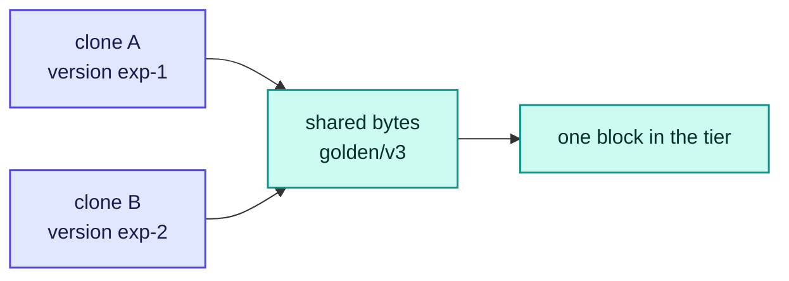

# RFC-0012: Dataset, version, snapshot and clone model

| | |
| --- | --- |
| **Status** | Accepted |
| **Phase** | 2 |
| **Depends on** | 0006, 0009, 0014 |

## Problem

AI work is organised around datasets, versions, experiments, checkpoints and models, not volumes
and LUNs. Making those first-class in the control plane is what lets a researcher clone a dataset for
an experiment without copying it, and lets an operator understand what is consuming capacity.

Cheap copy-on-write clones are the feature that makes this worth building. They are also the feature
whose implementation depends most on what the backend underneath can actually do.

## What of this is built

**Identity and the rules that follow from it.** A dataset carries a version, an address is derived
from the two, and the derivation is what makes the hardest question in this document stop being a
question. Clone is refused where a backend does not declare it.

There is no clone path, no garbage collection and no experiment or model kind. What exists is the
naming, the immutability rule, and the refusal.

## Assumptions

| Assumption | Basis | Risk if wrong |
| --- | --- | --- |
| A clone that copies is not a clone | Constraint from RFC-0006, and the reason the driver contract refuses to emulate one | A researcher waits for a copy of a dataset they were told was instant, and the feature that justifies the model is the one that does not work |
| A version is immutable once written | Reasoned, and the property every other rule here rests on: garbage collection, cache identity and reproducibility all assume it | A cached block is valid for a name whose contents changed, and a reader gets a mixture of two versions |
| A fan-out of clones from one golden dataset is the common shape | Reasoned, from how experiments are run against a fixed corpus | The tier caches per clone rather than per byte, and the case it is worth most in is the one it handles worst |
| Most backends can snapshot and few can clone cheaply | Unverified. Object stores generally do neither, and the ones this project has driven do neither | The model is built around a primitive nothing has, and every clone is a refusal |

## Design

### The model, and what each thing is for

| Kind | Is | Mutable |
| --- | --- | --- |
| Dataset | A name a team uses for a body of data | Its versions change; its identity does not |
| Version | The contents of a dataset at a point, named by the user or by content | Never |
| Snapshot | A version the backend took, rather than one a user wrote | Never |
| Clone | A version that shares its bytes with a parent until something writes | Never, in the parts it shares |

Experiment, checkpoint and model are deliberately not kinds here. They are things a user attaches to a
version, and inventing a kind for each would make this document a schema for somebody's workflow
rather than a storage model. RFC-0023 owns lineage and is where they belong.

### Identity is part of the address, and that answers the hardest question

The question this document was asked is what a reader holding cached blocks from a deleted version
should see. The bytes are valid for an identity that no longer exists, so serving them is arguably
correct and definitely surprising.

**It stops being a question if the version is part of the address.** An object is addressed as the
dataset, the version and the name within it. A cached block is keyed by that address. So when a
version is deleted:

| | |
| --- | --- |
| Can a reader ask for it again | No. The address names a version that is gone, and the control plane will not resolve it |
| Are the cached blocks wrong | No. They are the correct bytes for an address nobody can name |
| What happens to them | They age out by eviction, like any block nobody asks for |
| Does anything have to be told | No, and that is the point: no invalidation message has to reach every node |

The alternative designs both fail in the same place. Telling every node to drop blocks needs a message
that arrives, and a node that missed it serves data for a deleted identity. Letting the tier serve
them anyway means a deleted version is still readable, which is the surprise the question names.

Making identity part of the address means a deletion needs no coordination at all, and the worst case
is capacity held by blocks nobody wants, which eviction already handles.

### One golden dataset, many clones, one copy in the tier

The case the tier is worth most in is a fan-out: a hundred experiments against one corpus. It is also
the case a naive cache handles worst, holding a hundred copies of bytes that are the same.

So **the tier keys on the address the backend serves, not on the address the user asked for.** A
clone that shares a byte with its parent shares the cached block, because the block is named by where
the byte actually lives.

That is the whole reason the resolution is two steps rather than one. A user's address resolves to a
backend address, and only the second is a cache key.

### A backend that cannot clone is told so, loudly

| The backend declares | A clone request |
| --- | --- |
| `clone` | Is made with the backend's own primitive |
| `snapshot` but not `clone` | Is refused, naming what is missing |
| Neither | Is refused, naming what is missing |

Copying the bytes is not a fallback. RFC-0006 already refuses to emulate an undeclared capability,
and a clone that copies is not a clone: the caller chose it precisely to avoid the copy, and taking
an hour to do what was advertised as instant is worse than saying no.

**The refusal names the capability rather than the operation.** An operator reading *this backend
does not declare clone* knows what to change; one reading *cloning is not supported* does not.

### Immutability, and what names mean

| Rule | Because |
| --- | --- |
| A version's contents never change once written | Everything else here rests on it: a cache key, a garbage collector and a reproducible experiment all assume the name still means what it meant |
| A version name is unique within a dataset and is never reused | Reuse makes a stale cached block indistinguishable from a fresh one, which is the failure the address design exists to prevent |
| A dataset may be deleted while a clone of it exists | The clone holds a reference, and the parent's bytes survive until nothing references them |

A name that could be reused would defeat the address design: the same address would mean two things
at two times, and a cached block would be valid for one of them with no way to tell which.

### Garbage collection is reference counting, and it is not built

Bytes are referenced by the versions that name them. A version deleted while a clone still shares its
bytes keeps those bytes alive, because the clone references them.

This document states the rule and does not implement it. Collection needs a control plane that can
enumerate every reference before deleting anything, and enumerating wrongly deletes a researcher's
data: it is the one operation here where being approximately right is much worse than being slow.

## Alternatives considered

| Alternative | Trade-off | Why not |
| --- | --- | --- |
| Invalidate cached blocks on delete | The tier never holds bytes for a dead identity | It needs a message that reaches every node, and a node that missed it serves data for a version that was deleted |
| Let the tier serve blocks of a deleted version | Nothing to coordinate, and the reads are fast | It is the surprise the question names: a deleted thing is still readable |
| Copy on clone when the backend cannot | Every clone request succeeds | It is silent degradation with a stopwatch: the caller chose a clone to avoid the copy |
| Make experiment and checkpoint first-class kinds | The model matches how researchers talk | It makes this a schema for one workflow, and RFC-0023 owns lineage |
| Content-addressed versions only | Identity is intrinsic and reuse is impossible | It takes the naming away from users, who name a version `v3` and mean it |

## Failure modes

| Failure | What happens | Why it is acceptable |
| --- | --- | --- |
| A version is deleted while a reader holds its blocks | The reader finishes from cache and cannot ask for more | The bytes are correct for the address; a mid-read deletion is a race the user created |
| A backend loses `clone` between declaration and request | The request is refused, naming the capability | Refusal over a copy that pretends to be a clone |
| A name is reused despite the rule | A stale block is served as a fresh one | This is why the rule is a rule; enforcing it needs the control plane that does not exist, and the gap is named here rather than assumed away |
| Garbage collection is never built | Deleted versions hold backend capacity forever | Storage is the cheapest thing being wasted, and deleting wrongly is much worse than deleting late |

## Performance implications

Resolution adds one map from a user address to a backend address, on a path that already talks to a
control plane. The cache key is a string that is already built per read.

The fan-out case improves rather than costs: a hundred clones of one corpus hold one copy of each
shared block, where a per-clone key would hold a hundred.

## Complexity

An address, an immutability rule and a refusal. The complexity deliberately not taken on is garbage
collection, which needs a complete reference graph, and the document says so rather than shipping a
collector that is approximately right.

## Security and tenancy

An address carries a dataset and a version, both of which are a tenant's names for their own data. A
clone crossing a tenancy boundary is a copy of one tenant's bytes into another's namespace and is
refused there rather than here; RFC-0016 owns who may reference whose data.

Deleting a version does not delete bytes a clone still references, which means a tenant can keep
another's bytes alive by cloning them. That is a quota question and belongs with quota.

## Open questions

- **Who may clone across a tenancy boundary**, since a clone that shares bytes makes one tenant's
  deletion depend on another's reference. Owned by
  [RFC-0016](0016-multi-tenancy-qos-and-security.md), which owns tenancy.
- **Whether experiment, checkpoint and model become kinds or stay attachments**, which this document
  answers for now and does not own. Owned by
  [RFC-0023](0023-lineage-and-reproducibility.md), which owns lineage.
- **How a reference graph is enumerated safely enough to delete against**, which is the one
  operation here where being approximately right is worse than being slow. No RFC owns it, because it
  needs a control plane that can enumerate every reference and nothing yet enumerates anything.
