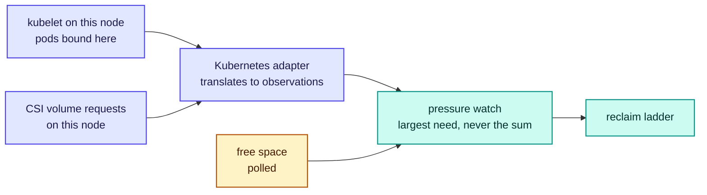

# RFC-0014: Kubernetes integration

| | |
| --- | --- |
| **Status** | Draft |
| **Phase** | 1 |
| **Depends on** | 0004, 0005 |

## Problem

Kubernetes is the MVP's only orchestrator. It supplies the signals that tell Forebay compute wants
its capacity back, and it is how users will ask for storage in the first place.

The interesting part is not the CSI driver. It is that Forebay's notion of borrowed capacity and
Kubernetes' notion of node resources have to agree, or the scheduler and the storage system will each
believe they own the same bytes.

## What of this is built

**None of it.** There is no operator, no CRD, no CSI driver, and nothing reads the Kubernetes API.

The agent's pressure watch has three inputs in its design and one in its code: it polls free space,
and the two that would give warning before a workload writes anything are the ones this document
supplies. That is why the watch is reactive today, and why `internal/agent` says so at startup.

## Assumptions

| Assumption | Basis | Risk if wrong |
| --- | --- | --- |
| The kubelet will tell a node-local process which pods are bound to it | Reasoned, from the kubelet's own API being how every node-local agent learns this | The agent reads the API server instead, and reclamation becomes blockable by a partition, which RFC-0004 forbids |
| Pods that will write a lot declare an ephemeral-storage request often enough to be worth watching | **Unverified**, and the reason free space is polled regardless | The declared-request input is noise and only polling is real, which makes the watch permanently reactive |
| Reclamation is fast enough that admitting a pod against capacity Forebay holds is safe | **Partly measured.** Reclaiming through the agent is 2.8 ms for 7 GiB and 7.4 ms under concurrent writes, so the filesystem is not the constraint. Detecting the need and invalidating readers is unmeasured and is what RFC-0004 expects to dominate, so the measured half is not the half that decides this | The scheduler has to be told about borrowed capacity after all, which makes a node with Forebay advertise less than one without |
| A user asks for a dataset, not for capacity | Reasoned, from borrowed capacity being cache rather than storage a user can hold | The CSI driver has to hand out reclaimable space as a volume, which promises a durability it cannot keep |

## Design

### Borrowed capacity is invisible to the scheduler

This is the decision the rest follows from, and the alternative is more tempting than it looks.

Subtracting borrowed capacity from a node's allocatable `ephemeral-storage` would stop the scheduler
ever admitting a pod whose storage need collides with Forebay's. It would also mean a node running
Forebay advertises less capacity than the same node without it, which is precisely the outcome
RFC-0005 forbids: **Forebay must never leave a node worse off than if Forebay were not installed.**
A scheduler that sees a smaller node schedules fewer pods onto it, and the project would have made
the cluster worse in order to make its own accounting tidier.

So the kubelet reports what it always reported, the scheduler schedules as it always did, and a pod
is sometimes admitted against space Forebay is holding. That is not a race to be avoided. It is the
signal, and returning the space is the thing this project is for.

The tolerance for this rests on reclamation being fast, which is measured for the parts that exist
and unmeasured for the part that matters most. If it turns out slow, the honest response is to
change this decision rather than to keep it and hope.

### What is a CRD, and what is not

| | Holds | Because |
| --- | --- | --- |
| **CRD** | What a user declares: datasets, and the intent attached to them | It is low-churn, it is the user's, and `kubectl get` is how people expect to see it |
| **Control plane state** | What the system observes: leases, capacity, residency | It changes per second and per node, and etcd is not where a fast-moving observation belongs |

The rule is that a CRD carries a declaration and never a measurement. A lease is not something a
user asks for; it is the record of a negotiation between a control plane and a node that the node
already has authority over. Writing leases into etcd would put the busiest fact in the system into
its slowest store, and would invite a second source of truth about capacity that the node is already
the authority on.

### Three inputs, and where the two missing ones come from

**The agent reads pods from the kubelet, not from the API server.** RFC-0004 requires that
reclamation never needs the control plane, because a partition must not be able to block a node from
giving compute its disk back. An agent that learned about pods from the API server would have exactly
that dependency, and would discover it during the incident rather than before.

`DiskPressure` is not an input. RFC-0004 already says that reaching it from pressure the agent could
have seen coming is an agent defect, and building on it would make the defect the design.

### Nothing Kubernetes-shaped enters the agent

The pressure watch takes observations, each carrying a source and a need, and reclaims against the
largest. Kubernetes is one source of observations. A Slurm adapter, or a bare-metal one, is another,
and neither requires the agent to change.

That is the whole of the answer to not constraining a later orchestrator: the agent already has no
opinion about where an observation came from, and this document does not give it one. The adapter is
a separate process with the Kubernetes client in it, and `internal/agent` keeps no Kubernetes types.

### The CSI driver mounts datasets, never capacity

A volume implies the data stays until the pod is done with it. Borrowed capacity does not stay: that
is its defining property. A driver that handed out borrowed space as a `PersistentVolume` would be
promising a durability it is designed to break.

So the driver attaches a dataset, which lives in a durable backend and is reached through the access
layer. The fast tier accelerates that read and is never itself the volume. Borrowed capacity stays
invisible to the user, which is also what makes it safe to reclaim.

It runs as both halves of a CSI driver and neither is unusual. The controller plugin resolves a
dataset to something mountable and does no provisioning, because nothing is being allocated. The node
plugin mounts it through the access layer, read-only, since a published version is immutable.

**Its interaction with the agent is one direction only: it reports, and never asks.** A volume
request on this node is one of the three things that tell the agent compute is about to want space,
so the node plugin hands it to the adapter as an observation like any other. It does not grant, does
not reclaim and does not consult the agent before mounting, because a mount that waited on a local
storage daemon would fail a pod for a reason the pod has nothing to do with.

Scratch is the case this leaves open. A job that wants fast local space and accepts losing it is
asking for exactly what the borrowed pool holds, and an ephemeral volume is nearly the right shape
except that ephemeral means "as long as the pod" and borrowed means "until compute wants it". Those
two are not the same promise, and pretending they are is how a job loses data it was told it could
keep.

### When the control plane is unreachable

RFC-0004 already settles what the agent does. This document adds what the Kubernetes side does.

| Keeps working | Stops |
| --- | --- |
| Mounted datasets, because the mount is between the client and the access layer | New datasets, since nothing reconciles a CRD |
| Reclamation, because its inputs are the kubelet and the local filesystem | Attaching a volume to a new pod |
| Existing leases decaying toward expiry | Grants, which need a control plane to propose them |

The operator is a reconciler, so an unreachable API server means it does nothing, which is the
correct amount of nothing. What must not happen, and what this arrangement prevents, is the storage
layer holding capacity it cannot release because the thing that would tell it to is unreachable.

## Alternatives considered

| Alternative | Trade-off | Why not |
| --- | --- | --- |
| Subtract borrowed capacity from node allocatable | The scheduler and Forebay can never disagree about a byte | A node running Forebay would advertise less capacity than one without it, which is the outcome RFC-0001 exists to prevent. It trades the project's central promise for tidier bookkeeping |
| Represent leases as CRDs | Everything visible through `kubectl`, one obvious source of truth, free persistence | Leases change per second per node and the node is already their authority. It would put the fastest-moving fact into etcd and create a second answer to a question that must have one |
| Read pods from the API server rather than the kubelet | A documented, stable interface, no kubelet credentials to manage | It makes reclamation blockable by a partition, which RFC-0004 forbids outright. The agent would learn this during an incident |
| Drive reclamation from `DiskPressure` | Nothing to build, the signal already exists | It fires once the node is in trouble. RFC-0004 treats arriving there as an agent defect, so building on it would make the defect the architecture |
| Ship an ephemeral CSI volume backed by borrowed capacity | Gives jobs the fast scratch they actually want | Ephemeral means as long as the pod, borrowed means until compute wants it. Offering one and delivering the other loses data a job was told it could keep |

## Failure modes

**The scheduler admits faster than the node can reclaim.** A burst of pods with large
ephemeral-storage requests can outrun any reclaim loop, and a workload that declares nothing gives no
warning at all. The agent reports a shortfall rather than pretending, and the node is then in the
state it would have been in with no lending at all, which is the floor this design guarantees.

**The kubelet is unreachable but the node is fine.** The agent loses its warning input and keeps
polling free space, so it degrades to reactive rather than stopping. Saying which mode it is in
matters more than the degradation.

**A CRD says something the cluster cannot honour.** A dataset asking for a capability no configured
backend declares is refused when it is declared, per RFC-0006, and not when somebody reads it.

**Two control planes reconcile the same cluster.** Neither can overcommit a node, because the node
decides whether a grant is real. They can still disagree about datasets, which is an ordinary
operator error and is not made safe by anything here.

## Performance implications

The adapter watches pods on one node, so its cost scales with pods per node rather than with cluster
size, which is the property that lets it be a DaemonSet rather than a controller.

The reclaim path does not touch Kubernetes at all. That is deliberate and is what keeps reclaim
latency a function of the filesystem and the access layer rather than of API server load, which is
highest exactly when a cluster is busy enough for reclamation to matter.

## Complexity

The CSI driver is the smallest part and the operator is the second smallest. The complexity is in
the seam: the adapter has to translate two Kubernetes signals into observations without letting
Kubernetes semantics leak into the agent, and it is much easier to pass a pod object one layer too
deep than it is to notice afterwards.

The second is that this document adds the first component that watches a cluster, which means the
first component whose failure is silent. A watch that stops delivering looks exactly like a cluster
where nothing is happening.

## Security and tenancy

The adapter needs to read pods bound to its own node, which is the narrowest useful permission and
is what a node-restricted credential grants. It must not need cluster-wide pod read, and a
deployment that gives it that has given a compromised node agent a view of the whole cluster.

The operator needs to reconcile the CRDs it owns and nothing else. The interesting question is
whether a namespace boundary is enough to keep one tenant's dataset from another's, or whether the
control plane's own credentials become the weak point, which is
[RFC-0016](0016-multi-tenancy-qos-and-security.md)'s to answer.

## Open questions

- **Whether a declared ephemeral-storage request predicts writing well enough to be worth acting
  on.** If it does not, the watch stays reactive whatever this document builds. Owned by
  [RFC-0018](0018-benchmark-and-falsification-suite.md), which owns workload definition.
- **What scratch should be**, given that a job wanting fast losable space is asking for what the
  borrowed pool holds, and no Kubernetes volume type makes that promise. No RFC owns it: it is a
  question about what to offer users rather than about how, and it should be answered by asking
  people who run these jobs.
- **Whether a node-restricted credential is sufficient for the adapter**, or whether the CSI
  driver's own permissions widen it again. Owned by
  [RFC-0016](0016-multi-tenancy-qos-and-security.md).
- **How an operator sees that the pod watch has stopped delivering**, since a silent watch and a
  quiet cluster look identical. Owned by [RFC-0017](0017-observability.md).
