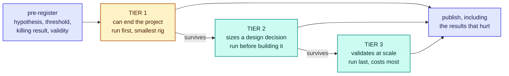

# RFC-0018: Benchmark and falsification suite

| | |
| --- | --- |
| **Status** | Accepted |
| **Phase** | 1 |
| **Depends on** | 0007, 0008 |

## Problem

RFC-0001 states five conditions under which Forebay should be abandoned. This document turns them
into experiments, and it is the most important one in Phase 1.

Its purpose is not to produce a favourable number. It is to find out, as cheaply and as early as
possible, whether the locality premise holds on hardware that matters. A benchmark suite designed to
make the project look good would be worse than none, because it would spend the project's remaining
credibility to buy a wrong answer.

The specific danger is visible in the project's own founding measurement. RFC-0001 records a Ceph
RGW read of a 226 MiB compressed object at 0.23 s against 1.71 s to read the same payload from local
disk, and reports both the seven-times wall-clock gap and the two-and-a-half-times bandwidth gap,
because the object crossing the network was compressed roughly three to one while the local read
moved every byte. That is the founding number of the project and it was confounded. Nothing here is
safe from the same mistake.

## What of this is built

**None of the suite.** No harness exists, no workload is defined, nothing is pre-registered and no
result has been published.

What exists is a handful of measurements taken while building the agent, recorded in the documents
that own the decisions they bear on.

| Measured | Where | Caveat this document inherits |
| --- | --- | --- |
| Ceph RGW fan-out at 995 MB/s against local disk at 400 MB/s | [RFC-0001](0001-thesis-scope-and-non-goals.md) | One environment the project does not control, and the payload crossing the network was compressed while the local read was not |
| `unlink` returning in 2.5 to 2.6 ms | [RFC-0005](0005-capacity-pools-and-elastic-leases.md) | It measured when the call returned, not when the capacity became usable by somebody else |
| Reclaiming 7 GiB through the agent in 2.759 ms, and 7.415 ms under four concurrent `O_DIRECT` writers | [RFC-0005](0005-capacity-pools-and-elastic-leases.md) | Covers choosing leases and unlinking extents, which RFC-0004 says are not what dominates, and both were taken while the device still had headroom. The same reclaim costs 142 to 773 ms once the drive is at its sustained write rate |
| Granting 2 GiB in 5 ms, with `fallocate` committing the blocks | [RFC-0005](0005-capacity-pools-and-elastic-leases.md) | One filesystem, one device |

That is four measurements against the twenty-five experiments below, and none of the four settles a
kill criterion on its own. Everything else the project believes about performance is prediction.

## Assumptions

| Assumption | Basis | Risk if wrong |
| --- | --- | --- |
| A result on one hardware profile does not transfer to another | Reasoned, from NVMe and NIC generations differing by more than the effects being measured | Results are quoted beyond their validity and the project is wrong in a way that looks measured |
| The access patterns that decide the outcome can be characterised well enough to replay | Unverified, and the reason workload definition is an experiment rather than a fixture | The suite measures a workload nobody runs, favourably |
| The project will publish a result that kills it | Unverified, and not a measurement. It is a question about people, which is why pre-registration exists rather than a promise | The suite becomes marketing, and the kill criteria never fire |
| RFC-0001's five criteria are the right ones to be falsifiable against | Reasoned. They were derived before any result existed, which is the only time such a list is honest | The suite is rigorous about the wrong questions |
| A measurement rig small enough to be cheap can still answer the existential questions | Reasoned, from three of the five criteria needing a fleet survey or one node rather than a cluster. The rig now exists, which removes the obstacle to trying and is not evidence the answer will come | The decisive experiments that remain are the fleet surveys, which need clusters the project does not own and cannot buy its way into |

## Design

### Pre-registration, because the alternative is a promise

RFC-0001 requires negative results to be published with the same prominence as positive ones. A rule
like that cannot be enforced after the fact, because by then the result is known and the reasons to
soften it are many and reasonable-sounding.

So an experiment is written down before it runs, and the written form has four parts:

| Part | What it fixes |
| --- | --- |
| **Hypothesis** | The claim being tested, in a form that can be false |
| **Threshold** | The number that separates pass from fail, chosen before the data exists |
| **Killing result** | What outcome would falsify the design decision this experiment supports, named explicitly |
| **Validity** | The hardware profile, workload and software versions the result is claimed for, and nothing beyond them |

A run that produces a number outside its pre-registered validity is a new experiment, not a
supporting data point for the old one. An experiment whose threshold moves after the data arrives is
reported as having moved, with both values.

This is the only mechanism in the project that makes "we will publish negative results" mean
something, and it is cheap: four sentences before a run.

### Experiments are tiered by what a result would kill

Tier 1 exists because the cheapest possible outcome is discovering early that the project should
stop. Those experiments run on the smallest rig that can answer them, and three of the five kill
criteria need no data path at all, which matters because this document's dependencies suggest
otherwise.

### The comparability rule

**Both arms of a comparison must do the same work, and the write-up must say what that work was.**

This generalises the compression confound rather than merely avoiding it. A backend serving
compressed bytes against a tier serving raw ones is not a comparison of locality. Neither is a
backend read that lands in page cache against a local read with `O_DIRECT`, nor a warm tier against
a cold backend, nor a tier with prefetch against a backend without it.

Every pre-registration therefore states which side of the comparison carries compression, caching,
prefetch and concurrency, and a result that cannot say is not reported as a locality result.

### The baselines are measured arms, not assumptions

Forebay is not compared against nothing. It is compared against the best simple alternative, and
there are two.

| Arm | Why it is the honest comparison |
| --- | --- |
| **Backend fan-out** | The counterexample the project starts from. Aggregate parallel bandwidth from a durable store is what Forebay has to beat, and on the one measurement that exists it wins |
| **Static provisioning** | RFC-0001's fourth kill criterion says that if a fixed split captures nearly all the value, the control plane's central function is unnecessary. That makes static provisioning an arm to run, not a position to argue against |

An alternative that only appears in prose is a strawman. Both of these produce numbers.

### The experiment register

Every question delegated to this document appears here. The register is the point: eleven RFCs defer
to this one, and a list that quietly loses an item is how a design decision ends up resting on
nothing.

**Tier 1, can end the project.**

| Experiment | Kill criterion | Needs |
| --- | --- | --- |
| ~~Where the locality crossover sits between node-local bandwidth and a node's achievable share of backend fan-out~~ | 2 | **Answered on one node, and there is no crossover inside the sweep.** Reading a 64 MiB object in 1 MiB blocks, reading a 256 MiB object in 1 MiB blocks, with the tier's extent evicted from the page cache before each measured run so the bytes come off the device, the tier serves 341 MiB/s at one reader against the backend's 72, and 2003 against 110 at sixteen. That is between five and eighteen times, and the backend flattens at 110 from four readers up, at nine per cent of a 10 GbE link, so what flattens is the store's answer to this node rather than the node's network. Left in the page cache the same tier reads 465 and 4419, so caching is worth between one and a half and two and a half times and is not where the result comes from. The remaining caveat is the backend: 110 is one shared store's answer on one day rather than a property of the technology, and its first-touch reads vary between 34 and 110 across runs |
| How much idle compute-local NVMe exists across real fleets, over what window, and whether the idle periods are long enough to be worth borrowing | 3 | A fleet survey, no code |
| Whether inference-serving nodes have idle NVMe at all, which the training-shaped survey above does not cover | 3 | A fleet survey, no code |
| How much of the available value static provisioning captures on the same workload | 4 | One node, both arms |
| What fraction of a real workload's storage traffic is regenerable, which bounds what a regenerable-only tier can ever be worth | 2 | Traces, no code |
| ~~Whether reclamation measurably harms the job that owns the node~~ | 1 | **Answered on one node, and it does not.** Taking back 16 GiB spread over 32 leases, through the agent's own reclaim path, leaves the workload's rate and its worst single write where they were, in all three regimes the device has: with headroom at one writer, saturated at four, and at the sustained write rate it falls to afterwards. Read against a control arm that lends the same capacity and never takes it back, run alternately with the treatment, since a device that slows as it is written would otherwise hand whichever arm ran second the blame. In the collapsed regime both arms read 535 MiB/s, which is the drive rather than the reclaim. What bounds the answer is resolution: a reclaim of a few milliseconds overlaps one or two of the writer's intervals, so the during column rests on a couple of samples |
| When freed capacity becomes observably available to a competing writer, which is what compute waits for, rather than when `unlink` returns | 1 | One node, no data path |
| Whether sub-second reclaim holds under simultaneous IO pressure | 1 | **Reopened, and the earlier answer was measured in the wrong regime.** 2.759 ms idle against 7.415 ms under four concurrent writers held while the device had headroom. Held at its sustained write rate, where a drive that took 6.5 GiB/s settles to 535 MiB/s, the same reclaim of 16 GiB took 142, 655 and 773 ms. It is still sub-second on this device, and it is two orders of magnitude nearer the deadline than the earlier figure implied. The number tracks the device's state rather than the concurrency: idle it is 3.7 to 19 ms, and the collapse arrives with the drive's write cliff rather than with the writers |
| How long revoking a reader takes against a running metadata server under load, and whether it fences one client or every reader of an extent | 1 | A pNFS deployment |

**Tier 2, sizes a design decision.**

| Experiment | Sizes | Owned in |
| --- | --- | --- |
| The fast tier's cache block size, trading index size against read amplification | The unit of the whole tier | RFC-0007 |
| How large the record of first reads must be before admission on second read fires at all | Whether admission functions | RFC-0007 |
| How much of a reader's working set one lease holds, which turns a per-block refetch into the burst a reader feels | The cost of reclamation | RFC-0007 |
| How long to wait on a peer before abandoning it for the backend | Whether peer fetch helps or hurts | RFC-0007 |
| Whether a rack-local hop beats going straight to a fanned-out backend | Whether the rack tier exists | RFC-0002, RFC-0007 |
| What a read costs crossing from the NFS server into the node agent, against reading the same bytes in one process | **Attempted and not answered.** The first pass took the price off a store-warm arm against a store-cold one and was measuring the store's cache. Corrected to two cold arms, the store's own first-touch variance swamps the difference: the same read in process gave 34, 35, 54 and 72 MiB/s on equivalent objects, and the socket arm ranged either side of it. An answer needs a store whose cache state is controlled, or a working set large enough that its variance averages out | RFC-0008 |
| ~~The headroom a node keeps free for reclamation to stay ahead of a workload's writes~~ | **Answered, and the answer is not a number.** The deficit a workload opens before the watch closes it tracks the write rate times the poll interval. Over ten runs at half a second, one second and two, against writers achieving between 92 and 2126 MiB/s, the deficit ran from 29 MiB to 2.18 GiB, and nine of the ten fell between 0.3 and 1.05 times that product. The tenth reached 6.5 times it, so the product is the shape and not the margin: a target set at it alone would have been short in one run of ten. A constant is worse than a formula, since the same drive gives rates sixty times apart depending on whether its cache is spent, so the headroom belongs in the configuration as a duration the node may be behind, converted to bytes against the rate it is achieving | RFC-0004 |
| The reclaim deadline default, derived from pod admission behaviour and measured end-to-end reclaim | RFC-0005's central promise. Half measured: the reclaim itself ranges from 3.7 ms on an idle device to 773 ms on one held at its sustained write rate, so a default has to be set against the loaded figure and the loaded figure is the one nobody had | RFC-0005 |
| The churn budget and the post-reclaim cooldown, whose shipped values are conservative guesses | Whether churn protection is real | RFC-0005 |
| Whether compressing the fast tier pays for CPU taken from the dataloader | Whether the tier compresses | RFC-0020 |
| How many copies the IO path actually has on a realistic stack | Whether the no-copy policy is achieved | RFC-0020 |
| Which of the three transport bottlenecks binds on target hardware | What the fast path is built on | RFC-0026 |
| Whether `hostNetwork` earns its cost against an ordinary pod network | How much isolation the agent gives up | RFC-0004 |
| Whether an NVMe read of a KV cache block beats recomputing the prefill, and above what prefix length | Whether RFC-0027 is worth writing | RFC-0027 |

**Tier 3, validates at scale.**

| Experiment | Question |
| --- | --- |
| The scaling curve across one node, one rack, ten racks and beyond | Where scaling stops, and whether it stops before it matters |
| Workload definitions replayed against the full path | Whether the tiered results survive a real access pattern |
| How often a dataloader asks the metadata server for layouts | Whether the metadata server is a bottleneck, since every layout request crosses it while bulk data does not |
| Which pods write, against which declared an ephemeral-storage request | Whether the pressure watch can ever be anticipatory, or stays reactive however much is built around it. The count in [RFC-0014](0014-kubernetes-integration.md) has answered half of it already, and not in the input's favour, so what is left is whether the few that declare are where the writing happens |
| Hardware profiles the results are valid for | Which results transfer to a different NVMe or NIC generation |

### What can run today

Three Tier 1 experiments need no Forebay code at all: the two fleet surveys and the regenerable
fraction, which are questions about other people's clusters and traces. Two more need only the node
agent, which exists and now grants, reclaims and unlinks real extents: when freed capacity becomes
available to a competing writer, and whether reclamation measurably harms the job that owns the node.
A sixth was answered while the agent was built, which is how it got into the table above.

The crossover experiment has run, and the harness is `cmd/forebay-bench`. It executes one plan
against every arm, checksums what each arm assembled so two arms cannot be compared on speed while
disagreeing about the bytes, and prints what each arm carried before it prints a number, because a
result that cannot say is not a locality result.

It also cannot prove an object is cold to the tier. Told to read one that has already been admitted,
it reports the tier's rate under a backend arm's name, which is how a 2079 MiB/s cold read appeared
during this work. Until the harness can ask the tier what it holds, a cold arm is only as honest as
the objects it was handed.

It does defeat the page cache, on the arm where that matters. A working set that fits in memory
would measure cache and NVMe together, so the tier's extent is evicted before each measured run with
`fadvise`, targeted at that file rather than dropping the whole machine's cache, which on a shared
node would charge every other workload for the measurement. The eviction is counted with `mincore`
rather than assumed, and a run whose eviction did not take is refused: a cached read reported as a
device read is indistinguishable from a fast disk, and nothing in the number would say which it
was.

The crossover experiment is the one that changed. It needs one node and one backend, and until the
agent could read from a durable store it had neither in the same place. It now has both: a node with
current accelerators and NVMe, an S3-compatible store the agent reads misses from, and a tier
holding blocks between them. The experiment that can end the project is therefore runnable, which
the fleet surveys and everything above one node still are not.

That rig also decides the shape of the comparison. Both arms have to read the same bytes the same
way, and the tier arm crosses a socket the backend arm need not, so a run that reports only the two
end numbers has measured locality and indirection together and cannot say in what proportion. The
crossover pre-registration therefore carries three arms rather than two, the third being the backend
read through the same socket, which is also the Tier 2 question RFC-0008 defers here.

So this document's declared dependencies are two unbuilt RFCs and most of its existential work needs
neither. The dependency row is honest about what the *suite* needs to be complete, and it is not a
reason to wait.

One Tier 2 value has stopped being abstract, and has now been measured. The headroom target had no
defensible default, so the pressure watch refuses to run without one, which meant an operator
deploying the agent supplied a number this document owned and nobody had measured. It is measured
above, and the reason there was no defensible constant turns out to be that no constant is the right
shape: what a node has to keep free is what its workload can write while the watch is not looking,
which is a rate multiplied by a poll interval. A node whose drive is fresh and one whose cache is
spent differ by sixty times on the same hardware, so a byte count set for one is wrong for the other.
Expressing the target as a duration the node may be behind is the change that follows, and it belongs
to RFC-0004 rather than here.

The margin is the part still open. Nine runs in ten sat at or under the product, and the tenth was
six times it, which is enough to say a target set at the product alone will sometimes be short and
not enough to say what covers it. What that run had in common with the others, and what it did not,
is unmeasured.

### Publishing

Results are published in this repository, in the RFC that owns the decision the experiment supports,
with the pre-registration alongside the outcome. A result that contradicts an accepted RFC supersedes
it, which RFC-0000 already allows and which has happened once.

Aggregate summaries may exist elsewhere. They may not be the only published form, because a summary
is where an inconvenient result goes to be averaged away.

## Alternatives considered

| Alternative | Trade-off | Why not |
| --- | --- | --- |
| Measure after building, when there is something complete to measure | Far cheaper to organise, and the numbers would be realistic | It inverts the project's whole posture. RFC-0000 warns that an unverified assumption quietly restated as fact is how a project talks itself into a wrong architecture, and building first is the mechanism by which that happens |
| Use standard storage benchmarks and report those numbers | Comparable across projects, no harness to write, credible to outsiders | fio and IO500 measure a device or a filesystem. None of the five kill criteria is a device question: they are about idle capacity across fleets, about harm to a co-tenant job, and about a crossover against a specific alternative. Standard benchmarks would be real work producing no decision |
| Let each RFC own and run its own measurement | No central register to maintain, and the owner of a decision owns its evidence | Comparability dies. Eleven documents would each choose their own workload and baseline, and the results could not be set beside one another. The compression confound is what one document's private methodology looks like from outside |
| Publish only results that are complete and conclusive | Higher quality, less noise, fewer misleading partial numbers | Conclusive is a judgement made after seeing the data, which is exactly when the incentive to withhold is strongest. Pre-registration means the obligation to publish is incurred before the result is known |
| Skip pre-registration and rely on the team's honesty | No process overhead, and the honesty is real | Honesty is not the failure mode. Reading a result generously is, and it is invisible from the inside. The threshold has to exist before the number does |

## Failure modes

**The suite measures what is easy rather than what decides.** Sequential reads on an idle node are
simple to harness and answer nothing. The register is ordered by what a result would kill precisely
to resist this, and an experiment that is cheap and answers nothing belongs to no tier.

**A favourable result on a rig nobody runs.** Every result carries the hardware profile it is valid
for, and a result quoted outside that profile is a new claim needing its own run.

**Pre-registration becomes a formality.** Thresholds written vaguely enough to be met by any outcome
are worse than none, because they add ceremony to the same wrong answer. A threshold that cannot be
stated as a number, or as a specific comparison, is not ready to be run.

**Everything becomes "needs more data".** An indefinite lack of conclusion is how a kill criterion is
avoided without ever being faced. An experiment that has run and produced a number reports that
number, including when it is inconvenient and the sample is small.

**The suite outlives its own validity.** Hardware moves, and a result from two NVMe generations ago
is not evidence about current hardware. Results carry dates and profiles so they can be retired
rather than inherited.

## Performance implications

The suite perturbs what it measures. A harness that runs on the node under test competes with it for
CPU, memory bandwidth and IO queue depth, and on a GPU node the dataloader is already competing for
the same CPU, which is the subject of one of the Tier 2 experiments.

Measurement overhead is therefore itself pre-registered: what the harness consumes, and whether the
measured effect is larger than that consumption. An effect smaller than the harness's own footprint
is not a result.

## Complexity

The hard part is not the harness, it is access. Two Tier 1 experiments are fleet surveys of clusters
the project does not own, and the regenerable-fraction experiment needs traces from real training
runs. None of that is engineering, and no amount of harness quality substitutes for it.

The second hard part is keeping the register honest. Eleven documents defer here, and the failure is
silent: a question deferred to this document and never entered into the register looks answered from
the deferring side and does not exist from this one. Writing this document found six such items.

## Security and tenancy

Workload traces are the sensitive artifact. An access trace from a real training run reveals dataset
structure, read patterns and often dataset identity, and a trace is exactly what the regenerable
fraction and workload definition experiments need.

Traces are therefore reduced before they leave the cluster that produced them, to the statistics an
experiment needs rather than the sequence of accesses, and a published result never carries a raw
trace. What reduction is sufficient is a question about disclosure rather than about measurement, and
RFC-0016 owns it.

The fleet surveys have the same shape at lower risk: how much NVMe sits idle on a cluster is
commercially meaningful to whoever owns the cluster, and results are published in aggregate across
fleets rather than per fleet.

## Open questions

- **What hardware the project can measure on beyond one node.** Answered for the node-scoped
  experiments: a node with current accelerators and NVMe, reading from an S3-compatible durable
  backend, runs the crossover experiment and both reclamation experiments. Unanswered above one
  node, since the rack and multi-rack rows in Tier 3 need hardware the project does not have. No RFC
  owns the remainder, because it is a question about access and funding rather than design.
- **What the driver conformance suite runs against.** Answered in the narrow sense: the suite is
  importable and runs unchanged against an S3-compatible store, so a driver for one can be proved
  without this project reviewing it. Unanswered for a contributor writing a driver for a store they
  cannot reach, which is the access problem arriving at a contributor rather than at the project.
  Owned here, since no other document can carry it.
- **How traces are reduced before they leave the cluster that produced them**, which decides whether
  the workload experiments can use real data at all. Owned by
  [RFC-0016](0016-multi-tenancy-qos-and-security.md), which owns disclosure.
- **Whether the fleet surveys can be run at all without a partner**, since they measure clusters the
  project does not own. No RFC owns this, for the same reason as the first question: it is answered
  by asking people rather than by instrumenting anything, which is also how RFC-0001 disposes of its
  fifth kill criterion.
