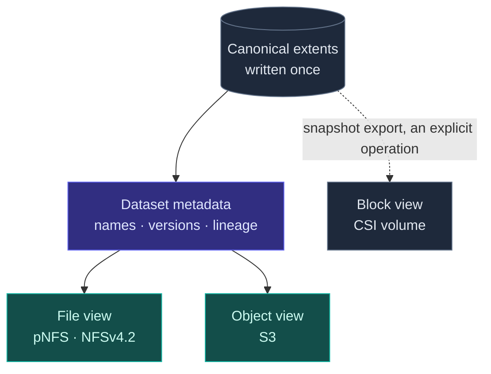

# RFC-0021: Single-copy multi-protocol access

| | |
| --- | --- |
| **Status** | Specified |
| **Phase** | 3 |
| **Depends on** | 0012, 0020 |
| **Supersedes** | The unified-namespace non-goal in 0001 |

## Problem

The same dataset is wanted through different doors. A training job wants POSIX files. A dataloader
written against object storage wants S3. A tool somewhere in the pipeline wants a block device. The
usual answer is to keep a copy per protocol, which multiplies capacity, and then to keep those copies
consistent, which nobody manages for long.

RFC-0001 originally listed a unified namespace as a non-goal, on the grounds that it multiplies
consistency problems for a benefit nobody had asked for. That was wrong on the second half: the
benefit has been asked for. This RFC replaces that position with a narrower one that is actually
deliverable.

## The honest boundary

The important thing this RFC does is say clearly which combinations are possible, because the
marketing version of this feature is not true and being caught claiming it is expensive.

| Combination | Verdict |
| --- | --- |
| **File and object over the same bytes, concurrently** | Yes. This is the feature |
| **Block over the same bytes as file or object, concurrently** | No. Not possible in any meaningful sense |
| **Block under the same control plane, namespace, policy, snapshots and clones** | Yes |
| **Converting between block and file or object, by snapshot export** | Yes, as an explicit operation |

### Why file and object can share bytes

A dataset is a set of immutable, whole objects with names. That is exactly what object storage is,
and it is very close to what a read-mostly filesystem is. A shard written once can be addressed as
`s3://bucket/dataset/v17/shard-00104` or read at `/datasets/imagenet/v17/shard-00104`, and both can
resolve to the same extents. The semantics that differ, such as rename, partial overwrite and POSIX
metadata, are precisely the ones AI datasets do not depend on.

### Why block cannot join them

A block volume is an opaque range of bytes with a filesystem inside it, written by a client kernel
that Forebay does not participate in. There are no objects in there to serve. Presenting those same
bytes as S3 objects would mean parsing a foreign on-disk format and racing the client that owns it.

Any system claiming concurrent block, file and object access to the same bytes means one of three
weaker things: separate copies kept in sync, block that is really a file underneath, or read-only
export of a quiesced snapshot. Forebay offers the third, and says so.

## Design

One canonical store, several views.

The file and object views are two renderings of one metadata graph over one set of extents. The block
view shares the control plane, the policy model, the snapshot machinery and the media, but not the
representation.

### Write once

A dataset version is written once and then immutable. Immutability is what makes the two views
consistent for free: there is no partial-write window during which file and object readers could
disagree, because there are no partial writes to a published version. A new version is a new
immutable set of extents that shares everything unchanged with its predecessor, under
[RFC-0020](0020-no-copy-policy.md).

Mutable working areas exist, and they are single-view: a scratch volume is a scratch volume. The
multi-protocol guarantee applies to published, immutable dataset versions, which is where it is
actually wanted.

## Alternatives considered

| Alternative | Trade-off | Why not |
| --- | --- | --- |
| A copy per protocol, kept in sync | Simple, each protocol gets an ideal layout | Multiplies capacity and creates a consistency problem that is never fully solved |
| A true POSIX filesystem with full mutable semantics, exported as objects | Most general, no restrictions on the workload | Requires reconciling rename and partial overwrite with immutable object keys, which is where this idea usually dies |
| Object only, with a FUSE shim for POSIX | Much less work | Reintroduces a client to ship and support, which RFC-0001 rules out, and FUSE costs exactly the copies RFC-0020 is trying to remove |
| Keep the original non-goal and do none of this | Smallest system | Forces users into per-protocol copies, which contradicts the no-copy policy the project is otherwise committed to |

## Failure modes

Views disagreeing is the failure users will notice. Immutability is the mitigation, and any feature
that puts a mutable dataset behind two views reintroduces the problem in full.

Deletion across views is subtler. If an object-view delete removes an extent that a file-view reader
holds open, the semantics have to be decided rather than inherited, because S3 and POSIX disagree
about what a delete means to an open reader.

Quota and capacity reporting become ambiguous when one set of bytes is visible under several names.
An operator asking how much this dataset costs deserves one answer, not a sum that double counts.

## Open questions

- Which POSIX semantics the file view declines to support, stated explicitly rather than discovered
  by users at runtime.
- Whether the object view should be S3-compatible enough for existing tooling, and what is dropped.
- How delete-with-open-readers behaves, and whether the two views can share one answer.
- Whether snapshot export to a block volume is worth building in v1 or belongs later.
- How capacity is attributed when extents are shared between versions and views.
