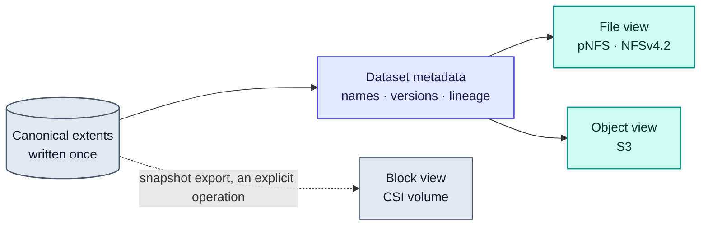

# RFC-0021: Single-copy multi-protocol access

| | |
| --- | --- |
| **Status** | Accepted |
| **Phase** | 3 |
| **Depends on** | 0012, 0020 |
| **Supersedes** | The unified-namespace non-goal in 0001 |

## Problem

The same dataset is wanted through different doors. A training job wants POSIX files. A dataloader
written against object storage wants S3. A tool somewhere in the pipeline wants a block device. The
usual answer is to keep a copy per protocol, which multiplies capacity, and then to keep those copies
consistent, which nobody manages for long.

RFC-0001 originally listed a unified namespace as a non-goal, on the grounds that it multiplies
consistency problems for a benefit nobody had asked for. That was wrong on the second half: the
benefit has been asked for. This RFC replaces that position with a narrower one that is actually
deliverable.

## What of this is built

**The two renderings, and the proof that they name one thing.** `internal/dataset` renders a
reference as the path the file view serves and as the key the object view serves, and parses either
back to the same reference and the same backend address. That is the feature's core reduced to the
part that can exist before either server does: if the two views could resolve to different addresses
the tier would hold two copies, and no amount of server code would fix it afterwards.

Neither server exists. The file view is RFC-0008's and is not written; the object view has no
document of its own and is not written either.

## Assumptions

| Assumption | Basis | Risk if wrong |
| --- | --- | --- |
| AI datasets do not depend on rename, partial overwrite or POSIX metadata | Reasoned, from what a shard-based dataset is: whole immutable objects with names | The file view declines semantics real jobs need, and the boundary drawn below is in the wrong place |
| Immutability is what makes two views agree, rather than a protocol between them | Reasoned, and close to a proof: there is no partial-write window because there are no partial writes to a published version | The two views need a consistency mechanism, which is the multiplied consistency problem RFC-0001 originally refused this feature over |
| Concurrent block access to the same bytes is not deliverable by anyone | Reasoned, from a block volume being an opaque range with a foreign filesystem inside it | The boundary is more conservative than it needed to be, and a competitor offers something real that this declines to |
| A dataloader written against S3 needs reads and listing, not writes | Reasoned, from what a dataloader does, and unverified against the tools people actually use | The object view is too narrow to adopt without changing the loader, which is the cost this feature exists to avoid |

## The honest boundary

The important thing this RFC does is say clearly which combinations are possible, because the
marketing version of this feature is not true and being caught claiming it is expensive.

| Combination | Verdict |
| --- | --- |
| **File and object over the same bytes, concurrently** | Yes. This is the feature |
| **Block over the same bytes as file or object, concurrently** | No. Not possible in any meaningful sense |
| **Block under the same control plane, namespace, policy, snapshots and clones** | Yes |
| **Converting between block and file or object, by snapshot export** | Yes, as an explicit operation |

### Why file and object can share bytes

A dataset is a set of immutable, whole objects with names. That is exactly what object storage is,
and it is very close to what a read-mostly filesystem is. A shard written once can be addressed as
`s3://bucket/dataset/v17/shard-00104` or read at `/datasets/imagenet/v17/shard-00104`, and both can
resolve to the same extents. The semantics that differ, such as rename, partial overwrite and POSIX
metadata, are precisely the ones AI datasets do not depend on.

### Why block cannot join them

A block volume is an opaque range of bytes with a filesystem inside it, written by a client kernel
that Forebay does not participate in. There are no objects in there to serve. Presenting those same
bytes as S3 objects would mean parsing a foreign on-disk format and racing the client that owns it.

Any system claiming concurrent block, file and object access to the same bytes means one of three
weaker things: separate copies kept in sync, block that is really a file underneath, or read-only
export of a quiesced snapshot. Forebay offers the third, and says so.

## Design

One canonical store, several views.

The file and object views are two renderings of one metadata graph over one set of extents. The block
view shares the control plane, the policy model, the snapshot machinery and the media, but not the
representation.

### Write once

A dataset version is written once and then immutable. Immutability is what makes the two views
consistent for free: there is no partial-write window during which file and object readers could
disagree, because there are no partial writes to a published version. A new version is a new
immutable set of extents that shares everything unchanged with its predecessor, under
[RFC-0020](0020-no-copy-policy.md).

Mutable working areas exist, and they are single-view: a scratch volume is a scratch volume. The
multi-protocol guarantee applies to published, immutable dataset versions, which is where it is
actually wanted.

### What the file view declines

Stated here rather than discovered at runtime, which is what the stub asked for. Each is refused with
an error rather than silently ignored, because a write that appears to succeed and does not is worse
than one that fails.

| Operation | Answer | Why |
| --- | --- | --- |
| Read, open, stat, readdir | Served | This is what a dataset is read with |
| Write, truncate, partial overwrite | Refused, read-only | A published version is immutable, which is what makes the two views agree |
| Rename | Refused | A name is part of the address the object view resolves. Renaming one view's name would unname the other's bytes |
| Hard link | Refused | Two names for one object is what a clone is, and it belongs in the metadata graph rather than in a directory |
| `mtime` and `ctime` | The version's publication time | One time for every object in a version, because that is when the bytes became what they are. A per-object time would be invented |
| Ownership and mode | The export's, uniformly | POSIX identity on the read path is RFC-0016's question, and it answers it with the network path rather than with a uid |

### What the object view offers

Reads and listing over published versions: `GET`, `HEAD`, and listing with a prefix. Not `PUT`, not
`DELETE`, not multipart upload, not versioning or lifecycle APIs.

That is enough for a dataloader written against object storage to work unchanged, which is the whole
point of offering the view, and it is deliberately not an S3 clone. A view that accepted `PUT` would
be a view that could write to a published version, which is the immutability the file view's answers
above are built on.

### Deleting a version that somebody is reading

One answer for both views, which is what the stub asks for and what RFC-0007 left unowned as a
consistency question.

Deleting a published version is **unnaming** it. The control plane stops resolving that
dataset-and-version pair, so no new read can address it, and because the version is part of the
address, cached blocks for it become unreachable rather than wrongly served. A reader already holding
a layout finishes what it was doing: its extents are not taken from underneath it, and it fails on
its next lookup rather than mid-read.

What that leaves is the bytes themselves, which cannot be freed until the last reference to them is
gone. Enumerating those references safely is the hardest part of the model and belongs to
[RFC-0012](0012-dataset-object-model.md), which owns it already. This document settles only what a
reader sees, and it is the same in both views because both resolve the same address.

## Alternatives considered

| Alternative | Trade-off | Why not |
| --- | --- | --- |
| A copy per protocol, kept in sync | Simple, each protocol gets an ideal layout | Multiplies capacity and creates a consistency problem that is never fully solved |
| A true POSIX filesystem with full mutable semantics, exported as objects | Most general, no restrictions on the workload | Requires reconciling rename and partial overwrite with immutable object keys, which is where this idea usually dies |
| Object only, with a FUSE shim for POSIX | Much less work | Reintroduces a client to ship and support, which RFC-0001 rules out, and FUSE costs exactly the copies RFC-0020 is trying to remove |
| Keep the original non-goal and do none of this | Smallest system | Forces users into per-protocol copies, which contradicts the no-copy policy the project is otherwise committed to |

## Failure modes

Views disagreeing is the failure users will notice. Immutability is the mitigation, and any feature
that puts a mutable dataset behind two views reintroduces the problem in full.

Deletion across views is subtler. If an object-view delete removes an extent that a file-view reader
holds open, the semantics have to be decided rather than inherited, because S3 and POSIX disagree
about what a delete means to an open reader.

Quota and capacity reporting become ambiguous when one set of bytes is visible under several names.
An operator asking how much this dataset costs deserves one answer, not a sum that double counts.

## Performance implications

Rendering and parsing an address is string work per request on the path that resolves a read, which
is not where time goes.

The saving is capacity rather than speed, and it is the reason for the feature: one copy instead of
one per protocol. It is unmeasured because neither view is served.

## Complexity

Small, and most of it is refusal. The design's work is drawing the boundary and holding it.

What it makes harder later is offering a writable view of a published version, which is now something
two other decisions rest on rather than a feature to add.

## Security and tenancy

Two doors to the same bytes need the same lock. Both views resolve through the same reference, so a
tenant that cannot name a dataset cannot address it in either, and the object view's listing is
bounded by the same scoping: it lists inside a dataset a tenant can already name rather than across
the export.

The object view is the one to watch, because listing is a capability the file view grants more
narrowly. A prefix listing that spanned datasets would let a tenant enumerate names they were not
given, which is the disclosure RFC-0016 constrains, and it is why listing is scoped to a dataset
rather than to a bucket.

## Open questions

- **Whether the object view's narrowness is narrow enough to break real tooling.** This document
  fixes what it offers and cannot say whether a given loader needs more, which is a question about
  the tools people use rather than about the design. Owned by
  [RFC-0018](0018-benchmark-and-falsification-suite.md), which owns workload definition.
- **How capacity is attributed when extents are shared between versions and views.** A version that
  shares everything with its predecessor costs nothing, and something has to decide who pays for the
  bytes both point at. Owned by [RFC-0012](0012-dataset-object-model.md), which owns the reference
  graph that makes the question answerable.
- **Whether snapshot export to a block volume is worth building.** Not in v1: it is an explicit
  operation and there is no block path to export to. Owned by this document, and it should be
  reopened when there is.
