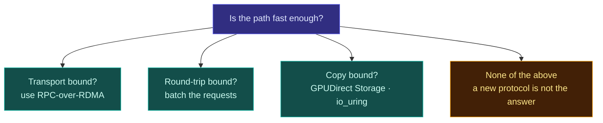

# RFC-0026: Transport and the high-throughput path

| | |
| --- | --- |
| **Status** | Draft |
| **Phase** | 2 |
| **Depends on** | 0007, 0008 |

## Problem

Forebay exists to keep accelerators fed, so the path between a node's NVMe and a GPU's memory is the
part that has to be fast. Two properties matter and they are not the same thing. Throughput decides
whether a training job can stream a dataset at the rate the GPUs consume it. Latency decides whether
a dataloader stalls between shards.

The obvious reaction is to design a protocol built for the job. That reaction deserves resistance,
because a new protocol means a new client, and not writing a client is the largest single cost the
project has avoided. Anything proposed here has to be weighed against reintroducing that cost.

This RFC separates three questions that get conflated whenever protocols are discussed, and answers
them differently.

## Three separate questions

| Question | What it is really asking |
| --- | --- |
| **Wire transport** | How bytes cross the network. TCP, RDMA, or something else |
| **Request pattern** | How many round trips it takes to ask for what you want |
| **Endpoint copies** | How many times a byte is copied between the device and GPU memory |

Almost every claim that "NFS is too slow for AI" is really a claim about one of these three, and
which one it is changes the answer completely.

## Design

### Transport: use RPC-over-RDMA, do not invent one

NFS already has an RDMA transport. [RFC 8166](https://www.rfc-editor.org/rfc/rfc8166.html) defines
RPC-over-RDMA version 1 and [RFC 8267](https://www.rfc-editor.org/rfc/rfc8267.html) binds NFS to it.
Linux implements it in-kernel, it composes with NFSv4.1 and NFSv4.2, and therefore with pNFS.

That means the fast transport is available without writing a client, and the commitment made in
RFC-0001 survives.

Every environment does not have RDMA, so the transport is detected rather than required, and TCP
remains a correct if slower path. RFC-0003 owns that detection.

### Endpoint copies: GPUDirect Storage, and io_uring on our side

The copy count between device and GPU memory is where latency quietly accumulates. Two mechanisms
apply at different ends of the path.

**GPUDirect Storage** moves data from the NIC or the device into GPU memory without staging it
through host memory. It works over NFS on RDMA, which means the standards path above does not
foreclose it. RFC-0001 keeps it out of v1 because it constrains hardware and only pays once the rest
of the path is fast, and nothing here changes that. It does mean v1 must not make choices that
prevent it later.

**io_uring** applies on the data server, which is our own node agent, and needs no protocol change at
all. It reduces syscall overhead on the serving side, where we control the code.

Neither of these is a protocol question, which is exactly the point.

### Request pattern: the one place a new protocol might be justified

This is where NFS genuinely has nothing to offer, and where AI workloads differ most from what NFS
was designed for.

A dataloader walking a sharded dataset issues many small reads. Each is a round trip. At a thousand
shards per step, per rank, the cost is dominated by round trips rather than by bytes, and no
transport fixes that because the transport is not what is slow. Batching is what fixes it, and NFS
has no way to express "give me these five hundred shards".

Two ways to get batching without a new general-purpose protocol:

- **Prefetch, which is already planned.** If RFC-0011 predicts the next shards correctly, the round
  trips happen ahead of the read and the dataloader never waits. Prefetch is a request-pattern fix
  disguised as a caching feature, and it is already in the roadmap. It should be measured before
  anything is designed to replace it.
- **A narrow batched-fetch sideband.** An optional endpoint on the node agent that takes a list of
  shard identifiers and streams them back in one exchange. It is not a filesystem protocol, it does
  not replace pNFS, and a client that does not speak it loses nothing but batching. It would be used
  by an integrated dataloader, not mounted.

A sideband is acceptable where a general protocol is not, because it is optional. Nobody has to
install it to use Forebay, and it cannot become a thing we are obliged to support on every kernel.

### What would justify replacing pNFS entirely

Recorded so that the bar is explicit rather than argued case by case. All three would have to hold.

1. Measurement shows RPC framing and marshalling, not transport and not round trips, dominates at the
   rates we care about.
2. Neither prefetch nor a batched sideband closes the gap.
3. The gap is large enough to justify shipping and supporting a client across kernels and
   distributions, forever.

Nobody has measured any of this. Until someone does, a new protocol is speculation with a large
maintenance bill attached.

## Alternatives considered

| Alternative | Trade-off | Why not |
| --- | --- | --- |
| Design a purpose-built protocol now | Full control of framing, batching and flow control | Reintroduces the client we deliberately refused to write, before any measurement says the protocol is the problem |
| NVMe-oF for the fast path | Very low latency, mature, hardware offload | Block semantics, so it cannot serve the file and object views RFC-0021 depends on. Plausible later for the block path specifically |
| TCP only, keep it simple | One path to test, works everywhere | Concedes the throughput ceiling on exactly the hardware Forebay targets |
| Require RDMA | Best case performance, simpler tuning | Excludes most clusters, and capability detection is cheap by comparison |

## Failure modes

RDMA failure modes are not TCP's. A congested or misconfigured fabric fails in ways that look like
corruption or hangs rather than slow transfers, and RoCE without properly configured flow control
degrades sharply rather than gracefully. Detection has to include whether the fabric is healthy, not
merely whether it is present.

A batched sideband creates a second path to the same data, and therefore a second place for a
consistency bug. It must share the fast tier's invalidation path rather than keeping its own view,
or reclamation could be honoured on one path and not the other.

## Performance implications

All predicted. Nothing here has been measured, and the whole point of the RFC is that the ordering of
work depends on measurements nobody has taken.

## Open questions

- Which of the three bottlenecks actually binds on target hardware. This is the question, and
  RFC-0018 should answer it before any of this is built.
- Whether prefetch alone closes the round-trip gap for realistic dataloader patterns.
- Whether GPUDirect Storage over NFS on RDMA works with a metadata server we wrote, or only with the
  configurations its vendor tests.
- Whether the block path should use NVMe-oF rather than CSI over the general path.
